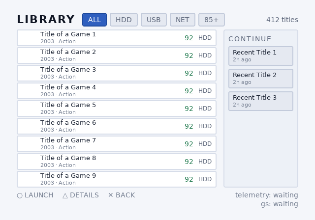
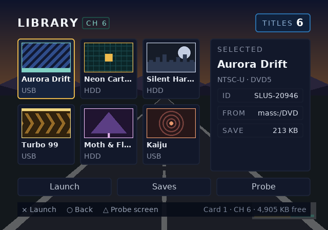

# OPHTML / ps2ui

**Build PlayStation 2 homebrew UIs from HTML and CSS.**

Your build machine does the expensive work: parsing, flexbox layout, text
wrapping and kerning, D-pad navigation, chrome rasterization. What ships to
the console is a single `.uib` blob that a small C99 runtime replays through
[gsKit]. The PS2 never parses, lays out, rasterizes, or allocates.

```
ui/*.html,css -> @ophtml/layout -> ui.json (IR) -> ps2ui-bake -> ui.uib -> runtime (C99 + gsKit)
                 Node, zero deps                  Python, Pillow only
```

Originally built for UIs shipped on an SD2PSX / PSxMemCard GEN2 virtual
memory card. Works for any PS2 homebrew project.

## What it looks like

One blob, two themes, swapped on the console at runtime by
`ps2ui_theme_set`. No rebuild, no second asset set: the palette is a CLUT
row and switching it is a table swap.

<table>
<tr>
<td></td>
<td></td>
</tr>
</table>

A memory-card browser and an overlay that composites over a running game:

<table>
<tr>
<td></td>
<td></td>
</tr>
</table>

Every image here is rendered by the Python previewer, which replays the
baked command list with the same quad order, scissor stack, CLUT lookups
and GS alpha domain the console uses. It can also put
[every focus state on one sheet](examples/memcard/screenshots/states.png),
which is how you review a whole screen's navigation without a console.

Three shipped examples, each buildable in one command:

- **[`examples/opl-env`](examples/opl-env)** is the largest: six screens,
  a windowed library, filters, a detail view, a confirm dialog, two themes.
- **[`examples/memcard`](examples/memcard)** is the memory-card browser
  above, and the smallest place to start reading.
- **[`examples/channel6`](examples/channel6)** is an overlay that draws
  over a live game frame, plus the `probe` screen this project uses as its
  console conformance target.

## Quick start

Three ways in, depending on what you want:

- **Follow the tutorial.** [docs/tutorial-uc3.md](docs/tutorial-uc3.md)
  builds a working OPL-class game browser from an empty directory with
  your own TTF. Every command in it is executed by CI, so the numbers it
  prints are the numbers you will get.
- **Look at a UI in your browser.** `ps2ui serve` puts a real baked frame
  behind a localhost page with arrow-key navigation, screen and theme
  switching. See [Previewing in a browser](#previewing-in-a-browser).
- **Put it on a console.** [docs/deploying.md](docs/deploying.md) covers
  memory cards, multi-channel devices, Open PS2 Loader and autoboot.


**Neither package is published yet, so a checkout is still the only way
in.** `ophtml` (PyPI) and `@ophtml/layout` (npm) both carry `0.3.0`,
tagged `v0.3.0`, which is the first release this repository has ever had
and the first of these numbers that names a tag rather than a number
somebody typed. They used to claim `0.2.0`, a release that does not
exist, through four moves of the `.uib` format; the blobs this tree bakes
are format **v7** and a 0.2.0-era runtime rejects them. Run it from a
checkout, and note that every CLI answers `--version`. Uploading is the
last step of Phase 4 in [docs/PLAN.md](docs/PLAN.md);
[docs/releasing.md](docs/releasing.md) is the procedure, and
`tools/check-versions.py` keeps this paragraph honest.

Requirements:

- Node 18+
- Python 3 with Pillow
- A C compiler for the host tests
- DejaVu Sans, or point `fonts/fonts.json` at your own TTF

**Install the baker once.** Every `python3 -m ps2ui_bake` line in this
file carries a `PYTHONPATH=packages/baker` in front of it. That is
tolerable for a command you run occasionally and grating for one you
start every session, so from a checkout:

```sh
pip install -e packages/baker
```

`ps2ui`, `ps2ui-bake`, `ps2ui-check` and `ps2ui-fontgen` are then bare
commands on `PATH`, and `-e` points them at this tree, so editing the
baker takes effect without reinstalling. The `PYTHONPATH=` spelling
stays documented everywhere below because it needs no install at all. It
is what CI runs, and what works in a clone you have just made.

A project is one file and a build is one command:

```sh
ps2ui fontgen /path/DejaVuSans.ttf /path/DejaVuSans-Bold.ttf
cat > ps2ui.json <<'EOF'
{ "screens": ["ui/library.html"], "css": "ui/app.css" }
EOF
ps2ui build          # compile every screen, bake one blob, write a preview
ps2ui check          # validate it against what the C runtime assumes
ps2ui serve          # and drive it in a browser: arrows, screens, themes
```

The three tools underneath stay, because a person debugging one stage
wants to run that stage:

```sh
# compile HTML+CSS to the IR
node packages/layout/bin/ps2ui-layout.js \
    examples/memcard/ui/library.html examples/memcard/ui/library.css \
    -o build/library.json

# bake the IR into a console blob, plus a verification PNG
PYTHONPATH=packages/baker python3 -m ps2ui_bake build/library.json \
    -o build/ui.uib --preview build/preview.png

# or run both stages plus all tests for the example:
./examples/memcard/build.sh

# or live-rebuild on every edit (~200ms per build). --screen picks one
# when the project has more than one; the output lands in build/dev/ so
# it never collides with build/:
PYTHONPATH=packages/baker python3 -m ps2ui_bake.ps2ui dev \
    examples/memcard/ps2ui.json --screen library

# `dev` is headless and writes PNGs, which is what keeps it useful in
# CI. For an edit loop you can navigate, use `ps2ui serve` below.
```

Console side: drop `runtime/ps2ui.c` and `runtime/ps2ui.h` into your ps2sdk/gsKit project.

```c
ps2ui_ctx ui;

/* One caller-provided block, sized by the blob rather than by
 * compile-time ceilings. `ps2ui-bake` prints the number, so this is a
 * constant you paste rather than one you guess; it must outlive `ui`. */
static uint8_t arena[1662] __attribute__((aligned(PS2UI_ARENA_ALIGN)));

ps2ui_load(&ui, uib_data, uib_len, arena, sizeof arena);
ps2ui_upload(&ui, gsGlobal);          /* textures + CSM1-permuted CLUTs  */

/* per frame */
ps2ui_render(&ui, gsGlobal);
if (pad_pressed & PAD_RIGHT) ps2ui_move(&ui, PS2UI_RIGHT);
if (pad_pressed & PAD_CROSS) launch(ps2ui_focus_name(&ui));
```

## Supported CSS

- Flexbox: direction, wrap, grow/shrink/basis, gap, justify/align. **`flex-direction` has no default** (see below)
- Box model (border-box): padding, margin, borders, border-radius (baked as nine-patch textures)
- Flat colors with real translucency
- `font-size`, `font-weight`, `line-height`, `letter-spacing`, `text-align`
- Kerning, on by default from the font's own pairs, see below
- `white-space: nowrap` with `text-overflow: ellipsis`
- `overflow: hidden` (GS scissor), `display: none`
- ``, see below
- `:focus` as a paint-only state. A `:focus` rule that changes geometry is a compile error.

Unknown properties warn. Unsupported values error with line numbers.

### `data-keep`

The baker drops draw commands that cannot produce a pixel: geometry
entirely outside its `overflow: hidden` clip is submitted every frame
and can never be seen. `data-keep` on an element exempts its own
geometry from that trim (it does not cascade to children).

There is one good reason to want it: an instrument. The channel-6
probe parks a magenta quad outside a clip rect so that a console
showing it proves the scissor is not being applied, a test that only
works while the quad provably cannot draw, which is exactly what the
trim would otherwise remove.

### `flex-direction` is required, not defaulted

Any container laying out two or more children must say which way they go:

```css
.row  { flex-direction: row; }
.list { flex-direction: column; }
```

Omitting it is a compile error naming the element and line. Containers with one child or none are never asked, because the answer cannot change what is drawn.

This deviates from CSS, which defaults to `row`, and it is deliberate. ps2ui previously defaulted to `column` and documented it nowhere, so authors who knew CSS got the opposite of what they wrote, and the shipped examples had already worked around it, stating `row` twenty times against `column` four. Switching the default would have silently relaid out every existing document; keeping it taught a permanent exception to CSS. Requiring the answer is the only version that cannot surprise anyone, and migrating both examples left their previews byte-identical, which is the evidence that nothing was relying on a guess.

## Kerning

`ps2ui-fontgen` extracts the face's kern pairs into the metrics JSON, and every stage that walks a string applies them: the layout measurer, the baker's pen, and the runtime pen that composes `data-slot` text on the console. There is nothing to turn on.

The pairs reach the console already resolved to pixels at each font's size, because the EE is not going to divide by 1000 per glyph pair. That makes the table per-size, and it means kerning is a **large-text feature**: `To` is -170 font units, which is -5px at 32px, -2px at 14px, and gone below about 10px. Headings tighten; body text does not measurably move. That is the honest behaviour of an integer pen on a machine with no subpixel glyph placement, not a knob that needs turning up.

All three pens walk a string the same way (kern, place, advance) and they have to agree to the pixel, because layout sizes the box and the other two draw into it. `TestCrossLanguagePen` runs the Node and Python pens over a corpus and compares every glyph position; the runtime suite checks the C pen against an independent scan of the same tables. If you write a fourth implementation, the rule is in [docs/format-uib.md](docs/format-uib.md).

Regenerate the committed metrics after changing `fontgen`:

```sh
./fonts/regen.sh
```

## Images

- Keep art in an `assets/` folder next to your HTML: `` (PNG only at build time)
- Paths resolve relative to the HTML document
- The baker decodes, pre-scales to the laid-out size, and packs the pixels into the `.uib`. The console never touches a filesystem
- **Art the app supplies at runtime**, cover art off a disc, HDD or network, is a *streamed slot*: `` with an explicit `width` and `height` in CSS. No `src`: nothing at bake time knows what the picture is. The blob carries geometry, the name and a VRAM reservation but no texels, and the app fills it with `ps2ui_tex_set(&ui, gs, "cover", texels, len)`. `len` is the **payload** figure on that slot's row in the bake's VRAM breakdown (`28000 B payload`), not the page-rounded `B in pages` next to it. The allocator commits whole 8 KiB pages, `tex_set` wants the linear texels, and passing the larger number is `PS2UI_ERR_SIZE`. Slot names are matched byte for byte, so a leading or trailing space in `data-tex-slot` is a build error rather than a name that silently never matches. Two elements naming the same slot share one reservation and draw in both places; the same name at two different sizes is a build error, because a slot has one reservation and the app is told one number. Nothing is copied: the buffer you pass becomes the DMA source and must stay alive, unmoved and 16-aligned for as long as the slot can be drawn. PSMCT32 only for now
- Add the `palettize` attribute (or bake with `--palettize-images`) to quantize an image to 8-bit indexed + CLUT. 4x less VRAM per texel for art within 256 colors. An already-indexed PNG keeps its own palette and index values instead of being requantized. Laying one out at a size other than its own is a build error when `palettize` asked for that image; under the project-wide `--palettize-images` it warns and requantizes instead, since that flag is a VRAM request rather than a claim about any one asset
- One deliberate CSS deviation: flex `stretch` never distorts an image's aspect ratio. Give it an explicit size if you want stretching

## Dynamic text

A real memory card browser reads its titles off the card at runtime, so baked strings alone don't cut it. Mark an element with `data-slot`:

```html
<p class="title" data-slot="save-0" data-slot-capacity="31">Placeholder</p>
```

```c
ps2ui_slot_set(&ui, "save-0", title_from_card);
```

The runtime composes glyph quads each frame from a baked glyph table, using the same advances and baseline as static text. The example preview is pixel-identical either way. Geometry, font, colors, and ellipsis policy stay compile-time. Fixed per-slot buffers, no allocation.

`.uib` files carry a CRC-32 and feature flags, so an older runtime rejects a newer blob with a clear error instead of misrendering it.

## Lists

A launcher's row count is a property of its data, not of its markup.
`data-repeat` stamps out N copies of a shape at compile time; `{i}` is
the 0-based index and `{n}` the 1-based one, substituted in any
attribute and in text:

```html
<div class="row" data-repeat="8" id="row-{i}" focusable>
  <p class="title" data-slot="title-{i}" data-slot-capacity="32">Slot {n}</p>
</div>
```

- Expansion runs before styles are computed, so a repeated row is
  indistinguishable downstream from one you typed out. The compiled
  command list is identical either way, which a test asserts.
- Nothing is renamed behind your back. Forget `{i}` on a `data-slot`
  and you get the existing duplicate-name error, which names the slot.
- Counts are 1..256 and must be literal. There is no data at build time.

The rows are fixed; the *window over your data* is a runtime concern:

```c
ps2ui_list list;
ps2ui_list_init(&list, "row-", 8);          /* 8 baked rows named row-0.. */
ps2ui_list_set_count(&ui, &list, n_games);  /* however many you found     */

/* on D-pad */
if (ps2ui_list_move(&ui, &list, down ? 1 : -1)) refill(&list);

/* refill: row r shows item_at(r), or blanks when past the end */
for (uint16_t r = 0; r < list.rows; r++) {
    int item = ps2ui_list_item_at(&list, r);
    ps2ui_slot_set(&ui, slot_name(r), item < 0 ? "" : titles[item]);
}
```

ps2ui owns the indices and where focus sits; you own the data. The
window slides by the minimum needed to keep the selection visible,
clamps at both ends rather than wrapping, and survives the list
shrinking under a selection that was past the new end. Those are the
cases worth not reimplementing.

No format change is involved: a list is a view over rows that are
already baked, so a UI that never uses one pays nothing.

## Hiding things at runtime

`display: none` is compile-time: it deletes the box before layout, so
the geometry closes up around it. `ps2ui_visible_set` is the other
thing, and the only one a fixed command list can offer. The subtree
keeps its space and stops being painted:

```c
ps2ui_visible_set(&ui, "row-7", 0);   /* stop drawing it   */
ps2ui_visible_set(&ui, "row-7", 1);   /* draw it again     */
ps2ui_visible_reset(&ui);             /* show everything   */
```

- The unit is a focusable subtree, because that is the grouping the
  command list already carries. Text inside it goes too, slots included.
- A hidden node is skipped by `ps2ui_move`, so the D-pad cannot land on
  something invisible. That is the half you do not get from blanking a
  slot's text.
- `ps2ui_focus_set` still reaches a hidden node, because naming one
  explicitly is a deliberate act.

Lists use it: `ps2ui_list_apply_visibility` hides the rows past the end
of your data, which is what makes a short list look short instead of
showing empty panels.

## Multiple screens

Pass several IR files to one bake:

```sh
ps2ui-bake library.json saves.json -o ui.uib
```

- Each file becomes a named screen in the same blob (name = file stem)
- Textures, atlases, and font tables are shared across screens
- `ps2ui_screen_set(&ui, "saves")` switches instantly
- Each screen remembers its own focus position

The example ships two screens ([saves screen](examples/memcard/screenshots/saves.png)).

### Dialogs and overlays: two screens in one frame

`ps2ui_render` **never clears**. That is a guarantee, not an accident of
the current implementation, and it is what makes modals work without a
modal feature:

```c
ps2ui_screen_set(&ui, "library");  ps2ui_render(&ui, gs);   /* base    */
ps2ui_screen_set(&ui, "confirm");  ps2ui_render(&ui, gs);   /* overlay */
gsKit_TexManager_nextFrame(gs);                             /* once    */
gsKit_queue_exec(gs);  gsKit_sync_flip(gs);
```

The second render composites over the first. Author the overlay screen
with a translucent scrim and a panel; everything outside it keeps
showing the base.

- **Input follows the last `screen_set`.** Draw the overlay last and it
  owns the D-pad with nothing extra to say. Dismissing it is one
  `screen_set` back to the base, which restores the focus the user left
  there.
- **`ctx->stats` describes one render, not the frame.** It resets at the
  top of every call, so a composited frame ends holding the overlay's
  counters. Read them between renders to sum a frame.
- **Call `gsKit_TexManager_nextFrame` once per frame, after the flip**,
  not between the two renders. It is the residency ageing tick; running
  it between them makes the overlay age the base's atlases, and an open
  dialog then re-uploads them every frame.
- **The scissor comes back at full canvas**, so your own geometry after
  the last render inherits the whole screen.

There is deliberately no `ps2ui_overlay_push`. The one thing it would
buy that this cannot express is keeping the input screen and the drawn
screens distinct: a dialog drawn over a base that still receives the
D-pad. Nothing has asked for that yet.

### Streaming art onto a console

`ps2ui_tex_set` takes **decoded** texels and copies nothing. The
pointer becomes the slot's DMA source. There is no image decoder on the
EE and ps2ui does not want one: the app owns device I/O and decoding,
the same split dynamic text has. Convert art on the host:

```sh
python3 tools/make_cover_raw.py ~/Art/*.png --size 128x128 --count 4
```

That writes bare PSMCT32 of exactly `w × h × 4` bytes per file, with
alpha in the GS domain (`0x80` is opaque, not `0xFF`; writing `0xFF`
asks the GS for about twice the coverage it has). The console reads
one into a 16-aligned buffer and hands that buffer over.

`fixtures/bench-stream` is a worked example of the whole path, and
`docs/bench-phase1.md` is the hardware sitting that reads it.

## Focus and navigation

- Mark elements `focusable`, one per screen `autofocus`
- The compiler solves the spatial navigation graph at build time; the runtime walks it with table lookups
- `--focus-wrap` adds wrap-around edges (right off a row's end lands on its start)
- `ps2ui_focus_set(ctx, "name")` moves focus programmatically, scoped to the current screen (names are only unique within one)

## Widescreen and video modes

`--mode ntsc|ntsc16x9|pal|pal16x9` sets the canvas and the aspect the
panel shows it at. `--display-aspect 16:9` sets the aspect on its own.

The framebuffer is a pixel grid; the television decides how wide it is
drawn, and on this hardware they disagree even at 4:3:

| mode | framebuffer | panel shows | pixel aspect |
|------|-------------|-------------|--------------|
| `ntsc` | 640x448 | 597x448 | 0.933 |
| `ntsc16x9` | 640x448 | 796x448 | 1.244 |
| `pal` | 640x512 | 683x512 | 1.067 |
| `pal16x9` | 640x512 | 910x512 | 1.422 |

PS2 widescreen is anamorphic, so a 16:9 UI uses the same 640x448 grid
and every square in it comes out 24% wider on screen. Two consequences:

- Bake with `--preview-display out.png` to get a PNG resampled to the
  panel's aspect. Compare photographs of the television against that
  one, and framebuffer captures against the 1:1 `--preview`.
- The linter warns when rounded corners or images will visibly
  distort, with the divisor to author against.

The aspect travels in the `.uib` header, so the runtime can report it
(`ps2ui_pixel_aspect_x1000`) and an app can assert its video setup
matches. Targeting PAL alone? `--mode pal` also adjusts the CRT
linter's safe areas.

To find out what a given television is actually doing, the channel-6
probe screen has an ASPECT cell: three boxes pre-squashed for 1:1, 4:3
and 16:9, of which exactly one reads square. `build.sh` bakes the same
UI at both aspects so you can check one panel in both TV modes
([docs/bringup.md](docs/bringup.md) step 10).

## CRT linter

Your desktop preview won't show you what a 2001 television does. The compiler warns about:

- Text outside the title-safe area (overscan)
- Fonts under 14px
- 1px horizontal lines (interlace flicker)
- Saturated reds (NTSC composite bleed)
- Low-contrast text
- Focusables unreachable by D-pad

The baker refuses a build outright when it would exceed what the runtime can load: the texture VRAM budget, `overflow: hidden` nested deeper than the scissor stack (`PS2UI_MAX_SCISSOR_DEPTH`, the one remaining fixed-size thing in the runtime), or a table past the format's own `uint16` count field. The four static table caps that used to sit here are gone. The context is sized from the blob through your arena, so a UI with 121 slots is a UI with 121 slots. Every bake prints the arena it needs, and that number is what `ps2ui_load` is handed.

## Render telemetry

`ps2ui_render` fills `ctx.stats` every frame: primitives submitted, command records and slots skipped by visibility, slot glyphs composed, scissor overflows. Counters only: the runtime does no timing and no I/O; where a log goes is the app's decision, the same split as slot data. The sample has a build that reads them:

```sh
make -C runtime/sample TELEMETRY=1 EE_BIN=telemetry.elf
```

It prints one line per elapsed second on stdout: measured frame rate, missed vsyncs, frame time for `ps2ui_render` in EE microseconds (min/avg/max), and the interval's counters (peaks for the budgeting numbers, a sum for scissor overflows so one bad frame in sixty is still visible). `printf` from the EE reaches PCSX2's console log and ps2link with no IRX modules, so it works on the very first boot; USB and UDP sinks can come later without touching the runtime.

## Repository layout

| path | what |
|------|------|
| `packages/layout` | HTML/CSS to `ui.json`. Node, zero dependencies. |
| `packages/baker`  | `ui.json` to `ui.uib` plus PNG previews. Python, Pillow only. |
| `runtime`         | `.uib` loader, gsKit replay, D-pad nav. C99, no allocation. |
| `fonts`           | metrics JSON (the layout/baker seam) and `ps2ui-fontgen`. |
| `docs`            | everything below, see [Documentation](#documentation). |
| `fixtures`        | measurement fixtures, not shipped examples; see [opl-scope](fixtures/opl-scope/README.md) |
| `examples/memcard`| the two-screen memory card browser from the screenshots. |
| `examples/opl-env`| the largest example: six screens, a windowed library, filters, a detail view, a confirm dialog, two themes. |
| `examples/channel6`| a [game browser for a PSxMemCard GEN2 channel](examples/channel6/README.md), plus a feature probe screen for console bring-up. |

The two interchange formats are fully documented, so any stage can be swapped out for another implementation.

## Documentation

Start here, in roughly this order:

| doc | what it is for |
|-----|----------------|
| [tutorial-uc3.md](docs/tutorial-uc3.md) | build a working game browser from an empty directory. Every command is executed by CI. |
| [deploying.md](docs/deploying.md) | get a UI onto a real console: memory cards, PSxMemCard GEN2 and SD2PSX channels, OPL, autoboot. |
| [bringup.md](docs/bringup.md) | the hardware log, and the ordered procedure for a first console or emulator run. |

Reference, when you need it:

| doc | what it is for |
|-----|----------------|
| [format-ir.md](docs/format-ir.md) | the `ui.json` interchange format, layout stage to baker. |
| [format-uib.md](docs/format-uib.md) | the `.uib` binary format the runtime reads. |
| [architecture.md](docs/architecture.md) | the decision log. |
| [design-v6-resource-model.md](docs/design-v6-resource-model.md) | how the context is sized from the blob rather than from compile-time ceilings. |
| [design-p3b-theming.md](docs/design-p3b-theming.md) | how runtime theming works, and why it is a CLUT swap. |

Project history and method, if you want to know why things are the way
they are:

| doc | what it is for |
|-----|----------------|
| [PLAN.md](docs/PLAN.md) | the sequencing document and its phase gates. |
| [findings.md](docs/findings.md) | every measured finding, including the ones later overturned. |
| [method.md](docs/method.md) | how this project decides something is true. |
| [releasing.md](docs/releasing.md) | the release procedure, and what it cost to make it followable. |

## Validating a blob

`ps2ui-check` re-reads a baked `.uib` and asserts what the C runtime
assumes but cannot afford to verify. The loader already rejects bad
magic, an unknown version, a failed CRC and unknown feature bits; this
covers the contents:

```sh
PYTHONPATH=packages/baker python3 -m ps2ui_bake.check build/ui.uib
```

- **Errors** mean the console will misbehave with no diagnostic: a table
  past what `ps2ui_load` accepts, an index into a table that isn't there,
  screens that don't partition the command list, unbalanced scissors,
  colors outside the GS domains, an unreachable focusable.
- **Warnings** are legal but known to look wrong or waste the GS: 1px
  lines on an interlaced CRT, commands that fall entirely outside their
  clip, textures nothing draws. `--strict` makes them fail.

Output is TAP. Useful on any blob, including ones this toolchain didn't
bake.

## Previewing in a browser

`ps2ui build` writes one frame in one state. `ps2ui serve` puts the same
renderer behind a localhost page and gives it a D-pad:

```sh
ps2ui serve                        # the ps2ui.json in this directory
ps2ui serve examples/memcard       # or a directory containing one
ps2ui serve --uib build/ui.uib     # a pre-baked blob: no project, no Node
```

`[--port 8080] [--screen NAME] [--theme N] [--no-watch] [--selftest]` is
the whole option list. Everything else (canvas, mode, display aspect,
fonts, output) comes from `ps2ui.json`, because that is what the
project file is for.

| in the page | what it drives |
|------|------|
| arrow keys | one `ps2ui_move` along the baked focus graph; an edge with no neighbour does nothing, as on the console |
| screen menu | `ps2ui_screen_set`, with focus remembered per screen |
| theme menu | `ps2ui_theme_set`, the tint table swaps and no geometry moves |
| aspect menu | 1:1 framebuffer, as authored, force 4:3, force 16:9 |
| a slot's text box | `ps2ui_slot_set` with what you type, capacity truncation included |
| click on the frame | hit-tests front-to-back to the command that drew there and shows its record; warnings jump to the command they name |

The forced aspect modes are the ones worth having: a 16:9-authored UI on
a 4:3 set, and the reverse, is a failure nothing else in the toolchain
surfaces, because every artifact it writes is already at the aspect you
asked for.

Editing a stylesheet rebuilds and refreshes without losing your place:
focus and screen are tracked by **name**, not index, because a rebuild
renumbers indices and an index-based selection teleports on every save.
A build error keeps the last good frame on screen and puts the message
in a banner; a watch server that dies on a typo is worse than no watch
server.

Operational details that are decisions rather than defaults:

- It binds `127.0.0.1` and only that. This is an unauthenticated dev
  tool and has no business on `0.0.0.0`.
- Port 8080, incrementing on `EADDRINUSE`, printing the URL it actually
  bound, because two examples side by side is a normal thing to want. An
  explicit `--port` fails instead of wandering.
- Output goes to `build/serve/`, never `build/`. CI, `build.sh` and
  `ps2ui build` all write `build/`, so a server there clobbers artifacts
  CI just verified, and a build clobbers the blob under a live server.

**The browser draws no UI content.** Every pixel is the Python
previewer rendering server-side and arriving as PNG bytes in an ``;
the focus rectangle, the 8px grid and the title-safe box are chrome over
the top of it. A canvas renderer in the page would be a fourth pen
beside the Node measurer, the Python baker and the C runtime.
`TestCrossLanguagePen` exists because holding three to agreement at the
pixel is hard, and a fourth would be the only one never diffed against
hardware. So the page shows what the PS2 will draw, for the same reason
`preview.png` does.

### What it will not tell you

**It does not replace hardware testing.** The bug class that has
justified the bench is not one a replay can see: **F-048**, gsKit's
full-screen clear not paying the blended fill rate despite ABE being set,
lives in a GS register `runtime/` has never written, inherited from
whatever `gsKit_init_screen` left behind. The command list was faithful
and the console diverged from it, so no faithful replay of that list can
catch it. F-047 was caught by an arm's own integrity check on a console,
not by any previewer either. [docs/findings.md](docs/findings.md) is the
log and [docs/bringup.md](docs/bringup.md) is still the procedure for a
first boot.

**Runtime visibility is not previewable in v1**, and that is a stated
boundary. The renderer is parameterised on screen, focus node, theme and
slot text; it has no visibility parameter, so `ps2ui_visible_set`,
`ps2ui_list_*` windowing and `ps2ui_list_apply_visibility` do not
appear: the page shows the baked state. Adding it later means threading
a hidden set through the renderer *and* mirroring `ps2ui_move`'s
skip-hidden walk in the navigation model, and a half-implementation
would show a D-pad landing where the console's cannot.

### `--uib`: a blob inspector

`--uib` skips the build entirely: read the blob, serve it, no project
file, no Node, no watching. That makes the same page an inspector for
**any** `.uib`, including one this toolchain did not bake, which is the
property `ps2ui-check` above already has. The two pair in that order:
check it, then look at what passed.

## Tests

```sh
cd packages/layout && npm test
cd packages/baker  && python3 -m unittest discover -s tests
cd runtime         && make test test-compat
```

The runtime test compiles the real `ps2ui.c` with `-Werror` against a stub gsKit and runs it over a real baked blob. It checks struct layouts against the file format, blob validation, CRC, the CSM1 permutation, focus-state draw cost, screen switching, and the D-pad walk. `test-compat` repeats everything with `PS2UI_GSKIT_HAS_FUNCTION=0` for older gsKit (text loses tinting).

## Status

The host toolchain is verified end to end, and CI builds a bootable PS2 ELF with the ps2dev toolchain, boots it in the Play! emulator and image-diffs the frame against the previewer's ground truth. That diff is a gating check: it first went green when the DMA-alignment fix landed (#40), has held through every texture-path change since, and a red there is a real rendering regression, not an advisory note. It is a floor, not a proof: at its calibrated tolerance it catches gross corruption, and a green diff does not by itself certify the texture path.

**The bring-up matrix is complete on a real PlayStation 2**, an SCPH-50000, NTSC, booted from USB under FreeMcBoot. Steps 1–7, 9 and 10 pass on hardware, including the full memcard UI rendering with legible text. The one caveat: step 8 (interlace field order) is void on the bench panel, whose deinterlacer weaves static fields. The 1px-checker shimmer proves the console outputs real 480i with differing fields, but the 30 Hz rule flicker itself needs a CRT nobody is holding the project for. See [docs/bringup.md](docs/bringup.md) for the hardware log.

Step 2 found a real fault, of the kind only hardware could find:

- **Alpha ran exactly inverted, and had since the renderer's first line.** Nothing in `runtime/` had ever written the GS `ALPHA` register, and gsKit's default is `GS_BLEND_BACK2FRONT` (`A=Cd B=Cs C=As D=Cs`, the operands swapped), so effective coverage was `128 - As`. A quad the `.uib` calls fully opaque at `As = 0x80` composited to pure background and disappeared; a nearly transparent one painted at almost full strength. Measured on six rungs on hardware and again under Play!, every one fitting `128 - As` to within a unit. `ps2ui_render` now asserts `(Cs - Cd) * As >> 7 + Cd` every frame, and two runtime checks fail if it stops.

**A correction to what this section used to say.** It claimed "the blend equation is right," citing the probe ladder compositing to `#8c0784` at `0x40` and `#c503c1` at `0x60`. Both colours were indeed on screen, but the ladder was running *backwards*, so they belonged to different rungs than the ones named. `0x40` is the single alpha where the correct and inverted equations agree, which is exactly why a check that looked for the presence of expected colours could not tell the difference. The colours were all there; the mapping was inverted.

Emulator measurements below, under Play! 0.72 (`Play!-8de4a71f-x86_64.AppImage`) on llvmpipe:

- **Textured rendering is correct.** The six most common colours in the captured frame are, apart from the background, all stylesheet text colours matched to within one unit: `#8b94a7` → `#8c94a8`, `#f2f5fa` → `#f2f6fa`, `#e8ecf4` and `#ffffff` exact. That exercises the glyph atlas, the CLUT upload, the CSM1 bit-3/bit-4 swizzle, `TEX0.TFX` modulate and the 0x80-identity colour domain, and the `+1`s are the quantisation `Cv = Ct·Cf >> 7` produces. Bring-up steps 3 and 5.
- **Solid fills at alpha `0x7f` and `0x80` did not appear.** `0x80` is the value every opaque quad in a `.uib` carries, which is why the UI frame came back 92.8% black with its text intact. Text survives because its alpha comes from the atlas, not from `0x80`. This was recorded as a possible Play! HLE artifact. **It was not.** Real silicon does the same thing, for the reason above, and the frame was black because the render loop clears with blending on: under the inverted equation a clear at `0x80` resolves to the *destination*.
- **With the blend asserted**, the same capture returns 52.8% `#0a0e1a` against an expected 58.6%, means within one unit per channel, and global RMSE 22.89 down from 72.89. Of that 22.89, **6.40 is the capture pipeline's own resampling floor**, measured on the runner by round-tripping the previewer PNG through the same resizes with no renderer involved.

**Getting this onto a console:** [docs/deploying.md](docs/deploying.md) covers memory cards, multi-channel devices like the PSxMemCard GEN2 and SD2PSX, Open PS2 Loader, and autoboot. For a first console or emulator run, work [docs/bringup.md](docs/bringup.md) in order. `runtime/sample/` is the standalone ELF. Start with `make -C runtime/sample MINIMAL=1`, which is step 1 alone (clear, hold, exit, three gsKit calls), so that if nothing appears you already know whether the boot path or the drawing failed. `PROBE=1` then builds the step 2 instrument, and `tools/make_testcard.py` builds a texel-alignment card.

See [docs/architecture.md](docs/architecture.md) for the decision log.

## Roadmap

Rough priority order. Scoring and detail live in [BACKLOG.md](BACKLOG.md).

- [x] Hardware bring-up ([docs/bringup.md](docs/bringup.md) carries the log; step 8 stays open for a CRT, non-blocking)
- [x] Browser previewer with D-pad navigation, theme and aspect switching (`ps2ui serve`)
- [x] Emulator screenshot job in CI (Play!, headless, image-diffed against the previewer, and gating)
- [ ] Precompiled GIF/DMA chains for near-zero CPU per frame
- [ ] `position: absolute` for overlays and dialogs
- [ ] Localization workflow (per-locale builds)
- [ ] npm / PyPI releases
- [x] CLUT-swap theming and a tint table `ps2ui_theme_set` selects (`.uib` v7)
- [x] Streamed textures the app fills on the console, `ps2ui_tex_set` (`.uib` v6)
- [x] List templating (`data-repeat`), list windowing, runtime visibility
- [x] Kerning, applied identically by all three pens (`.uib` v5)
- [x] Widescreen and per-mode pixel aspect (`.uib` v4)
- [x] Dynamic text slots, multi-screen blobs, images with palettization (0.2.0)

## License

MIT, see [LICENSE](LICENSE).

[gsKit]: https://github.com/ps2dev/gsKit
