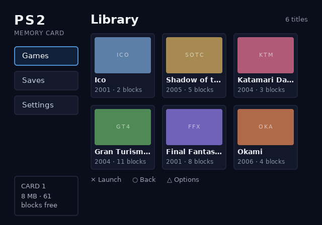

# OPHTML / ps2ui

Build PlayStation 2 homebrew UIs from HTML and CSS.

The toolchain does all the heavy lifting on your build machine: parsing, flexbox layout, text wrapping, D-pad navigation, and chrome rasterization. The output is a single `.uib` blob that a small C99 runtime replays through [gsKit]. The PS2 itself never parses, lays out, rasterizes, or allocates.

Originally built for UIs shipped on an SD2PSX / PSxMemCard GEN2 virtual memory card. Works for any PS2 homebrew project.

```
ui/*.html,css -> @ps2ui/layout -> ui.json (IR) -> ps2ui-bake -> ui.uib -> runtime (C99 + gsKit)
                 Node, zero deps                  Python, Pillow only
```



The image above comes from the Python previewer, which replays the baked command list with the same quad order, scissor stack, CLUT lookups, and GS alpha domain the console uses. It can also render [every focus state on one sheet](examples/memcard/screenshots/states.png).

## Quick start

Requirements:

- Node 18+
- Python 3 with Pillow
- A C compiler for the host tests
- DejaVu Sans, or point `fonts/fonts.json` at your own TTF

```sh
# compile HTML+CSS to the IR
node packages/layout/bin/ps2ui-layout.js \
    examples/memcard/ui/library.html examples/memcard/ui/library.css \
    -o build/library.json

# bake the IR into a console blob, plus a verification PNG
PYTHONPATH=packages/baker python3 -m ps2ui_bake build/library.json \
    -o build/ui.uib --preview build/preview.png

# or run both stages plus all tests for the example:
./examples/memcard/build.sh

# or live-rebuild on every edit (~200ms per build):
node packages/layout/bin/ps2ui-dev.js \
    examples/memcard/ui/library.html examples/memcard/ui/library.css -o build/dev
```

Console side: drop `runtime/ps2ui.c` and `runtime/ps2ui.h` into your ps2sdk/gsKit project.

```c
ps2ui_ctx ui;
ps2ui_load(&ui, uib_data, uib_len);   /* validates, points into the blob */
ps2ui_upload(&ui, gsGlobal);          /* textures + CSM1-permuted CLUTs  */

/* per frame */
ps2ui_render(&ui, gsGlobal);
if (pad_pressed & PAD_RIGHT) ps2ui_move(&ui, PS2UI_RIGHT);
if (pad_pressed & PAD_CROSS) launch(ps2ui_focus_name(&ui));
```

## Supported CSS

- Flexbox: direction, wrap, grow/shrink/basis, gap, justify/align
- Box model (border-box): padding, margin, borders, border-radius (baked as nine-patch textures)
- Flat colors with real translucency
- `font-size`, `font-weight`, `line-height`, `letter-spacing`, `text-align`
- `white-space: nowrap` with `text-overflow: ellipsis`
- `overflow: hidden` (GS scissor), `display: none`
- ``, see below
- `:focus` as a paint-only state. A `:focus` rule that changes geometry is a compile error.

Unknown properties warn. Unsupported values error with line numbers.

## Images

- Keep art in an `assets/` folder next to your HTML: `` (PNG only at build time)
- Paths resolve relative to the HTML document
- The baker decodes, pre-scales to the laid-out size, and packs the pixels into the `.uib`. The console never touches a filesystem
- Add the `palettize` attribute (or bake with `--palettize-images`) to quantize an image to 8-bit indexed + CLUT. 4x less VRAM per texel for art within 256 colors
- One deliberate CSS deviation: flex `stretch` never distorts an image's aspect ratio. Give it an explicit size if you want stretching

## Dynamic text

A real memory card browser reads its titles off the card at runtime, so baked strings alone don't cut it. Mark an element with `data-slot`:

```html
<p class="title" data-slot="save-0" data-slot-capacity="31">Placeholder</p>
```

```c
ps2ui_slot_set(&ui, "save-0", title_from_card);
```

The runtime composes glyph quads each frame from a baked glyph table, using the same advances and baseline as static text. The example preview is pixel-identical either way. Geometry, font, colors, and ellipsis policy stay compile-time. Fixed per-slot buffers, no allocation.

`.uib` files carry a CRC-32 and feature flags, so an older runtime rejects a newer blob with a clear error instead of misrendering it.

## Multiple screens

Pass several IR files to one bake:

```sh
ps2ui-bake library.json saves.json -o ui.uib
```

- Each file becomes a named screen in the same blob (name = file stem)
- Textures, atlases, and font tables are shared across screens
- `ps2ui_screen_set(&ui, "saves")` switches instantly
- Each screen remembers its own focus position

The example ships two screens ([saves screen](examples/memcard/screenshots/saves.png)).

## Focus and navigation

- Mark elements `focusable`, one per screen `autofocus`
- The compiler solves the spatial navigation graph at build time; the runtime walks it with table lookups
- `--focus-wrap` adds wrap-around edges (right off a row's end lands on its start)
- `ps2ui_focus_set(ctx, "name")` moves focus programmatically

Targeting PAL? `--mode pal` sets the 640x512 canvas and adjusts the CRT linter's safe areas.

## CRT linter

Your desktop preview won't show you what a 2001 television does. The compiler warns about:

- Text outside the title-safe area (overscan)
- Fonts under 14px
- 1px horizontal lines (interlace flicker)
- Saturated reds (NTSC composite bleed)
- Low-contrast text
- Focusables unreachable by D-pad

## Repository layout

| path | what |
|------|------|
| `packages/layout` | HTML/CSS to `ui.json`. Node, zero dependencies. |
| `packages/baker`  | `ui.json` to `ui.uib` plus PNG previews. Python, Pillow only. |
| `runtime`         | `.uib` loader, gsKit replay, D-pad nav. C99, no allocation. |
| `fonts`           | metrics JSON (the layout/baker seam) and `ps2ui-fontgen`. |
| `docs`            | [architecture](docs/architecture.md) / [IR format](docs/format-ir.md) / [.uib format](docs/format-uib.md) |
| `examples/memcard`| the two-screen memory card browser from the screenshots. |
| `examples/channel6`| a [game browser for a PSxMemCard GEN2 channel](examples/channel6/README.md), plus a feature probe screen for console bring-up. |

The two interchange formats are fully documented, so any stage can be swapped out for another implementation.

## Tests

```sh
cd packages/layout && node --test test/*.test.js
cd packages/baker  && python3 -m unittest discover -s tests
cd runtime         && make test test-compat
```

The runtime test compiles the real `ps2ui.c` with `-Werror` against a stub gsKit and runs it over a real baked blob. It checks struct layouts against the file format, blob validation, CRC, the CSM1 permutation, focus-state draw cost, screen switching, and the D-pad walk. `test-compat` repeats everything with `PS2UI_GSKIT_HAS_FUNCTION=0` for older gsKit (text loses tinting).

## Status

The host toolchain is verified end to end, and CI builds a bootable PS2 ELF with the ps2dev toolchain. Nothing has run on real hardware yet. For a first console or emulator run, follow [docs/bringup.md](docs/bringup.md). `runtime/sample/` is the standalone ELF for it, and `tools/make_testcard.py` builds a texel-alignment card.

See [docs/architecture.md](docs/architecture.md) for the decision log.

## Roadmap

Rough priority order. Scoring and detail live in [BACKLOG.md](BACKLOG.md).

- [ ] First run on real hardware / PCSX2 ([docs/bringup.md](docs/bringup.md) is the procedure)
- [ ] Working emulator screenshot job in CI
- [ ] Precompiled GIF/DMA chains for near-zero CPU per frame
- [ ] List templating and scrolling for data taller than the screen
- [ ] Kerning
- [ ] `position: absolute` for overlays and dialogs
- [ ] Localization workflow (per-locale builds)
- [ ] npm / PyPI releases
- [x] Dynamic text slots, multi-screen blobs, images with palettization (0.2.0)

## License

MIT, see [LICENSE](LICENSE).

[gsKit]: https://github.com/ps2dev/gsKit
