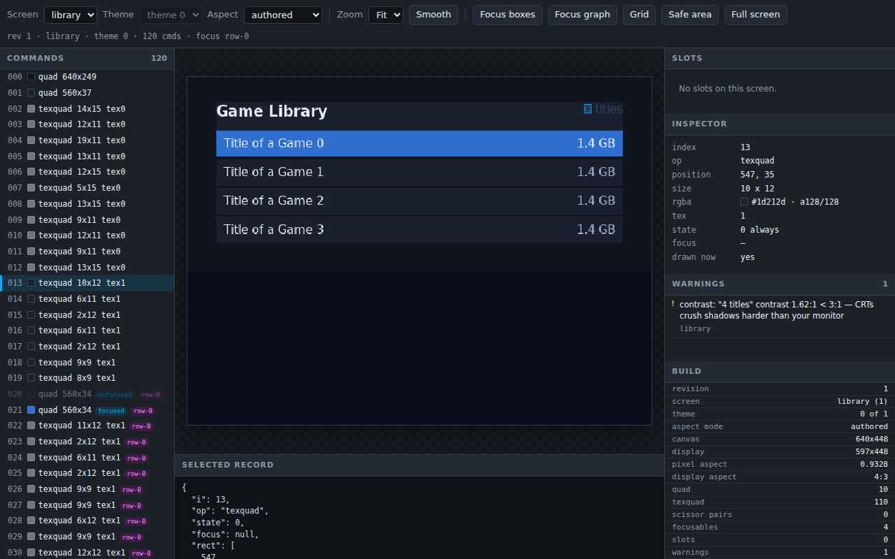

# CRT linter

Eight rules read every compiled screen and report what a desktop preview cannot show. Overscan crops the edges. Interlacing makes a 1px line shimmer. Composite video smears saturated red.

## What it is

The linter runs inside [ps2ui-layout](page:cli/ps2ui-layout#options) on every compile. No flag turns it on.

Each rule reads the display list and the focus graph after layout. Slot text is linted too, because a `data-slot` placeholder is spliced back into the list the linter sees.

Every rule is a warning. A warning goes to stderr as one `warning: <rule>: <message>` line and changes no output file. Pass `--strict` to turn any warning into exit 1.

`ps2ui serve` lists the same warnings beside the frame they came from.



## Minimal example

The demo project pairs [library.html](repo:docs/site/assets/authoring/crt-linter/demo/ui/library.html) with [library.css](repo:docs/site/assets/authoring/crt-linter/demo/ui/library.css). Its header count is painted in a colour close to the panel behind it.

```css
.header  { flex-direction: row; padding-bottom: 12px; background: var(--panel); }
.count   { font-size: 16px; color: #39425a; }
```

```sh
ps2ui-layout ui/library.html ui/library.css --fonts fonts/fonts.json -o build/library.json
```

```text
warning: contrast: "4 titles" contrast 1.62:1 < 3:1 — CRTs crush shadows harder than your monitor
ps2ui-layout: 24 paint commands, 4 focusables -> build/library.json
```

The fix is the colour, not the rule. Point `.count` at the sheet's dim ink.

```css
.count   { font-size: 16px; color: var(--dim); }
```

```sh
ps2ui-layout ui/library.html ui/library.css --fonts fonts/fonts.json --strict -o build/library.json
```

```text
ps2ui-layout: 24 paint commands, 4 focusables -> build/library.json
```

## Reference table

One screen trips every rule at once. Save it as `ui/kitchen.html` and `ui/kitchen.css`, with any PNG beside it as `ui/cover.png`.

```html
<screen name="kitchen">
  <div class="screen">
    <p class="tiny">Fine print</p>
    <div class="hair"></div>
    <div class="redbox"></div>
    <div class="dim"><p class="ink">Nearly invisible</p></div>
    <p class="cjk">設定</p>
    <div class="chip" id="chip" focusable autofocus>OK</div>
    <div class="wide" id="wide" focusable>Overhang</div>
    <div class="round"></div>
    
  </div>
</screen>
```

```css
.screen  { flex-direction: column; background: #0a0e1a; gap: 4px; }
.tiny    { font-size: 9px; color: #f2f5fa; }
.hair    { height: 1px; background: #f2f5fa; }
.redbox  { height: 8px; background: #e01020; }
.dim     { flex-direction: column; background: #808080; height: 24px; }
.ink     { font-size: 16px; color: #858585; }
.cjk     { font-size: 18px; color: #f2f5fa; }
.chip    { width: 20px; height: 20px; font-size: 16px; color: #f2f5fa; }
.wide    { width: 700px; height: 30px; font-size: 16px; color: #f2f5fa; }
.round   { height: 20px; background: #223046; border-radius: 12px; }
```

```sh
ps2ui-layout ui/kitchen.html ui/kitchen.css --fonts fonts/fonts.json --mode ntsc16x9 -o build/kitchen.json
```

```text
warning: aspect-distortion: 1 rounded corner(s) draw 24% wider than tall at PAR 1.2444; divide the radius by 1.244 to look round
warning: aspect-distortion: 1 image(s) draw 24% wider than tall at PAR 1.2444; pre-squash the art or set an explicit width
warning: min-font-size: "Fine print" is 9px; below 14px is unreadable from a couch
warning: overscan: text "Fine print" at (0,0) leaves the title-safe area; a CRT may crop it
warning: interlace-flicker: 1px line at (0,15) will shimmer on an interlaced CRT; use 2px
warning: ntsc-red-bleed: saturated red fill rgb(224,16,32) at (0,20) smears on composite video
warning: overscan: text "Nearly invisible" at (0,32) leaves the title-safe area; a CRT may crop it
warning: contrast: "Nearly invisible" contrast 1.07:1 < 3:1 — CRTs crush shadows harder than your monitor
warning: overscan: text "設定" at (0,61) leaves the title-safe area; a CRT may crop it
warning: charset: codepoint U+8A2D in "設定": non-Latin text wrapping is untested
warning: overscan: text "OK" at (0,87) leaves the title-safe area; a CRT may crop it
warning: overscan: text "Overhang" at (0,111) leaves the title-safe area; a CRT may crop it
warning: focus-target-size: focusable "chip" is 20x20px; smaller than 24px is hard to see highlighted from 3 meters
warning: overscan: focusable "wide" extends past the action-safe area
ps2ui-layout: 11 paint commands, 2 focusables -> build/kitchen.json
```

| rule | threshold | message | opt-out |
|---|---|---|---|
| `aspect-distortion` | pixel aspect further than 0.08 from 1.0; counted once per document over rects with a radius and over images | `N rounded corner(s) draw P% wider than tall at PAR X; divide the radius by Y to look round`, and `N image(s) draw P% wider than tall at PAR X; pre-squash the art or set an explicit width`. A pixel aspect below 1.0 reads `narrower` in place of `wider` | none; change the mode or the display aspect |
| `interlace-flicker` | a 1px border, or a filled rect 1px tall | `1px line at (x,y) will shimmer on an interlaced CRT; use 2px` | none; use 2px |
| `ntsc-red-bleed` | a fill with red above 200 and both green and blue below 80 | `saturated red fill rgb(r,g,b) at (x,y) smears on composite video` | none; desaturate the fill |
| `min-font-size` | text below 14px, or below the `--min-font-size` value | `"TEXT" is Npx; below Mpx is unreadable from a couch` | none; raise the floor |
| `overscan` (text) | the text origin inside the 5% title-safe inset, or its bottom past the inset | `text "TEXT" at (x,y) leaves the title-safe area; a CRT may crop it` | none |
| `overscan` (focusable) | the focusable's right or bottom edge past the canvas edge | `focusable "NAME" extends past the action-safe area` | none |
| `charset` | a codepoint above U+24FF outside five allowed blocks; at most one per text run | `codepoint U+XXXX in "TEXT": non-Latin text wrapping is untested` | none |
| `contrast` | a ratio below 3.0 against the composited background | `"TEXT" contrast R:1 < 3:1 — CRTs crush shadows harder than your monitor` | `data-nocontrast` |
| `focus-target-size` | a focusable narrower or shorter than 24px | `focusable "NAME" is WxHpx; smaller than 24px is hard to see highlighted from 3 meters` | none |

The five blocks `charset` allows are U+2000-206F, U+2190-21FF, U+2200-22FF, U+25A0-25FF and U+2700-27BF. Face-button glyphs and D-pad arrows live there and stay quiet.

[ps2ui-check](page:cli/ps2ui-check#output) adds three more, read from the blob rather than the document. They are advisory, like the compiler's rules, and a blob that trips them still exits 0 without `--strict`.

```sh
ps2ui-check examples/memcard/build/ui.uib
```

```text
...
ok 61 - no 1px quads to shimmer on an interlaced CRT
ok 62 - every command can produce a pixel
ok 63 - every texture is drawn or belongs to a font
...
```

| label | severity | flag |
|---|---|---|
| `no 1px quads to shimmer on an interlaced CRT` | warning | `--allow-hairline N` |
| `every command can produce a pixel` | warning | `--allow-dead N` |
| `every texture is drawn or belongs to a font` | warning | none |

Both flags are exact counts, not ceilings. Declaring more instruments than the blob holds is itself a warning, so a deleted test quad cannot pass unnoticed.

```sh
ps2ui-check --strict --allow-hairline 1 examples/memcard/build/ui.uib
```

```text
...
ok 61 - 0 1px quad(s), but 1 declared deliberate (--allow-hairline): 1 of the instruments that count names is gone, and the check can no longer see what it measures # TODO warning
...
FAIL: 63 checks, 0 error(s), 1 warning(s)
```

## Behaviour

### Contrast

The rule composites every rect that contains the text's origin, in paint order, and measures the WCAG ratio against the result. Reading the innermost rect alone would score a translucent scrim as though it were opaque.

When transparency survives the whole stack the true backdrop is unknowable at build time. The rule brackets it, measures against black and against white, and reports the worse of the two.

```html
<div class="screen">
  <div class="scrim"><p class="label">Now playing</p></div>
</div>
```

```css
.screen { flex-direction: column; padding: 40px; }
.scrim  { flex-direction: column; background: rgba(0, 0, 0, 0.6); padding: 12px; }
.label  { font-size: 20px; color: #555555; }
```

```sh
ps2ui-layout ui/scrim.html ui/scrim.css --fonts fonts/fonts.json -o build/scrim.json
```

```text
warning: contrast: "Now playing" contrast 1.30:1 < 3:1, over a bright frame showing through the 40%-transparent background — CRTs crush shadows harder than your monitor
ps2ui-layout: 2 paint commands, 0 focusables -> build/scrim.json
```

A node's focused background and its unfocused text never share a frame, so the rule never stacks one under the other. Only matching states composite. Colour forms and translucency are on [CSS](page:authoring/css#colours).

`data-nocontrast` is the only per-rule opt-out in the compiler. It silences `contrast` on one element's own text and does not cascade to child elements.

```html
<div class="blk" data-nocontrast>
  <p class="ink">MMMM</p>
</div>
```

```css
.blk { flex-direction: column; background: #7a5c3e; padding: 20px; }
.ink { color: #7a5c3e; font-size: 16px; }
```

```sh
ps2ui-layout ui/nc-parent.html ui/nc.css --fonts fonts/fonts.json -o build/nc.json
```

```text
warning: overscan: text "MMMM" at (20,20) leaves the title-safe area; a CRT may crop it
warning: contrast: "MMMM" contrast 1.00:1 < 3:1 — CRTs crush shadows harder than your monitor
ps2ui-layout: 2 paint commands, 0 focusables -> build/nc.json
```

Move the attribute onto the `<p>` that holds the text. The contrast line goes and `overscan` stays.

```sh
ps2ui-layout ui/nc-own.html ui/nc.css --fonts fonts/fonts.json -o build/nc.json
```

```text
warning: overscan: text "MMMM" at (20,20) leaves the title-safe area; a CRT may crop it
ps2ui-layout: 2 paint commands, 0 focusables -> build/nc.json
```

### Strict

`--strict` counts warnings, not rules. It promotes every warning the compile produced, CSS warnings included, and no rule can be made strict on its own.

`--min-font-size PX` is the only lint threshold any command line writes. The contrast floor of 3.0, the distortion limit of 0.08 and the 5% safe inset have no flag and no project key.

The canvas flags reach the lints indirectly. The safe inset is 5% of the canvas, so `--mode pal` moves it, and the distortion rule reads the pixel aspect the mode sets. Modes and aspects are on [video modes](page:authoring/video-modes).

The project key `minFontSize` forwards to the same flag on `ps2ui build`.

### Per theme

Lints run once over the root row and once over every later theme row. A later row's line carries an `@theme <name>: ` prefix.

`contrast` and `ntsc-red-bleed` read colour, so a theme can change their verdict. Those two are reported per row. Every other rule produces the same line in every row and is reported once.

```html
<div class="panel">
  <p class="ink">Now playing</p>
  <p class="fine">5 titles</p>
</div>
```

```css
:root { --panel: #101623; --ink: #f2f5fa; }
@theme light { --panel: #f4f6fa; --ink: #ffffff; }
.panel { flex-direction: column; width: 400px; background: var(--panel); padding: 40px; }
.ink   { color: var(--ink); font-size: 16px; }
.fine  { color: var(--ink); font-size: 9px; }
```

```sh
ps2ui-layout ui/theme.html ui/theme.css --fonts fonts/fonts.json -o build/theme.json
```

```text
warning: min-font-size: "5 titles" is 9px; below 14px is unreadable from a couch
warning: @theme light: contrast: "Now playing" contrast 1.08:1 < 3:1 — CRTs crush shadows harder than your monitor
warning: @theme light: contrast: "5 titles" contrast 1.08:1 < 3:1 — CRTs crush shadows harder than your monitor
ps2ui-layout: 3 paint commands, 0 focusables -> build/theme.json
```

## Limits and errors

`ps2ui dev` and `ps2ui-dev` accept `--strict` and `--min-font-size` and act on neither. The watch loop sets them on the wrong object. The compiler reads lint overrides from one field the flags never reach. This is a defect, queued as a separate change. Lint against `ps2ui build` until it lands.

The example project sets `strict: true` and `minFontSize: 11`. The build honours both and reports nothing.

```sh
cd examples/opl-env
ps2ui build
```

```text
ps2ui-layout: 31 paint commands, 7 focusables -> build/landing.json
ps2ui-layout: 84 paint commands, 17 focusables -> build/library.json
...
```

The watch loop forwards the same two settings and prints 44 warnings measured against the 14px default.

```sh
ps2ui dev --screen library --once
```

```text
built in 486ms — 84 commands, 17 focusables, 44 warnings -> build/dev/preview.png
  warning: min-font-size: "Title of a Game 1" is 13px; below 14px is unreadable from a couch
...
```

Three further limits change what a rule reports.

- The focusable form of `overscan` names the action-safe area and tests the canvas edge. A focusable 640px wide on a 640x448 canvas passes, and 641px warns.
- The `Safe area` overlay in `ps2ui serve` draws a 10% inset. The `overscan` rule uses 5%, so the overlay is not the rectangle the rule enforces.
- A warning listed in `ps2ui serve` carries a screen name and no command index. Clicking it switches screen when the warning belongs to another one, and never selects a command.

Every message this page shows, with its cause and its fix, is indexed on [diagnostics](page:reference/diagnostics).

## Related pages

- [ps2ui-layout](page:cli/ps2ui-layout#options) for `--strict`, `--min-font-size` and the exit codes
- [ps2ui-check](page:cli/ps2ui-check#output) for the blob-side CRT checks and the allow flags
- [Video modes](page:authoring/video-modes) for the canvas, the pixel aspect and the distortion the linter measures
- [CSS](page:authoring/css#colours) for colour forms, translucency and the `:focus` paint delta
- [Diagnostics](page:reference/diagnostics) for every message in the toolchain
