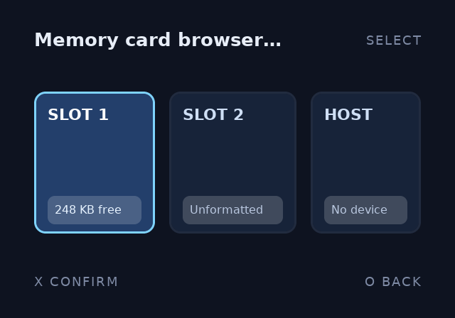
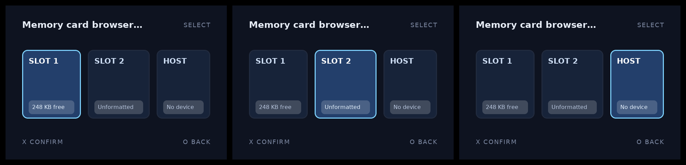

# CSS

`ps2ui-layout` reads one stylesheet per screen and resolves it once, at build time. There is no runtime cascade, no media query and no user agent sheet. Every element starts from one frozen initial style and the sheet moves it from there.

## What it is

A deliberate subset of CSS. The layout model is flexbox and border-box, so `width` and `height` include padding and border. Colours are flat. Geometry is baked into the blob, so anything that would need to be re-resolved on the console is refused rather than half-honoured.

Two rules have no CSS equivalent. `flex-direction` is required on any container that lays out two or more children. A `:focus` rule may not change geometry, because both focus states share one baked layout.

This screen is compiled from a sheet using rounded corners, a translucent fill over an opaque one, an ellipsized title and a `:focus` delta:



Its source is [demo.html](repo:docs/site/assets/authoring/css/demo/demo.html) and [demo.css](repo:docs/site/assets/authoring/css/demo/demo.css).

## Minimal example

A twelve-line sheet covering the flex axis, the box model, a border, a focus delta and an ellipsis:

```css
.screen { flex-direction: column; padding: 32px; gap: 12px;
          background: #0e1320; color: #e8eef8; font-size: 18px }
.title { font-size: 26px; font-weight: bold; letter-spacing: 2px }
.list { flex-direction: column; gap: 8px; overflow: hidden }
.row { flex-direction: row; align-items: center; height: 48px;
       padding: 0 16px; border: 2px solid #222b40; border-radius: 8px;
       background: #182339 }
.row:focus { background: #24406b; border-color: #7fd4ff }
.row:focus .name { color: #ffffff }
.name { flex-grow: 1; white-space: nowrap; text-overflow: ellipsis }
.size { color: #7f8ca6; font-size: 16px }
.empty { opacity: 0.5 }
```

Compile it against a document with two `focusable` rows:

```
$ ps2ui-layout min.html min.css --fonts fonts/fonts.json -o min.json
ps2ui-layout: 15 paint commands, 2 focusables -> min.json
```

Fifteen commands for six elements, because `.row:focus` splits each row into an `unfocused` and a `focused` pair and `overflow: hidden` adds a scissor bracket.

## Reference table

Every property below is a `case` in `applyDeclaration`. Anything else warns and is dropped.

Layout:

| property | values | default | notes |
|---|---|---|---|
| `display` | `flex`, `none` | `flex` | Any other value is an error. `none` drops the element and its whole subtree. |
| `flex-direction` | `row`, `row-reverse`, `column`, `column-reverse` | none | Required. See [the two hard rules](#the-two-hard-rules). |
| `flex-wrap` | `nowrap`, `wrap` | `nowrap` | Only `wrap` changes the result. |
| `justify-content` | `flex-start`, `flex-end`, `center`, `space-between`, `space-around` | `flex-start` | Main axis. |
| `align-items` | `flex-start`, `flex-end`, `center`, `stretch` | `stretch` | Cross axis. `stretch` skips an ``, see [images](page:authoring/images#behaviour). |
| `align-self` | `auto`, plus the `align-items` values | `auto` | Overrides the parent for one item. |
| `flex-grow` | number | `0` | |
| `flex-shrink` | number | `1` | |
| `flex-basis` | px, `%`, `auto` | `auto` | |
| `flex` | `none`, or `<grow> [<shrink>] [<basis>]` | | Shorthand. `flex: 1` is grow 1, shrink 1, basis `0px`. |
| `gap` | one or two px lengths | `0` | Row gap first, column gap second. One value sets both. |
| `row-gap`, `column-gap` | px | `0` | |
| `width`, `height` | px, `%`, `auto` | `auto` | Border-box: the value includes padding and border. |
| `min-width`, `min-height`, `max-width`, `max-height` | px, `%`, `auto` | unset | Clamp the used size on that axis. |
| `overflow` | `visible`, `hidden` | `visible` | `hidden` brackets the children with a scissor pair. |

Box:

| property | values | default | notes |
|---|---|---|---|
| `padding` | 1 to 4 px lengths | `0` | Expands in CSS order: top, right, bottom, left. |
| `padding-top`, `padding-right`, `padding-bottom`, `padding-left` | px | `0` | |
| `margin` | 1 to 4 px lengths | `0` | Margins do not collapse. |
| `margin-top`, `margin-right`, `margin-bottom`, `margin-left` | px | `0` | |

Border:

| property | values | default | notes |
|---|---|---|---|
| `border` | `<width> solid <color>`, or `none` | | `solid` is the only style. A `var()` token is accepted here. |
| `border-width` | px | `0` | Grows inward, border-box. |
| `border-color` | a colour, or `var(--name)` | unset | A zero-width or transparent border emits no border. |
| `border-radius` | one px length | `0` | One value only. Clamped to half the shorter side at emission. |

Colour:

| property | values | default | notes |
|---|---|---|---|
| `background`, `background-color` | a colour, `none`, `transparent`, or `var(--name)` | none | Flat colours only. A gradient is a texture to bake. |
| `color` | a colour, or `var(--name)` | `white` | Inherits. Carries its `var()` name to children. |
| `opacity` | `0` to `1` | `1` | Clamped. Multiplies into the alpha of this element's fill, border and text. |

`var()`, `:root` and `@theme` belong to [theming](page:authoring/theming#what-it-is).

Text:

| property | values | default | notes |
|---|---|---|---|
| `font-size` | px | `16` | Inherits. |
| `font-weight` | `normal`, `bold`, or a number | `400` | Inherits. 600 and above selects the bold face, see [text and fonts](page:authoring/text-and-fonts#faces-and-weights). |
| `line-height` | px, a bare number, or `%` | `1.25` | Inherits. A bare number multiplies the font size; `%` is divided by 100 first. |
| `letter-spacing` | px | `0` | Inherits. Added between glyphs, after kerning. |
| `text-align` | `left`, `center`, `right` | `left` | Inherits. |
| `white-space` | `normal`, `nowrap` | `normal` | Inherits. `nowrap` suppresses wrapping. |
| `text-overflow` | `clip`, `ellipsis` | `clip` | `ellipsis` needs `white-space: nowrap`, see [text and fonts](page:authoring/text-and-fonts#ellipsis). |

### Units

| unit | accepted by | notes |
|---|---|---|
| `px` | every length property | The only unit `gap`, `padding`, `margin`, `border-width`, `border-radius`, `font-size` and `letter-spacing` take. |
| `%` | `width`, `height`, `min-*`, `max-*`, `flex-basis`, `line-height` | Resolved against the container's content box. On `line-height` it becomes a multiplier. |
| `auto` | `width`, `height`, `min-*`, `max-*`, `flex-basis` | |
| bare number | `flex-grow`, `flex-shrink`, `line-height`, `opacity`, `font-weight`, and the size properties | A bare number on a size is used as pixels. On a px-only property it is refused by name, except `0`. |
| `em`, `rem`, `vw`, `vh`, `ch` | nothing | Not a length. The error names the token. |

### Colours

| form | example | notes |
|---|---|---|
| named | `black`, `white`, `red`, `green`, `blue`, `gray`, `grey`, `transparent` | The whole set. `green` is `0,128,0`; `gray` and `grey` are both `128,128,128`. |
| `#rgb` | `#abc` | Each digit doubled. Alpha 255. |
| `#rgba` | `#abcd` | Fourth digit is alpha. |
| `#rrggbb` | `#aabbcc` | Alpha 255. |
| `#rrggbbaa` | `#aabbccdd` | |
| `rgb()` | `rgb(10, 20, 30)`, `rgb(50%, 0%, 100%)` | Three channels, each a number or a percentage. |
| `rgba()` | `rgba(255, 255, 255, 0.18)` | Alpha is 0 to 1 and scales to 0 to 255. |

Any other name is an error. `orange` does not compile.

## Behaviour

### Selectors and the cascade

The grammar is the type selector, `.class`, `#id`, `*` and a compound of those. Whitespace is the descendant combinator. `:focus` may sit on any compound, and a selector list is comma-separated. Nothing else parses. The child, sibling and attribute combinators are errors:

```
$ ps2ui-layout one.html child.css --fonts fonts/fonts.json -o x.json
error: css: unsupported selector syntax near ">" in ">"
```

Specificity is the usual `(id, class, type)` triple summed over every compound, with source order as the tiebreak. `*` contributes nothing. `:focus` counts as a class, so `.card:focus` is `(0, 2, 0)` and beats `div:focus` at `(0, 1, 1)` whatever order they are written in.

### Inheritance

Seven properties inherit: `color`, `font-size`, `font-weight`, `line-height`, `text-align`, `white-space` and `letter-spacing`. The `var()` name behind `color` inherits with it, so a theme moves a parent and its inheriting children together. Everything else resets to the initial value, `background` and `border` included.

The focus pass inherits from the parent's focus style. A focused row recolours the text inside it without the child carrying a `:focus` rule of its own.

### The two hard rules

`flex-direction` is required on any container laying out two or more children. A container with one child or none is never asked, because the answer cannot change what is drawn. Every offender is reported at once, sorted by line:

```
$ ps2ui-layout undirected.html undirected.css --fonts fonts/fonts.json -o x.json
error: layout: 2 container(s) lay out two or more children without stating flex-direction:
  <div> line 1 (2 children)
  <div> line 3 (2 children)
There is no default. CSS's initial value is row, ps2ui once used column, so either silent answer is wrong for half of all authors — add flex-direction: row or column to each.
```

`:focus` is a paint-only delta. A `:focus` rule that sets any of 33 geometry properties is a compile error naming the property and the line:

```
$ ps2ui-layout f.html fgeo.css --fonts fonts/fonts.json -o x.json
error: css: line 2: :focus may not change "width" — focus is a paint-only delta. Both states share one baked layout; move the geometry to the base rule.
```

The guarded set is 33 properties:

| group | guarded properties |
|---|---|
| flex | `display`, `flex-direction`, `flex-wrap`, `justify-content`, `align-items`, `align-self`, `flex-grow`, `flex-shrink`, `flex-basis` |
| size | `width`, `height`, `min-width`, `min-height`, `max-width`, `max-height` |
| spacing | `gap`, `row-gap`, `column-gap`, `padding` and its four sides, `margin` and its four sides, `border-width` |
| text metrics | `font-size`, `line-height`, `white-space` |
| other | `overflow`, `position` |

A paint property passes:

```
$ ps2ui-layout f.html fweight.css --fonts fonts/fonts.json -o x.json
...
ps2ui-layout: 2 paint commands, 1 focusables -> x.json
```

Every focus state of the demo screen, drawn from one baked layout:



More on the focus graph is on [focus and navigation](page:authoring/focus-and-navigation#behaviour).

### Unvalidated keywords

Keyword values are stored verbatim. Seven properties accept any string: `flex-direction`, `flex-wrap`, `justify-content`, `align-items`, `align-self`, `text-align` and `white-space`. A misspelling falls through to the default branch of the switch that later reads it. `flex-direction: rows` compiles and lays out as a column. It also satisfies the required-direction check, which tests that a declaration exists and not that its value parses. `text-align: centre` compiles and aligns left. Both cost a screen that looks wrong with no diagnostic anywhere, so spell these values against the table above.

The checked keyword properties are `display` and `overflow`. Both refuse an unknown value by name.

### Scissor and display none

`overflow: hidden` on a non-text box wraps its children in a `scissor_push`/`scissor_pop` pair, which becomes a GS scissor rectangle. There is no scrolling, so `scroll` and `auto` are errors.

`display: none` removes the element and its subtree before layout runs. The element occupies no space and emits no commands. On the root element it is `layout: root element is display: none`.

## Limits and errors

| message | cause |
|---|---|
| `css: unsupported selector syntax near "<c>" in "<s>"` | A combinator or pseudo-class outside the grammar, such as `>`, `+` or `:hover`. |
| `css: line <n>: malformed declaration "<d>"` | A declaration with no colon. |
| `css: line <n>: selector without a block` | The sheet ends after a selector. |
| `css: line <n>: unterminated block` | A `{` with no matching `}`. |
| `css: line <n>: unterminated comment` | A `/*` with no matching `*/`. |
| `css: line <n>: <p>: "<v>" is not a length` | A unit the parser does not know, such as `em`, or two values where one is expected. |
| `css: line <n>: <p>: unitless "<v>" — write "<v>px"` | A bare non-zero number on a px-only property. |
| `css: line <n>: <p>: only px supported, got "<v>"` | A `%` or `auto` on a px-only property. |
| `css: line <n>: <p>: bad color "<v>"` | A colour name outside the eight, or a malformed hex or `rgb()`. |
| `css: line <n>: padding: 1-4 values` | Five or more values in a box shorthand. Same for `margin`. |
| `css: line <n>: border: unsupported token "<t>"` | A border style other than `solid` or `none`. |
| `css: line <n>: display: only "flex" and "none" exist on this target (got "<v>")` | Any other `display` value. |
| `css: line <n>: overflow: only visible\|hidden` | Any other `overflow` value. |
| `css: line <n>: opacity: bad value` | An `opacity` that is not a number. |
| `css: line <n>: :focus may not change "<p>"` | A geometry property inside a `:focus` rule. |
| `layout: N container(s) lay out two or more children without stating flex-direction:` | One or more containers with two or more children and no `flex-direction`. |
| `layout: root element is display: none` | `display: none` matched the root element. |
| `css: line <n>: property "<p>" not supported on this target; ignored` | Warning. An unknown property, `position` included. |
| `css: line <n>: at-rule "<a>" ignored` | Warning. Any at-rule other than `@theme`. |

Every message above is listed with its stage and fix in [diagnostics](page:reference/diagnostics#css).

Three gaps are worth writing down. A `:focus` compound that matches no `focusable` element is dropped in silence. A typo in the class name and a missing attribute look the same. `font-weight` inside a `:focus` rule reaches the focused command. The line was measured at the base weight, so a focused bold run can overrun its box. `letter-spacing`, `text-align` and `text-overflow` inside a `:focus` rule are accepted and then discarded at emission. All four properties sit outside the geometry guard.

## Related pages

| page | why |
|---|---|
| [HTML](page:authoring/html#what-it-is) | the elements and attributes a selector can match |
| [Theming](page:authoring/theming#what-it-is) | `:root`, `@theme`, `var()` and the tint table |
| [Text and fonts](page:authoring/text-and-fonts#what-it-is) | measuring, kerning, wrapping and the ellipsis |
| [Images](page:authoring/images#what-it-is) | intrinsic sizing and the stretch deviation |
| [Focus and navigation](page:authoring/focus-and-navigation#what-it-is) | `focusable`, the solver and reachability |
| [CRT linter](page:authoring/crt-linter#what-it-is) | contrast, overscan and minimum font size |
| [ps2ui-layout](page:cli/ps2ui-layout#options) | the flags that change the canvas and the lint floor |
| [ui.json](page:reference/ir-format#layout) | what a resolved sheet becomes |
