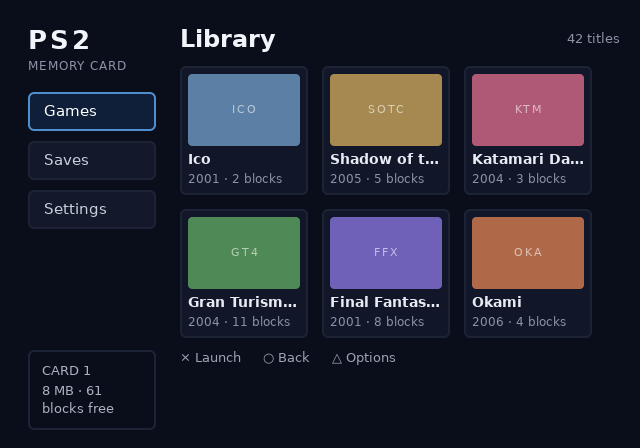

# Dynamic text

## What it is

A slot is one line of text the console writes at runtime. Mark the
element with `data-slot` and give the slot a name. The text inside the
element becomes the placeholder, drawn until the app calls
`ps2ui_slot_set`.

Everything except the string is decided at compile time. The slot's
position, width, font, size, weight, letter-spacing, alignment,
ellipsis policy and both colours travel in the blob. The runtime walks
the baked glyph table. It composes quads with the pen the baker used,
so runtime text matches the baked text beside it.

Reserve the bytes with `data-slot-capacity`. Leave it off and the slot
gets 63 bytes.

## Minimal example

From the tutorial's `ui/library.html`:

```html
<span class="count" data-slot="count" data-slot-capacity="16">0 titles</span>
```

The app fills it each frame:

```c
ps2ui_slot_set(&ui, "count", count_text);
```

The memcard example does the same on its library screen. Rendering that
screen with the slot set shows the runtime string in place of the baked
one:



## Reference table

| attribute | effect |
|---|---|
| `data-slot="<name>"` | Turns the element's text into a runtime slot under that name. The name must be non-empty and unique across every screen in the blob. |
| `data-slot-capacity="<bytes>"` | Bytes the runtime reserves for the string, terminator excluded. Defaults to 63. Must fit a uint16. |

Two runtime calls reach a slot. Both take the slot name and search the
whole blob.

| function | effect |
|---|---|
| `ps2ui_slot_set(ctx, name, text)` | Copies `text` into the slot, truncated at its capacity on a UTF-8 boundary. `NULL` restores the placeholder. `""` blanks the slot. Returns 1, or 0 for an unknown name. |
| `ps2ui_slot_get(ctx, name)` | Returns the runtime string when one is set, else the placeholder. Returns NULL for an unknown name. |

The full signatures and the scope rules are on
[the C API reference](page:runtime/api-reference#slots).

## Behaviour

### What the blob carries

| baked property | authored with | what the runtime does with it |
|---|---|---|
| position and width | the element's box in CSS | fixes the pen origin and the ellipsis budget |
| font, size, weight | `font-size`, `font-weight` | selects the baked glyph table |
| letter-spacing | `letter-spacing` | added between glyphs, alongside the kern pair |
| alignment | `text-align` | shifts the pen when the run is narrower than the box |
| ellipsis | `text-overflow: ellipsis` | cuts the run and appends U+2026 |
| base and focus colour | `color` and `color` under `:focus` | picks the colour for the current focus state |
| capacity | `data-slot-capacity` | sizes the slot's buffer and bounds the copy |

The slot's font entry carries every codepoint the metrics know, plus the
ellipsis. Static text bakes only the glyphs it used. A slot cannot know
its string at bake time, so it takes the whole charset. See
[text and fonts](page:authoring/text-and-fonts#kerning) for the pen and
the kern table both stages share.

A slot draws only while its screen is current. A slot whose focus node
is hidden is skipped.

### Truncation

`ps2ui_slot_set` copies at most `capacity` bytes, then drops a trailing
partial UTF-8 sequence. Capacity counts bytes, not characters. A
two-byte character costs two.

Text wider than the slot box is ellipsized when the box carries
`text-overflow: ellipsis`. The cut lands on the last glyph that leaves
room for the ellipsis and its kern pair. Without that property the whole
run is drawn and the enclosing scissor clips it.

### Names

Slot names resolve over the whole blob. `ps2ui_slot_set` walks every
slot in the file and takes the first match. A name repeated on two
screens would leave the second slot unreachable. The baker refuses that
blob. Prefix per-screen readouts with the screen name, as
`runtime/sample/main.c` does.

Slot names are not focus-node names and share no namespace with them.
Refilling a row of a list is a slot write per row, driven by
[the list window](page:authoring/lists#behaviour).

## Limits and errors

| message | stage | cause | fix |
|---|---|---|---|
| `layout: <tag> line N: data-slot needs a name` | compile | `data-slot=""` | name the slot |
| `layout: <tag> line N: a data-slot element must contain exactly one text node (the placeholder), no child elements` | compile | an element child, or no child at all | move the markup outside the slot element |
| `layout: data-slot "<name>" placeholder wraps to N lines ...` | compile | the placeholder does not fit on one line | add `white-space: nowrap` or widen the box |
| `layout: duplicate data-slot name "<name>"` | compile | one document uses a name twice | rename one |
| `slot name '<n>' is on screen '<a>' and screen '<b>' ...` | bake | two screens share a name | prefix each with its screen |
| `slot '<name>': capacity <n> does not fit the format's uint16 capacity field.` | bake | capacity above 65535 | lower it |
| `slot "<name>": letter-spacing <v>px does not fit the format's i16 field (-32768..32767px).` | bake | `letter-spacing` outside i16 | lower it |

A placeholder that wraps stops the compile:

```
$ ps2ui-layout err-wrap.html wrap.css --fonts fonts/fonts.json -o e2.json
error: layout: data-slot "count" placeholder wraps to 5 lines — slots are single-line; add white-space: nowrap or widen the box
```

A name shared by two screens stops the bake:

```
$ ps2ui-bake library.json saves.json -o two.uib --fonts fonts/fonts.json
ps2ui-bake: slot name 'count' is on screen 'library' and screen 'saves'; slot names resolve over the whole file, so only the first would ever be reachable from the app
```

Capacity is not clamped. The baker records what the markup asked for and
refuses only what the format cannot hold:

```
$ ps2ui-bake big.json -o big.uib --fonts fonts/fonts.json
  runtime tables: 1 textures, 1 CLUTs, 1 slots, 1 screens
error: slot 'count': capacity 70000 does not fit the format's uint16 capacity field.
```

The host previewer diverges from the console in three ways.
`preview.render(uib, slot_text=...)` draws the
string it is handed without applying the capacity, so a render can show
text the console would cut. It treats an empty override as no override
and draws the placeholder, where `ps2ui_slot_set(ctx, name, "")` blanks
the slot. The `ps2ui serve` slot box caps input at `capacity` UTF-16
code units, while the console truncates at `capacity` bytes. Typing into
that box is covered on [the previewer page](page:cli/previewer#output).

## Related pages

| page | why |
|---|---|
| [C API reference](page:runtime/api-reference#slots) | the two slot calls and their scope rules |
| [Lists](page:authoring/lists#behaviour) | refilling a window of rows |
| [Text and fonts](page:authoring/text-and-fonts#kerning) | the pen both stages run |
| [Previewer](page:cli/previewer#output) | seeing slot text without a console |
| [HTML](page:authoring/html#reference-table) | every attribute the compiler reads |
