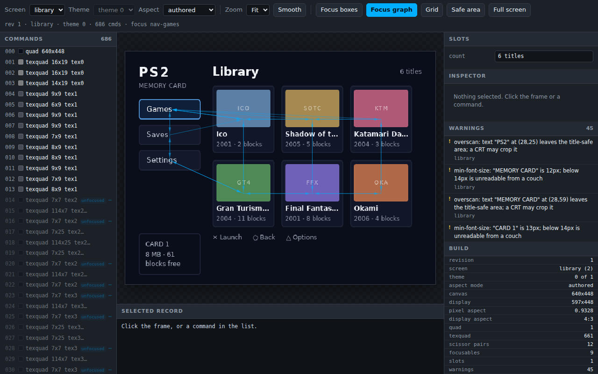

# Focus and navigation

The console has a D-pad and no pointer. Mark the elements a person can land on, and the compiler solves where every direction leads, once, at build time.

## What it is

An element carrying `focusable` becomes one focus node. The node holds the element's laid-out rectangle, a name, and four neighbour ids. `ps2ui-layout` solves the four neighbours for every node by comparing rectangles, writes them into the IR, and the baker copies them into the blob.

The runtime never measures anything. `ps2ui_move` reads one field of one struct and assigns an index. That is the whole of D-pad navigation at runtime.

Focus is also a paint state. A `:focus` rule on a focusable element compiles to a second command, paired with the unfocused one. The border below changes colour without a second layout pass. See [CSS](page:authoring/css#behaviour) for the paint side.

## Minimal example

Three tiles in a row. The first carries `autofocus`.

```html
<div class="page">
  <div class="row">
    <div class="tile" id="tile-ico" focusable autofocus>Ico</div>
    <div class="tile" id="tile-sotc" focusable>Shadow of the Colossus</div>
    <div class="tile" id="tile-gt4" focusable>Gran Turismo 4</div>
  </div>
</div>
```

```css
.page { width: 640px; height: 448px; background: #10141f; padding: 64px }
.row { display: flex; flex-direction: row; gap: 24px }
.tile { width: 160px; height: 160px; background: #1b2233; color: #e8ecf4; font-size: 18px; border-width: 2px; border-color: #1b2233 }
.tile:focus { background: #22304a; border-color: #e3b341 }
```

```sh
ps2ui-layout tiles.html tiles.css --fonts fonts/fonts.json -o tiles.json
```

```text
ps2ui-layout: 11 paint commands, 3 focusables -> tiles.json
```

Read the solved graph back out of the IR. Save this as `edges.js`; the blocks below reuse it.

```js
const { resolve } = require('path');
const ir = require(resolve(process.argv[2]));
const by = Object.fromEntries(ir.focus.nodes.map((n) => [n.id, n.name]));
const f = (v) => (v === null ? '-' : by[v]);
for (const n of ir.focus.nodes) {
  console.log(`${n.name}  up=${f(n.up)} down=${f(n.down)} left=${f(n.left)} right=${f(n.right)}`);
}
```

```sh
node edges.js tiles.json
```

```text
tile-ico  up=- down=- left=- right=tile-sotc
tile-sotc  up=- down=- left=tile-ico right=tile-gt4
tile-gt4  up=- down=- left=tile-sotc right=-
```

`ir.focus.initial` is `3`, the box id of `tile-ico`.

## Reference table

| attribute | element | effect | page |
|---|---|---|---|
| `focusable` | any | Adds one focus node and opens a focus scope. Presence only, so `focusable="false"` is focusable. | [HTML](page:authoring/html#reference-table) |
| `autofocus` | any focusable element | Makes that node the screen's initial focus. Presence only. | [HTML](page:authoring/html#reference-table) |
| `id` | any focusable element | Names the focus node. Wins over `name`. | [HTML](page:authoring/html#reference-table) |
| `name` | any focusable element | Names the focus node when the element carries no `id`. | [HTML](page:authoring/html#reference-table) |

| flag | argument | default | effect |
|---|---|---|---|
| `--focus-wrap` | none | off | Fills the edges the solver left empty with wrap-around edges. See [ps2ui-layout](page:cli/ps2ui-layout#options). |

A project file sets the same thing per screen with `focusWrap`. See [the project file](page:authoring/project-file#reference-table).

| signature | returns | scope | notes |
|---|---|---|---|
| `int ps2ui_move(ps2ui_ctx*, ps2ui_dir)` | 1 when focus changed, else 0 | current screen | Follows one graph edge. Skips hidden nodes. |
| `const char *ps2ui_focus_name(const ps2ui_ctx*)` | the focused node's name, or NULL | current screen | The name the HTML chose. |
| `int ps2ui_focus_set(ps2ui_ctx*, const char *name)` | 1, or 0 for an unknown name | current screen | Reaches hidden nodes. |

Full signatures and the `ps2ui_dir` enum are on the [C API reference](page:runtime/api-reference#focus).

## Behaviour

### The solver

For one node and one direction, `findTarget` walks every other node on the screen and keeps the best. Five rules decide it.

1. A candidate qualifies only when its centre is strictly beyond the current centre on the pressed axis.
2. A candidate whose perpendicular extent overlaps the moving box's is "in the beam".
3. In-beam candidates beat every out-of-beam candidate.
4. Among equals, the lowest `along + 2 * perp` wins, where `along` is the centre distance along the pressed axis and `perp` the centre distance across it.
5. A remaining tie goes to the lower box id, which is document order.

Rule 4 is why pressing right prefers a same-row tile slightly further away over a nearer diagonal one. A direction with no qualifying candidate is `null`.

A 3-wide by 2-tall grid of 144x120 tiles, tiles `a` to `f` in document order:

```sh
ps2ui-layout grid.html grid.css --fonts fonts/fonts.json -o grid.json
node edges.js grid.json
```

```text
a  up=- down=d left=- right=b
b  up=- down=e left=a right=c
c  up=- down=f left=b right=-
d  up=a down=- left=- right=e
e  up=b down=- left=d right=f
f  up=c down=- left=e right=-
```

`a` goes down to `d`, never to the diagonal `e`, because `d` is in the beam and `e` is not.

### Wrap

`--focus-wrap` runs a second pass over the empty edges only. It takes the farthest candidate that is in the beam and sits on the opposite side of the pressed direction. Pressing right off a row's last tile lands on that row's first tile.

```sh
ps2ui-layout grid.html grid.css --fonts fonts/fonts.json --focus-wrap -o grid-wrap.json
node edges.js grid-wrap.json
```

```text
a  up=d down=d left=c right=b
b  up=e down=e left=a right=c
c  up=f down=f left=b right=a
d  up=a down=a left=f right=e
e  up=b down=b left=d right=f
f  up=c down=c left=e right=d
```

All eight empty edges filled. None of the sixteen solved edges moved. In a two-row grid the wrapped `up` and the solved `down` land on the same node, which the `a` row above shows.

### Names

A node's name is the element's `id`. With no `id`, it is the `name` attribute. With neither, it is `box` followed by the compiler's internal box id, which changes when the markup above it changes. Name every focusable the app talks about.

### Initial focus

The first focusable carrying `autofocus`, in document order, is the screen's initial focus. With no `autofocus`, it is the first focusable. A second `autofocus` is accepted in silence and loses to the first.

### Screens

Focus is per screen. Each screen entry in the blob carries `focus_first`, `focus_count` and its own initial node. The baker appends each screen's nodes in order. It then rewrites every edge from the screen-local id to the global index, so no edge points outside its screen.

The memcard example builds two screens that both name a node `nav-games`:

```sh
PYTHONPATH=packages/baker python3 -c "
from ps2ui_bake.uib import read_uib
b = read_uib('examples/memcard/build/ui.uib')
for s in b.screens: print(s['name'], s['focus_first'], s['focus_count'], s['initial'])
print(b.focus[0]['name'], b.focus[9]['name'])"
```

```text
library 0 9 0
saves 9 7 10
nav-games nav-games
```

`ps2ui_focus_set` and `ps2ui_visible_set` resolve a name inside the current screen's range, so naming the other screen's node fails rather than reaching it.

### Hidden nodes

`ps2ui_move` walks past a hidden node in the same direction instead of landing on it. When every candidate in that direction is hidden it returns 0 and focus stays put. `ps2ui_focus_set` is deliberate and still reaches a hidden node. See [Moving and hiding](page:runtime/moving-and-hiding#behaviour).

### Seeing the graph

The previewer draws one arrow per solved edge. Press `n` or click Focus graph.

```sh
ps2ui serve examples/memcard
```



`preview.montage` renders one canvas per focusable of a screen with that node focused. The library screen has nine.

```sh
PYTHONPATH=packages/baker python3 -c "
from ps2ui_bake.uib import read_uib
from ps2ui_bake import preview
preview.montage(read_uib('examples/memcard/build/ui.uib')).save(
    'docs/site/assets/authoring/focus-and-navigation/states.png')"
```


More on both under [the previewer](page:cli/previewer#output).

## Limits and errors

| message | stage | severity | cause | fix | page |
|---|---|---|---|---|---|
| `layout: <tag> line N: nested focusable inside another focusable — the D-pad model has one focus ring; flatten the hierarchy.` | layout | error, exit 1 | `focusable` inside another focusable's subtree | Move the inner `focusable` out, or drop it and style the child from the parent's `:focus` rule | [Diagnostics](page:reference/diagnostics) |
| `focus: "<name>" is unreachable from the initial focus by D-pad` | layout | warning, exit 0 | No chain of edges reaches the node from the initial focus | Move the node so a neighbour can see it, or add `--focus-wrap` | [Diagnostics](page:reference/diagnostics) |
| `<screen>: every focusable reachable by D-pad` | check | error, exit 1 | The same walk, re-run over the blob | As above, then rebuild | [ps2ui-check](page:cli/ps2ui-check#output) |
| `<screen>: no D-pad edge leaves the screen` | check | error, exit 1 | An edge points outside the screen's focus range | Report it; the baker remaps every edge, so a failure here means a malformed blob | [ps2ui-check](page:cli/ps2ui-check#output) |

A nested focusable:

```text
error: layout: <div> line 3: nested focusable inside another focusable — the D-pad model has one focus ring; flatten the hierarchy.
```

An unreachable node, here a second focusable stacked exactly on the first:

```text
warning: focus: "over-tile" is unreachable from the initial focus by D-pad
ps2ui-layout: 5 paint commands, 2 focusables -> island.json
```

Exit stays 0. Add `--strict` to make it fail:

```text
warning: focus: "over-tile" is unreachable from the initial focus by D-pad
ps2ui-layout: 5 paint commands, 2 focusables -> island.json
ps2ui-layout: --strict: 1 warning(s)
```

A `:focus` rule still only matches an element that carries `focusable`, but since 0.7.0 it no longer does so in silence. When the missing attribute is the only reason the rule did not match, the compiler warns and names the selector, so a forgotten `focusable` and a typo in the class name no longer look the same:

```
warning: css: line 3: ".panel:focus" matches <div> line 1, but no element in that
selector has the focusable attribute, so the :focus delta can never show. Add
focusable, or drop the :focus.
```

Three more limits have no diagnostic behind them.

- Focus names are unique per screen by convention. Two focusables with the same `id` on one screen compile without a warning. `ps2ui-check` does not test for it, and the runtime's lookup returns the first match.
- The graph is solved against the baked layout. Nothing re-solves it at runtime, so hiding a node changes which nodes are reachable, not which edges exist.
- `--focus-wrap` is a compile-time flag. Wrap edges are ordinary edges in the blob, indistinguishable from solved ones.

## Related pages

- [HTML](page:authoring/html#reference-table) for every attribute the compiler reads.
- [ps2ui-layout](page:cli/ps2ui-layout#options) for `--focus-wrap` and `--strict`.
- [The project file](page:authoring/project-file#reference-table) for `focusWrap`.
- [C API reference](page:runtime/api-reference#focus) for the calls.
- [Moving and hiding](page:runtime/moving-and-hiding#behaviour) for hidden nodes.
- [Previewer](page:cli/previewer#output) for the focus graph overlay.
- [The frame loop](page:runtime/frame-loop#behaviour) for the activation convention.
