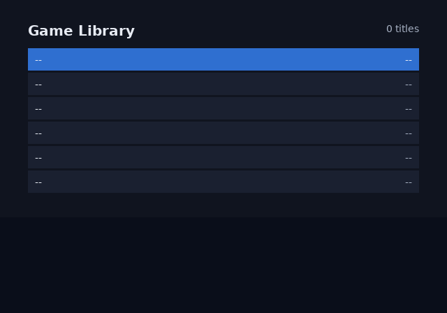
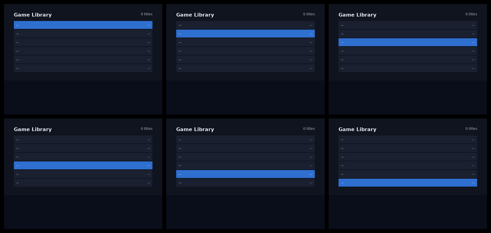

# Lists

A list is two halves. `data-repeat` bakes a fixed number of rows at compile time. `ps2ui_list` scrolls any number of items through those rows at runtime.

## What it is

The row count belongs to the markup. The item count belongs to the data, and there is no data at build time. `data-repeat="6"` stamps six copies of one row into the document. The runtime then maps item `top + r` onto row `r`, and hides the rows past the end of the data.

Expansion happens on the element tree, before any style is computed. A repeated row compiles to exactly the commands a typed-out row compiles to. Nothing downstream can tell a copy from an original.

Six rows cost six focus nodes and six copies of the row's paint commands. That cost is the same whether the app has three items or three hundred.



## Minimal example

The screen below is the tutorial's [library.html](repo:docs/tutorial-uc3.md#L78). One row carries `data-repeat="6"`, an `id` with `{i}` in it, and two slots.

```html
<screen name="library">
  <div class="page">
    <div class="header">
      <span class="title">Game Library</span>
      <span class="count" data-slot="count" data-slot-capacity="16">0 titles</span>
    </div>
    <div class="row" data-repeat="6" id="row-{i}" focusable>
      <span class="name" data-slot="name-{i}" data-slot-capacity="40">--</span>
      <span class="size" data-slot="size-{i}" data-slot-capacity="12">--</span>
    </div>
  </div>
</screen>
```

Build the project that holds it.

```sh
ps2ui build
```

```text
ps2ui-layout: 14 paint commands, 6 focusables -> build/library.json
...
ps2ui-bake: 1 screen(s), 24 records, 2 textures (32 KiB baked), 1 CLUTs -> build/ui.uib
ps2ui-bake: arena 1516 bytes (static uint8_t arena[1516] __attribute__((aligned(16))))
```

That run wrote six focus nodes named `row-0` to `row-5`, and thirteen slots. The runtime binds a list to those names and fills those slots. This is the loop from [the tutorial](repo:docs/tutorial-uc3.md#L379).

```c
ps2ui_list list;
ps2ui_list_init(&list, "row-", 6);           /* the six baked rows */
ps2ui_list_set_count(&ui, &list, n_games);   /* however many you found */

for (;;) {
    if (pad_down)  ps2ui_list_move(&ui, &list, +1);
    if (pad_up)    ps2ui_list_move(&ui, &list, -1);

    for (uint16_t r = 0; r < list.rows; r++) {
        int item = ps2ui_list_item_at(&list, r);
        char name[8];
        sprintf(name, "name-%u", r);
        ps2ui_slot_set(&ui, name, item < 0 ? "" : titles[item]);
    }
    ps2ui_slot_set(&ui, "count", count_text);
    ...
}
```

Add `ps2ui_list_apply_visibility(&ui, &list)` after the refill to hide the rows past the end, not only blank them.

## Reference table

| attribute | rule |
|---|---|
| `data-repeat="N"` | Stamps N copies of the element into its parent, in place. |
| the count | A literal decimal from 1 to 256. It is baked, so it cannot come from data. |
| `{i}` | The 0-based copy index, substituted in every attribute value and text node of the subtree. |
| `{n}` | The 1-based copy index, substituted the same way. |
| `data-repeat` on the root element | Refused. The root has no parent to repeat into. |
| `data-repeat` inside a `data-repeat` subtree | Refused. Only one index is in scope. |
| `data-repeat` in the cascade | Never arrives. The expansion pass consumes the attribute. |

The seven list functions are also on the [C API reference](page:runtime/api-reference#lists), with their scope column.

| signature | returns | notes |
|---|---|---|
| `void ps2ui_list_init(ps2ui_list *list, const char *prefix, uint16_t rows)` | none | Binds `rows` baked rows named `prefix` plus the row index. Stores the prefix pointer without copying it. |
| `void ps2ui_list_set_count(ps2ui_ctx *ctx, ps2ui_list *list, uint16_t count)` | none | Clamps `sel` and `top` into range and moves focus with them. A `NULL` `ctx` moves the indices only. |
| `int ps2ui_list_move(ps2ui_ctx *ctx, ps2ui_list *list, int delta)` | 1 when `sel` or `top` changed, else 0 | Clamps at both ends. Pass `list->rows` as the delta for a page. |
| `int ps2ui_list_select(ps2ui_ctx *ctx, ps2ui_list *list, uint16_t item)` | 1 when `sel` or `top` changed, else 0 | Absolute item index. An index at or past `count` clamps to the last item. |
| `int ps2ui_list_item_at(const ps2ui_list *list, uint16_t row)` | `top + row`, or -1 | -1 past the last row and past the last item. This is the refill loop's test. |
| `int ps2ui_list_selected_row(const ps2ui_list *list)` | 0 to `rows` minus 1, or -1 | -1 for an empty list, and for a list bound to no rows. |
| `void ps2ui_list_apply_visibility(ps2ui_ctx *ctx, const ps2ui_list *list)` | none | Hides every row whose `item_at` is -1 and shows the rest, by row name. |

## Behaviour

### Expansion

The expansion pass runs before styles are computed, so the cascade sees N ordinary elements. Substitution rewrites attribute values and text nodes together. Give each copy a distinct `id` and distinct slot names, or the copies address the same thing. [layout.test.js](repo:packages/layout/test/layout.test.js#L913) asserts that a repeated row and a typed-out row produce identical command lists.

A count above 1 with no `{i}` and no `{n}` anywhere in the subtree warns and compiles. The check reads descendant attributes too, so `{i}` on a nested `data-slot` alone is enough.

Every focus state of the six baked rows is in the montage below.



### Runtime window

`ps2ui_list` holds five public fields: `prefix`, `rows`, `count`, `top` and `sel`. `top` is the item shown in row 0. `sel` is the selected item. The functions own `top` and `sel`, and the app reads them.

The window slides the minimum distance that puts `sel` back on screen. It never recentres. Moving down from the last visible row scrolls by one row, and the selection stays on the bottom row.

The window never wraps. Moving down on the last item returns 0, and so does moving up on the first.

When `count` is larger than `rows`, `top` stops at `count` minus `rows`. The last screenful is therefore full. When `count` is at most `rows`, `top` is 0.

Shrinking `count` under a selection that sat past the new end pulls both back into range. Setting `count` to 0 resets `sel` and `top` to 0.

Run the suite that proves each of those.

```sh
make -C runtime test
```

```text
ok 138 - list starts empty
ok 139 - empty list has no item in row 0
ok 140 - empty list has no selected row
ok 141 - moving in an empty list does nothing
ok 142 - rows past the end of a short list report -1
ok 143 - long list starts at the top
ok 144 - selection reaches the last visible row without scrolling
ok 145 - the fifth step scrolls by exactly one row
ok 146 - the selection stays on the bottom row while scrolling
ok 147 - row 0 now shows item 1
ok 148 - moving past the end clamps
ok 149 - the last item is on the last row
ok 150 - moving down at the end is a no-op
ok 151 - moving past the start clamps
ok 152 - moving up at the start is a no-op
ok 153 - a page down moves one screenful
ok 154 - shrinking the list pulls the selection and window back in
ok 155 - emptying the list resets it
ok 156 - a prefix that matches no node still tracks indices
...
PASS: 410 checks, 0 failure(s)
```

### Focus sync

Every index change rebuilds the selected row's focus name and calls `ps2ui_focus_set`. The name is the prefix followed by the decimal row index, so `"row-"` addresses `row-0` upwards. Those names come from the `id` on the repeated element, described on [Focus and navigation](page:authoring/focus-and-navigation#behaviour).

Row text is ordinary slot text. Refill it with `ps2ui_slot_set` after every move, as on [Dynamic text](page:authoring/dynamic-text#behaviour).

### Visibility

`ps2ui_list_apply_visibility` calls `ps2ui_visible_set` once per row. A hidden row takes its panel and its slot glyphs out of the frame. Call it after `set_count` and after any move. What hiding does to a frame is on [Moving and hiding](page:runtime/moving-and-hiding#behaviour).

```text
ok 297 - apply_visibility hides only the rows past the end
ok 298 - a short list draws less than a full one
ok 299 - shrinking a list never leaves focus on a hidden row
ok 300 - and focus follows the clamped selection
```

## Limits and errors

Each row below stops the compile. `ps2ui-layout` prints the message on stderr with an `error: ` prefix and exits 1.

| message | cause |
|---|---|
| `layout: <T> line N: data-repeat="R" is not a whole number. The count is baked, so it cannot come from data.` | The value does not match `^\d+$`. |
| `layout: <T> line N: data-repeat="R" is out of range 1..256. Every copy costs commands, and a focusable one costs a focus node, so this is a budget you want to feel.` | The count is 0, or above 256. |
| `layout: <T> line N: data-repeat inside data-repeat. Only one index is in scope, so the inner {i} would be ambiguous.` | A repeated subtree holds another `data-repeat`. |
| `layout: <T> line N: data-repeat on the root element has nothing to repeat into; put it on a child` | The root element carries the attribute. |
| `layout: duplicate data-slot name "S"` | A `data-slot` under a repeat has no `{i}` in its name. |

```sh
ps2ui-layout err/r300.html err/base.css --fonts fonts/fonts.json -o err/r300.json
```

```text
error: layout: <div> line 2: data-repeat="300" is out of range 1..256. Every copy costs commands, and a focusable one costs a focus node, so this is a budget you want to feel.
```

One case warns and compiles.

```sh
ps2ui-layout err/noindex.html err/base.css --fonts fonts/fonts.json -o err/noindex.json
```

```text
warning: layout: <div> line 2: data-repeat="3" but no {i} or {n} anywhere inside, so every copy is identical. Add {i} to the ids and data-slot names, or the copies cannot be told apart.
...
ps2ui-layout: 7 paint commands, 0 focusables -> err/noindex.json
```

Three limits have no message at all.

A prefix that matches no baked focus name fails silently. The indices still move and `ps2ui_list_move` still returns 1, because the focus call's failure is discarded. Check `ps2ui_focus_name` against the row you expect during bring-up.

Nothing compares `list->rows` with the number of rows the blob actually carries. A `rows` larger than the blob has makes `apply_visibility` address names that do not resolve, and those calls do nothing.

Row names are built into a 64-byte stack buffer, `PS2UI_LIST_NAME_MAX`. A longer prefix is truncated, which then matches nothing.

## Related pages

- [HTML](page:authoring/html#reference-table) for the other twelve attributes the compiler reads.
- [Dynamic text](page:authoring/dynamic-text#what-it-is) for slot names, capacity and truncation.
- [Focus and navigation](page:authoring/focus-and-navigation#what-it-is) for how the six rows become a D-pad graph.
- [Moving and hiding](page:runtime/moving-and-hiding#what-it-is) for visibility beyond a list.
- [C API reference](page:runtime/api-reference#lists) for the signatures and their scope.
