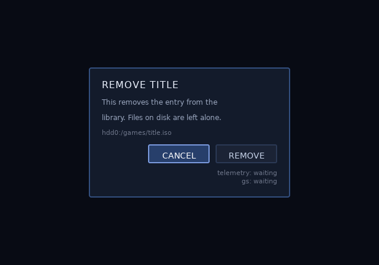

# Screens and overlays

## What it is

One `.uib` blob holds several screens. Pass several IR files to one bake
and each becomes a screen, named by its file stem. Textures, CLUTs,
atlases and font tables are shared across every screen in the blob.

`ps2ui_screen_set` chooses the screen the next render replays.
`ps2ui_render` never clears. Two `screen_set` and `render` pairs in one
frame composite, so the second screen draws over the first. That is the
dialog, the confirm box and the toast, with no modal feature in the
runtime and no second blob.




The overlay is an ordinary screen. Author a scrim and a panel, leave the
rest of the canvas empty, and composite it over whatever is already on
the frame.

## Minimal example

Bake the six opl-env screens into one blob. The stems name them.

```sh
$ ps2ui-bake landing.json library.json detail.json filters.json recent.json confirm.json -o ui.uib
...
ps2ui-bake: 6 screen(s), 2158 records, 21 textures (161 KiB baked + 61 KiB reserved by slots), 2 CLUTs -> ui.uib
ps2ui-bake: arena 7319 bytes (static uint8_t arena[7319] __attribute__((aligned(16))))
```

Draw the base, then the dialog. This file compiled in this session under
the host flags.

```c
#include "ps2ui.h"

static ps2ui_ctx ui;

/* One frame. The base screen, then the dialog over it. */
void frame(GSGLOBAL *gs, int dialog_open)
{
    gs->PrimAlphaEnable = GS_SETTING_OFF;
    gsKit_clear(gs, GS_SETREG_RGBAQ(0x0a, 0x0e, 0x1a, 0x80, 0x00));
    gs->PrimAlphaEnable = GS_SETTING_ON;

    ps2ui_screen_set(&ui, "library");
    ps2ui_render(&ui, gs);

    if (dialog_open) {
        ps2ui_screen_set(&ui, "confirm");   /* also takes the D-pad */
        ps2ui_render(&ui, gs);
    }

    gsKit_queue_exec(gs);
    gsKit_sync_flip(gs);
    gsKit_TexManager_nextFrame(gs);         /* once, after the flip */
}

/* Dismissing the dialog is one call back. Focus returns to the node the
 * user left on the base screen. */
void dismiss(void)
{
    ps2ui_screen_set(&ui, "library");
}
```

```sh
$ cc -std=c99 -Wall -Wextra -Werror -Istub -Ivendor/gsKit -Ivendor/host-shim -I. -c x.c -o x.o
```

The compile exited 0 with no diagnostics. The clear and the flip belong
to the app, in the order the [frame loop](page:runtime/frame-loop#reference-table)
fixes.

## Reference table

| call | effect |
|---|---|
| `ps2ui_screen_set(&ui, "confirm")` | Makes that screen current for the next render and for input; saves the outgoing screen's focus and restores the target's; returns 1, or 0 for an unknown name |
| `ps2ui_screen_name(&ui)` | Returns the current screen's name; never NULL after load |
| `ps2ui_render(&ui, gs)` | Replays the current screen over whatever is already in the framebuffer; never clears; resets `ctx->stats` at entry |

Signatures and scope rules sit on the
[C API reference](page:runtime/api-reference#screens).

## Behaviour

### Naming

A screen's name is its IR file's stem, so `confirm.json` is the screen
`confirm`. A project file lists HTML paths and `ps2ui build` keeps the
same rule. Stems must be unique across one bake. The blob opens on
screen 0, which is the first IR on the command line, at that screen's
baked initial focus.

### Shared tables

One bake is one texture space. Screens share every table except the
per-screen ranges of commands, focus nodes and slots. The three bakes
below show the split.

```sh
$ ps2ui-bake library.json -o t.uib
...
ps2ui-bake: 1 screen(s), 694 records, 18 textures (80 KiB baked + 27 KiB reserved by slots), 1 CLUTs -> t.uib
$ ps2ui-bake confirm.json -o t.uib
...
ps2ui-bake: 1 screen(s), 110 records, 8 textures (80 KiB baked), 1 CLUTs -> t.uib
$ ps2ui-bake library.json confirm.json -o t.uib
...
ps2ui-bake: 2 screen(s), 804 records, 19 textures (112 KiB baked + 27 KiB reserved by slots), 1 CLUTs -> t.uib
```

Records add up, 694 plus 110 to 804. Textures do not, 18 plus 8 to 19.
The two screens share one font atlas and one CLUT. A second screen costs
its own geometry and only the art nothing else uses.

### Focus memory

`ps2ui_screen_set` writes the outgoing screen's focus index into the
arena and loads the target's. Each screen starts on its baked
`autofocus` and keeps whatever the user left it on. Setting the screen
that is already current returns 1 and changes nothing. Focus inside a
screen is on
[focus and navigation](page:authoring/focus-and-navigation#screens).

### Compositing


The frame above is synthetic. `preview_in_game.py` draws the road and
the sky from flat shapes, because a real game's pixels are a licensing
problem in a repository.

| rule | why it matters |
|---|---|
| `ps2ui_render` never clears, so two renders sum into one frame | The overlay needs no background of its own beyond a scrim, and the base keeps showing through it |
| Input follows the last `screen_set` | The overlay drawn last owns the D-pad, and `ps2ui_focus_set` cannot reach the base's nodes from it |
| Dismissing is one `screen_set` back to the base | Focus returns where the user left it, so an open dialog costs no focus bookkeeping |
| `ctx->stats` describes one render, not the frame | A composited frame ends holding the overlay's counters; read them between the two renders to sum a frame |
| `gsKit_TexManager_nextFrame` runs once after the flip | Called between the renders it ages the base's textures, so an open dialog re-uploads the base's atlases every frame |

`make -C runtime test` proves the five rules.

```
$ make -C runtime test
...
ok 271 - compositing two screens draws the sum: render adds to the frame, it does not own it
ok 272 - and render issued no clear, which is the guarantee the sum above only depends on
ok 273 - and issued no residency ageing tick: nextFrame is the frame loop's, once per frame, or the overlay ages the base
ok 276 - stats describe one render, not the composited frame
ok 279 - after the composite, input resolves inside the overlay: the last screen_set owns the D-pad
ok 280 - and the base's focused node is not reachable from it, so the overlay is not merely drawn on top -- it has input scope
ok 281 - and dismissing restores the base's focus where the user left it
ok 283 - a composited frame in steady state transfers no pixels: two renders share one residency generation, so an open overlay does not re-upload the base's atlases every frame
...
1..410
PASS: 410 checks, 0 failure(s)
```

Rendering a screen does not consume it. After a composite, the overlay
alone costs the primitives it cost before, and the base costs its own.
The second render leaves the scissor at the full canvas. An app drawing
its own geometry after the UI inherits the whole screen.

### Scope

Focus and visibility resolve on the current screen. Slot names resolve
over the whole blob, first match wins. Give an overlay's slots their own
names. The opl-env dialog calls its telemetry lines `confirm-telem` and
`confirm-telem2` for that reason. Slot naming is on
[dynamic text](page:authoring/dynamic-text#names).

## Limits and errors

Every screen in one blob shares one video mode. A second IR with a
different `canvas` is refused, and no blob is written.

```sh
$ ps2ui-bake games.json games-16x9.json -o ui.uib
warning (layout games-16x9): aspect-distortion: 24 rounded corner(s) draw 24% wider than tall at PAR 1.2444; divide the radius by 1.244 to look round
warning (layout games-16x9): aspect-distortion: 6 image(s) draw 24% wider than tall at PAR 1.2444; pre-squash the art or set an explicit width
ps2ui-bake: screen 'games-16x9': canvas {'w': 640, 'h': 448, 'displayAspect': [16, 9], 'par': 1.2444, 'display': {'w': 796, 'h': 448}} differs from {'w': 640, 'h': 448, 'displayAspect': [4, 3], 'par': 0.9333, 'display': {'w': 597, 'h': 448}} — all screens share one video mode
```

Bake one blob per mode instead, the way
[video modes](page:authoring/video-modes#reference-table) describes.

| limit | what happens | fix |
|---|---|---|
| Two IRs share a file stem | `error: duplicate screen name 'games' (file stems must be unique)`, exit 1 | Rename one IR file |
| Two IRs differ in `canvas` | The flattener refuses, exit 1, no `.uib` written | Compile every screen at one mode and canvas |
| Boxes overlap inside one screen | `position`, `left` and `top` are ignored with a warning from the CSS stage | Author the overlapping part as a second screen and composite it |
| An overlay names a slot the base already uses | `ps2ui_slot_set` takes the first match in the blob and writes the wrong screen's text | Prefix the overlay's slot names |
| The app wants input on the base while a dialog draws | There is no way to express it; input follows the last `screen_set` | None today; the idiom cannot separate the drawn screen from the input screen |

There is no `ps2ui_overlay_push`, by decision. The idiom costs nothing
and expresses everything the API would, except an input screen distinct
from the drawn screens. Exit codes for the refusals are on
[ps2ui-bake](page:cli/ps2ui-bake#exit-codes).

The Python previewer cannot show a composite. `preview.render` replays
one screen over a background colour, not over a frame, so a two-screen
result has nowhere to come from. A host can do it outside the previewer.
`examples/channel6/preview_in_game.py` renders the screen on full
transparency and composites it in Pillow, which is what produced the
frame above.

```python
ui = preview.render(uib, background=(0, 0, 0, 0), screen="games")
frame.alpha_composite(ui)
```

An overlay's translucency is baked into its own quads. The opl-env scrim
is authored `rgba(6, 9, 16, 0.62)`. Render that screen on full
transparency and read the alpha channel back.

```sh
$ python3 -c "from ps2ui_bake.uib import read_uib; from ps2ui_bake import preview; print(preview.render(read_uib('examples/opl-env/build/ui.uib'), screen='confirm', background=(0, 0, 0, 0)).getchannel('A').getextrema())"
(157, 255)
```

The floor is the scrim, at 0.62 of 255. Nothing in the blob is left for
the frame alpha to supply.

## Related pages

| page | why |
|---|---|
| [The frame loop](page:runtime/frame-loop#behaviour) | Where the two renders sit between the clear and the flip |
| [C API reference](page:runtime/api-reference#screens) | `ps2ui_screen_set`, `ps2ui_screen_name` and `ps2ui_render` in full |
| [Previewer](page:cli/previewer#output) | Why `ps2ui serve` shows one screen at a time |
| [opl-env](page:examples/opl-env#what-it-demonstrates) | Six screens in one blob, including the confirm dialog |
| [channel6](page:examples/channel6#what-it-demonstrates) | An overlay browser with no ground of its own |
| [Moving and hiding](page:runtime/moving-and-hiding#behaviour) | The draw-time offset, and hiding a subtree instead of swapping screens |
