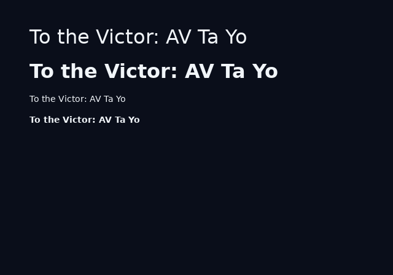

# Text and fonts

A project ships two font faces, regular and bold. Each face is a TTF and a metrics JSON generated from it by [ps2ui-fontgen](page:cli/ps2ui-fontgen#synopsis). One `fonts.json` names both, and both halves of the toolchain read it: `ps2ui-layout` measures from the metrics, `ps2ui-bake` rasterizes from the TTF.

## What it is

Text is measured in Node and drawn in Python, so the two must agree to the pixel. They agree because they share one metrics file and one rounding rule. Advances and kerns are integers of pixels, never floats, because the GS has no subpixel glyph positioning.

The compiler does all the line breaking. A `.uib` blob holds placed glyph quads, not a paragraph to be flowed. Slot text is the exception, and it walks the same pen at runtime. See [dynamic text](page:authoring/dynamic-text#behaviour).

The same string at two sizes and two weights:



The T/o and A/V pairs close up at 32px. At 14px the same kerns round to zero.

## Minimal example

`fonts/fonts.json` in this repository:

```json
{
  "regular": {
    "ttf": [
      "/usr/share/fonts/truetype/dejavu/DejaVuSans.ttf",
      "/usr/share/fonts/TTF/DejaVuSans.ttf",
      "/opt/homebrew/share/fonts/DejaVuSans.ttf",
      "/Library/Fonts/DejaVuSans.ttf",
      "/usr/local/share/fonts/DejaVuSans.ttf",
      "~/Library/Fonts/DejaVuSans.ttf",
      "vendor/DejaVuSans.ttf"
    ],
    "metrics": "default.metrics.json"
  },
  "bold": {
    "ttf": [ "..." ],
    "metrics": "default-bold.metrics.json"
  }
}
```

`ttf` is a candidate list and the first path that exists wins. `~` expands before the absolute test. A relative candidate resolves against the manifest's own directory. Pass the file to both tools:

```sh
ps2ui-layout ui/library.html ui/library.css --fonts fonts/fonts.json -o build/library.json
ps2ui-bake build/library.json --fonts fonts/fonts.json -o build/ui.uib
```

`--font-dir DIR` is the other spelling. It takes a directory holding `default.metrics.json` and `default-bold.metrics.json` under exactly those names.

## Reference table

Fields of a metrics JSON, from `build_metrics` in [fontgen.py](repo:packages/baker/ps2ui_bake/fontgen.py#L79):

| field | type | meaning |
|---|---|---|
| `family` | string | Family name passed to `ps2ui-fontgen`. |
| `weight` | integer | CSS weight this face stands for. |
| `unitsPerEm` | integer | Always 1000. The face is loaded at a 1000px em. |
| `ascent` | integer | Ascent in units, from the TTF at that em. |
| `descent` | integer | Descent in units, positive. |
| `advances` | object | Decimal codepoint string to integer units. |
| `kerning` | object | `"prev,cur"` codepoint pair to integer units, sparse and directional. |
| `missing` | integer | Advance for a codepoint absent from `advances`. |
| `source` | string | File name of the TTF it was generated from. |

CSS properties the pen reads. Values and defaults are on the [CSS page](page:authoring/css#reference-table).

| property | effect on the pen |
|---|---|
| `font-size` | Scales every advance and every kern. |
| `font-weight` | Picks the face. 600 and above is bold. |
| `letter-spacing` | Adds pixels at each junction between two glyphs. |
| `line-height` | Sets the line box height and the half-leading. |
| `white-space` | `nowrap` skips wrapping and measures the string whole. |
| `text-overflow` | `ellipsis` truncates an overflowing `nowrap` line. |
| `text-align` | Shifts a placed line inside the content box. |

## Behaviour

### Faces and weights

There is no weight axis. `font-weight` selects one of two faces, and 600 is the boundary. Compile four weights in a row and read the pen positions back:

```sh
ps2ui-layout weights.html weights.css --fonts fonts/fonts.json -o weights.json
python3 -c "
import json
for c in json.load(open('weights.json'))['commands']:
    if c['op']=='text': print('weight %3d  x=%d' % (c['weight'], c['x']))
"
```

```
weight 500  x=40
weight 599  x=75
weight 600  x=110
weight 700  x=150
```

Each box holds `Ta` at 32px. The 500 and 599 boxes are 35px wide, the 600 box is 40px wide. The IR carries the CSS number, not the face name; the compiler and the baker each apply the same 600 test.

### The charset

The shipped metrics carry 115 codepoints. Print them from the committed file:

```sh
python3 -c "
import json
cps = sorted(int(k) for k in json.load(open('fonts/default.metrics.json'))['advances'])
print(len(cps), 'codepoints,', sum(1 for c in cps if 32 <= c <= 126), 'of them 32 to 126')
print(' '.join('U+%04X %s' % (c, chr(c)) for c in cps if c > 126))
"
```

```
115 codepoints, 95 of them 32 to 126
U+00A0   U+00B7 · U+00D7 × U+2013 – U+2014 — U+2018 ‘ U+2019 ’ U+201C “ U+201D ” U+2026 … U+2190 ← U+2191 ↑ U+2192 → U+2193 ↓ U+25A1 □ U+25B3 △ U+25C7 ◇ U+25CB ○ U+2713 ✓ U+2715 ✕
```

A codepoint outside that set takes the `missing` advance, which is the advance of `?`. Three pens then diverge in what they draw. The compiler only measures. The baker's atlas uses the `?` advance and rasterizes the real character from the TTF. The runtime and the blob pen substitute the `?` glyph, because the blob's font table has no entry. Extend the set with a charset file argument to `ps2ui-fontgen`.

### Measuring and rounding

One rule governs both hosts:

```
advance_px = floor(units * size / 1000 + 0.5)
```

`floor(x + 0.5)` is written out on both sides because Python's `round()` rounds half to even and JavaScript's `Math.round` does not. A kern rounds independently by the same rule, so a pen built from integral advances and integral kerns never lands on a half pixel.

```sh
python3 -c "
from ps2ui_bake.rounding import glyph_advance_px, kern_px
print('T advance at 32px:', glyph_advance_px(611, 32))
print('kern T,o at 32px: ', kern_px(-170, 32))
print('kern T,o at 11px: ', kern_px(-170, 11))
print('kern T,o at  8px: ', kern_px(-170, 8))
"
```

```
T advance at 32px: 20
kern T,o at 32px:  -5
kern T,o at 11px:  -2
kern T,o at  8px:  -1
```

`measure`, `wrapText` and `ellipsize` all run one walk: kern before the glyph, record the position, then advance. Letter-spacing is a junction cost, so `n` glyphs carry `n - 1` junctions and the first glyph has none.

A test runs both pens over nine strings, seven sizes and three letter-spacings and compares every glyph position:

```sh
cd packages/baker && python3 -m unittest discover -s tests -p test_baker.py -k TestCrossLanguagePen -v
```

```
test_the_comparison_would_notice_a_disagreement (test_baker.TestCrossLanguagePen.test_the_comparison_would_notice_a_disagreement) ... ok
test_the_two_pens_place_every_glyph_on_the_same_pixel (test_baker.TestCrossLanguagePen.test_the_two_pens_place_every_glyph_on_the_same_pixel) ... ok

----------------------------------------------------------------------
Ran 2 tests in 0.260s

OK
```

### Kerning

Kerning is a property of the ordered pair. `To` kerns and `oT` does not. The table is sparse: only pairs whose rounded value is non-zero are stored.

Kerning is a sub-em adjustment, so it thins out as the size falls. The regular face carries 284 pairs; 161 of them are non-zero at 14px and 123 are not. Rounding is asymmetric about zero, so a tie under-applies a negative kern. Text then comes out a pixel wider than ideal rather than narrower, and the measured box is never smaller than what is drawn in it.

### Wrapping

Break opportunities are spaces only. CJK line breaking does not exist here. The `charset` lint rule reports the first codepoint above U+24FF in a run:

```
warning: charset: codepoint U+65E5 in "日本": non-Latin text wrapping is untested
```

A word wider than the box is not broken. It becomes its own overflowing line, and the box keeps the wider width.

The width a line accumulates while wrapping equals `measure()` of the same line. The join cost is the space's own advance, both kerns the space makes with its neighbours, and two letter-spacings.

### Ellipsis

`text-overflow: ellipsis` applies only alongside `white-space: nowrap`. Both are tested together. Compile one box with each:

```css
.screen { flex-direction: column; }
.clip, .ell { width: 100px; font-size: 14px; text-overflow: ellipsis; }
.ell { white-space: nowrap; }
```

```
y=1   Shadow of
y=19  the Colossus
y=37  Shadow of t…
```

The `.clip` box wrapped to two lines and kept its text. The `.ell` box truncated. The `…` is measured attached to the candidate prefix, because it kerns against whatever glyph the cut leaves last. A trailing space before the `…` is stripped.

### Line height and baseline

`line-height` accepts a px length, a unitless multiplier and a per cent. A per cent is stored as the multiplier `value / 100`. All three resolve to integral pixels. At `font-size: 16px`, the three forms below produce the same 24px step:

```css
.px  { line-height: 24px; }
.num { line-height: 1.5; }
.pct { line-height: 150%; }
```

```
y=2    aaa
y=26   bbb
y=50   aaa
y=74   bbb
y=98   aaa
y=122  bbb
```

A text command's `y` is the line top plus `floor(leading / 2)`, where leading is the line height minus the ascent and descent in pixels. At 16px the ascent is 15px and the descent 4px, so a 24px line box leaves 5px of leading and the first line starts at 2.

### Regenerating the metrics

The metrics are committed so a contributor with no TTF gets identical advances. One command rebuilds them:

```sh
./fonts/regen.sh
```

```
regen: regular = /usr/share/fonts/truetype/dejavu/DejaVuSans.ttf
ps2ui-fontgen: 115 glyphs, 284 kern pairs -> /home/user/OPHTML/fonts/default.metrics.json
regen: bold = /usr/share/fonts/truetype/dejavu/DejaVuSans-Bold.ttf
ps2ui-fontgen: 115 glyphs, 163 kern pairs -> /home/user/OPHTML/fonts/default-bold.metrics.json
```

`git diff --exit-code fonts/` after that run exited 0. The script resolves its TTFs through `fonts.json`, so the metrics come from the file the build rasterizes.

## Limits and errors

| message | cause | fix |
|---|---|---|
| `no font metrics at <path>` | `--font-dir` names a directory without both fixed file names. | Generate both files, or pass `--fonts fonts.json`. |
| `<path>: no "regular" face with a "metrics" path` | A manifest face is absent or has no `metrics` key. | Add the key. The message names the `ps2ui-fontgen` argv. |
| `<path>: cannot be read as a fonts.json manifest (...)` | The manifest is missing or is not JSON. | Fix the file. |
| `fonts.json: no candidate TTF for '<face>' exists: [...]` | No `ttf` candidate resolves, at bake time. | Add the path your machine uses to the list. |
| `layout: data-slot "<n>" placeholder wraps to <k> lines` | A slot placeholder does not fit on one line. | Add `white-space: nowrap`, or widen the box. |

Further limits:

| limit | detail |
|---|---|
| Two faces | `font-weight` buckets at 600. No other weight exists. |
| 115 glyphs | Anything else measures as `?` until the charset is extended. |
| Spaces only | No hyphenation, no CJK breaking, no soft hyphen. |
| `~` in `metrics` | The baker expands it, the compiler does not. A manifest using `~` for a metrics path loads in `ps2ui-bake` and fails in `ps2ui-layout` with an `ENOENT` naming a literal `~` directory. |
| Unvalidated keywords | `white-space` and `text-overflow` are stored as written. Any value other than `nowrap` or `ellipsis` behaves as the default. |
| Raqm | `ps2ui-fontgen` refuses to write metrics from a Pillow without the Raqm layout engine, because kerning cannot be extracted. See [installation](page:getting-started/installation#limits-and-errors). |

## Related pages

- [ps2ui-fontgen](page:cli/ps2ui-fontgen#synopsis) generates a metrics JSON and a `fonts.json`.
- [CSS](page:authoring/css#reference-table) lists every text property, its values and its default.
- [Dynamic text](page:authoring/dynamic-text#behaviour) covers slot text, which walks this pen at runtime.
- [Installation](page:getting-started/installation#limits-and-errors) covers the Raqm requirement.
