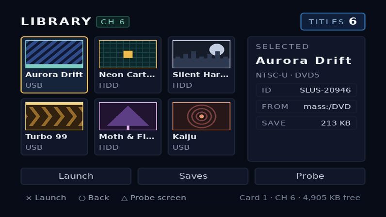
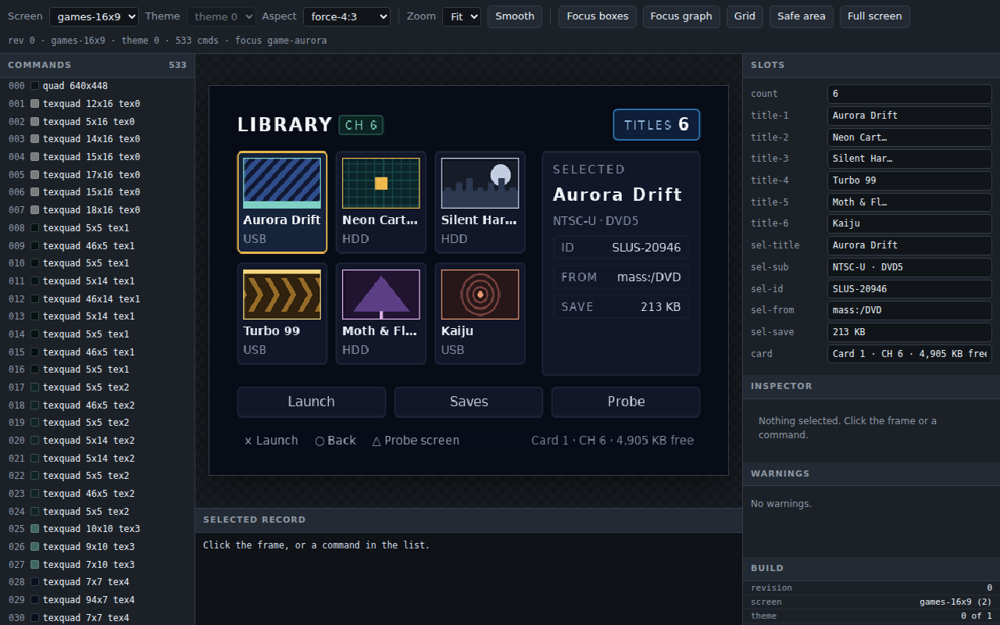

# Video modes

## What it is

A video mode fixes two separate things. The framebuffer is the pixel grid the compiler lays out in. The panel is the shape the television draws that grid at. `MODES` in [aspect.js](repo:packages/layout/src/aspect.js#L47) pairs them into four presets.

Select one with `--mode` on [ps2ui-layout](page:cli/ps2ui-layout#modes), or with the `mode` key in the project file. The pair reaches the blob header, so the runtime can report the aspect the UI was authored for.

PS2 widescreen is anamorphic. `ntsc16x9` keeps the same 640x448 framebuffer as `ntsc` and asks the panel to stretch it sideways. Every authored pixel then draws wider than it is tall. A square in CSS arrives on the television as a rectangle.

## Minimal example

Name the mode once, in `ps2ui.json`:

```json
{
  "screens": ["ui/title.html"],
  "css": "ui/title.css",
  "mode": "ntsc16x9",
  "out": "build/ui.uib",
  "preview": "build/preview.png",
  "previewDisplay": "build/preview-display.png"
}
```

Build it:

```sh
ps2ui build mini/ps2ui.json
```

```text
ps2ui-layout: 2 paint commands, 0 focusables -> build/title.json
...
ps2ui-bake: 1 screen(s), 9 records, 1 textures (16 KiB baked), 1 CLUTs -> build/ui.uib
ps2ui-bake: arena 1066 bytes (static uint8_t arena[1066] __attribute__((aligned(16))))
ps2ui-bake: preview -> build/preview.png
ps2ui-bake: display preview 796x448 at 16:9 -> build/preview-display.png
```

`build/preview.png` is 640x448, the framebuffer. `build/preview-display.png` is 796x448, the panel.

## Reference table

Framebuffer is the canvas the compiler lays out in. Panel is the aspect the television draws it at. PAR is the pixel aspect ratio, above 1.0 when pixels draw wider than tall.

| mode | framebuffer | panel | PAR |
|---|---|---|---|
| `ntsc` | 640x448 | 4:3 | 0.9333 |
| `ntsc16x9` | 640x448 | 16:9 | 1.2444 |
| `pal` | 640x512 | 4:3 | 1.0667 |
| `pal16x9` | 640x512 | 16:9 | 1.4222 |

Each row comes from compiling the channel6 games screen under that mode and reading `ir.canvas`:

```sh
ps2ui-layout channel6/ui/games.html channel6/ui/channel6.css -o out/pal16x9.json --mode pal16x9
```

```text
{'w': 640, 'h': 512, 'displayAspect': [16, 9], 'par': 1.4222, 'display': {'w': 910, 'h': 512}}
```

Three flags decide the pair, and two of them override the third.

| flag | effect |
|---|---|
| `--mode ntsc\|ntsc16x9\|pal\|pal16x9` | sets framebuffer size and panel aspect together, from the table above |
| `--canvas WxH` | replaces the framebuffer size, keeping the panel aspect |
| `--display-aspect W:H` | replaces the panel aspect, keeping the framebuffer size |

Argument order does not matter. The bin applies `--mode` first and the two overrides afterwards, at [ps2ui-layout.js](repo:packages/layout/bin/ps2ui-layout.js#L88).

```sh
ps2ui-layout channel6/ui/games.html channel6/ui/channel6.css -o out/c1.json --mode pal --canvas 704x448
```

```text
{'w': 704, 'h': 448, 'displayAspect': [4, 3], 'par': 0.8485, 'display': {'w': 597, 'h': 448}}
```

The same three names are project keys, spelled `mode`, `canvas` and `displayAspect`. `ps2ui build` carries an override for `--mode` only.

## Behaviour

### Anamorphic pixels

PAR is `displayAspect / (canvasW / canvasH)`, at [aspect.js](repo:packages/layout/src/aspect.js#L33). The 4:3 modes are not square-pixel either, so no mode draws a CSS square as a square.

The IR carries the exact ratio, the derived PAR and the panel size. The panel size takes height as authoritative, because anamorphic stretching is horizontal.

Changing the panel aspect changes no pixel the compiler emits. The 1:1 render of the channel6 16:9 blob is byte-identical to the 4:3 one:

```sh
cmp docs/site/assets/authoring/video-modes/games-1x1.png examples/channel6/build/preview.png
```

That command prints nothing and exits 0. What the mode changes is the header, the lint warnings and the panel-aspect preview.

### Previewing at the panel's aspect

`--preview` on [ps2ui-bake](page:cli/ps2ui-bake#options) writes framebuffer pixels. Compare that PNG against a framebuffer capture. Here is the channel6 16:9 blob at 1:1.


`--preview-display` resamples that render to the panel size and prints what it wrote. Compare this PNG against a photograph of the television.



[ps2ui serve](page:cli/previewer#output) offers the same choice live, in the Aspect menu.

| aspect mode | what the frame shows |
|---|---|
| `framebuffer` | the render at 1:1, canvas size |
| `authored` | the blob's own aspect, the default |
| `force-4:3` | the render resized to 4:3, whatever the blob says |
| `force-16:9` | the render resized to 16:9, whatever the blob says |

Forcing is the mismatch check. A 16:9 screen forced to 4:3 shows what a console left in 4:3 does to it.



### The distortion lint

`aspect-distortion` checks the document once, when PAR leaves 1.0 by more than 0.08. It emits one warning for rounded corners and one for images, each only when that kind is present. See [the CRT linter](page:authoring/crt-linter#reference-table) for the rule beside the others. Both 4:3 modes stay under the threshold and stay quiet.

```sh
ps2ui-layout channel6/ui/games.html channel6/ui/channel6.css -o out/ntsc16x9.json --mode ntsc16x9
```

```text
warning: aspect-distortion: 24 rounded corner(s) draw 24% wider than tall at PAR 1.2444; divide the radius by 1.244 to look round
warning: aspect-distortion: 6 image(s) draw 24% wider than tall at PAR 1.2444; pre-squash the art or set an explicit width
ps2ui-layout: 90 paint commands, 9 focusables -> out/ntsc16x9.json
```

Geometry is frozen at bake time, so the fix is authoring. Divide a radius by the PAR to get a corner that reads as round. Pre-squash art, or give an image an explicit width.

### The header field

The header holds the ratio as two integers, `display_aspect_num` and `display_aspect_den`, at [ps2ui.h](repo:runtime/ps2ui.h#L110). `ps2ui-check` prints it in its summary line.

```sh
ps2ui-check examples/channel6/build/ui-16x9.uib
```

```text
...
# examples/channel6/build/ui-16x9.uib: 640x448 at 16:9, 2 screen(s), 1242 commands, 25 textures, 15 slots
PASS: 75 checks, 0 error(s), 1 warning(s)
```

[ps2ui_pixel_aspect_x1000](page:runtime/api-reference#queries) derives the PAR from those fields in integer arithmetic. Loading one blob per mode and calling it returns 933, 1244, 1066 and 1422. The runtime draws in framebuffer pixels whatever the answer. Use the value to check the video mode the app set, as in [first boot, step 10](page:runtime/first-boot#steps-1-10).

### PAL

PAL is a taller framebuffer, 640x512, so its PAR differs from NTSC at the same panel aspect. The linter derives its title-safe inset from the canvas, at 5% per side. That is 32 by 22 pixels at 640x448 and 32 by 26 at 640x512.

The same text therefore passes one canvas and fails the other. This screen puts 20px text at (40,24):

```html
<div class="screen">
  <p class="head">CHANNEL 6</p>
</div>
```

```css
.screen { flex-direction: column; background: #060a14; padding: 24px 40px; }
.head { font-size: 20px; color: #e8eefc; }
```

At `--canvas 640x448` it compiles silently. At `--canvas 640x512` the inset grows to 26 and the text falls outside it:

```sh
ps2ui-layout inset/inset.html inset/inset.css -o out/i512.json --canvas 640x512
```

```text
warning: overscan: text "CHANNEL 6" at (40,24) leaves the title-safe area; a CRT may crop it
ps2ui-layout: 2 paint commands, 0 focusables -> out/i512.json
```

## Limits and errors

One blob carries one video mode. Every IR in a bake must agree on canvas and aspect, or the flattener refuses before anything is written.

```text
...
ps2ui-bake: screen 'probe-16x9': canvas {'w': 640, 'h': 448, 'displayAspect': [16, 9], 'par': 1.2444, 'display': {'w': 796, 'h': 448}} differs from {'w': 640, 'h': 448, 'displayAspect': [4, 3], 'par': 0.9333, 'display': {'w': 597, 'h': 448}} — all screens share one video mode
```

A second aspect is a second build. `ps2ui build --mode ntsc16x9 -o build/ui-16x9.uib` moves the intermediates with the blob, which renames the screens inside it. The 16:9 channel6 blob holds `games-16x9` and `probe-16x9`, not `games` and `probe`. Pass the suffixed name to `ps2ui_screen_set` and to the previewer.

An unknown mode reaches `ps2ui-layout` unchecked by the project loader. It prints the usage line and `ps2ui build` exits 1. A malformed `--display-aspect` is worse: it escapes the argument loop and prints a stack trace, see [ps2ui-layout exit codes](page:cli/ps2ui-layout#exit-codes).

Square pixels at 16:9 need a wider framebuffer, `--canvas 796x448 --display-aspect 16:9`, which compiles to PAR 1.0006 and no distortion warning. The default VRAM budget does not survive it.

```text
...
  framebuffers assumed: 2x draw/display + 1x Z @ 796x448 = 4472832 B
  the default budget does not exist at this canvas: three framebuffers at 796x448 need 4472832 B of 4194304 B total VRAM, so there is nothing left to charge textures against and an empty blob would fail here
...
error: texture VRAM footprint exceeds budget (see breakdown above; override with --vram-budget)
```

Declare `vramBudget` for the layout actually running. With Z buffering off the console holds two framebuffers, which left 1212416 B for the same blob and baked it clean.

## Related pages

| page | why |
|---|---|
| [ps2ui-layout](page:cli/ps2ui-layout#options) | every flag, including `--mode`, `--canvas` and `--display-aspect` |
| [ps2ui-bake](page:cli/ps2ui-bake#options) | `--preview-display` and the rest of the bake transcript |
| [The CRT linter](page:authoring/crt-linter#reference-table) | `aspect-distortion` beside the other rules and their thresholds |
| [Previewer](page:cli/previewer#output) | the Aspect menu and the inspector's pixel aspect readout |
| [C API reference](page:runtime/api-reference#queries) | `ps2ui_pixel_aspect_x1000` and the other queries |
| [First boot](page:runtime/first-boot#steps-1-10) | checking the console's video mode against the blob |
| [The project file](page:authoring/project-file#reference-table) | `mode`, `canvas`, `displayAspect` and `vramBudget` |
| [VRAM budget](page:authoring/vram-budget#behaviour) | what a wider framebuffer costs |
