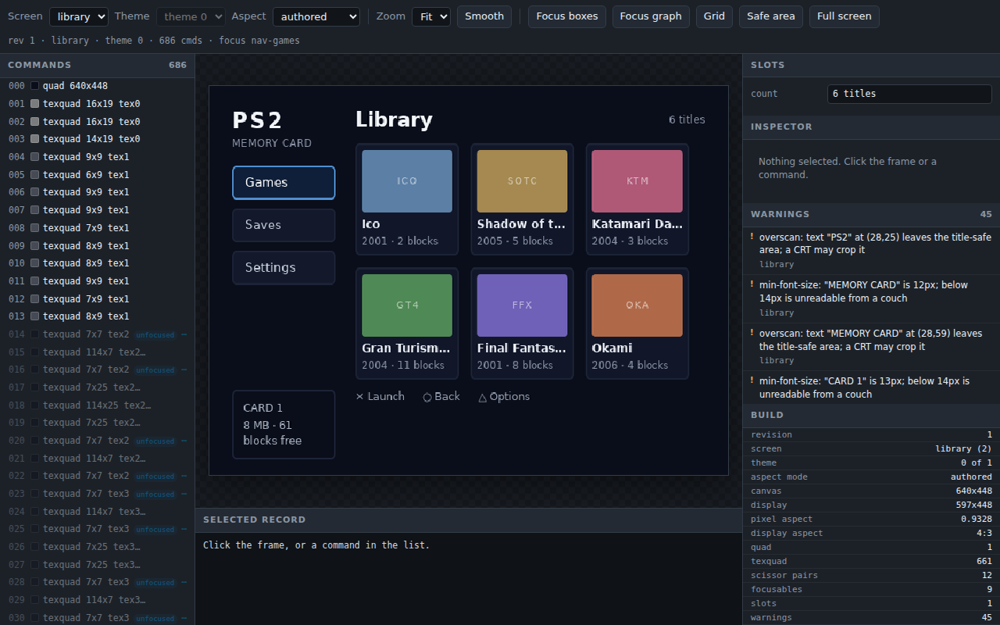
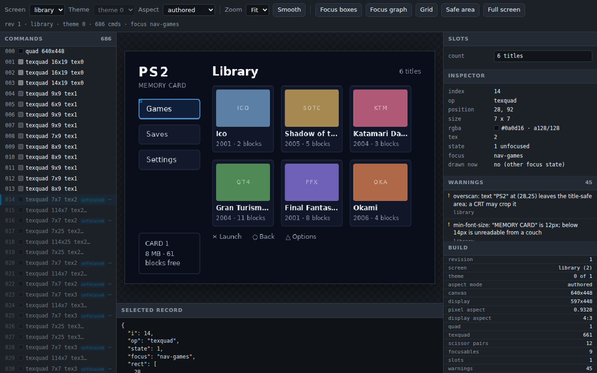
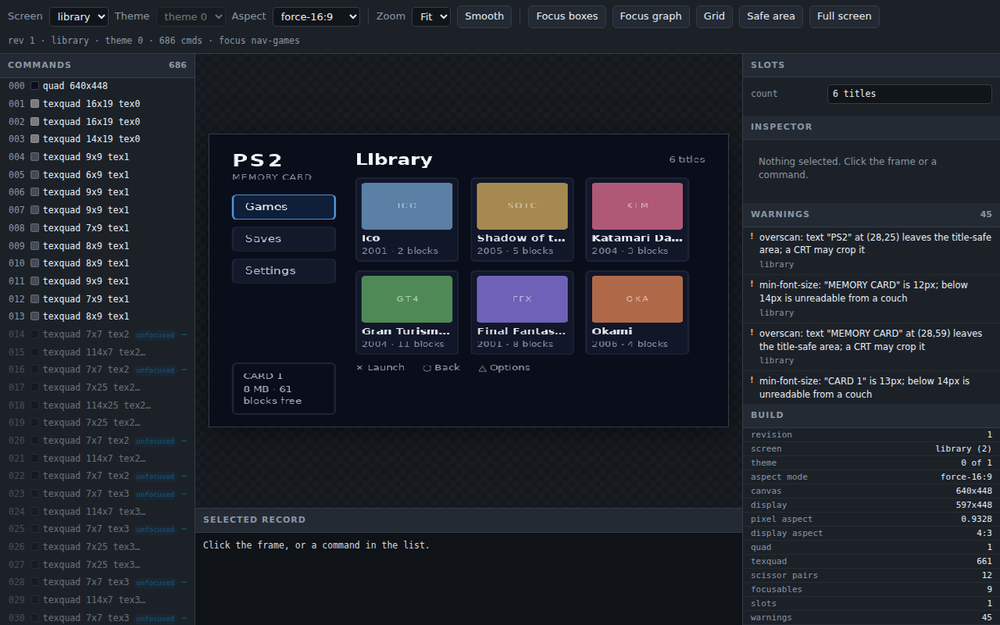
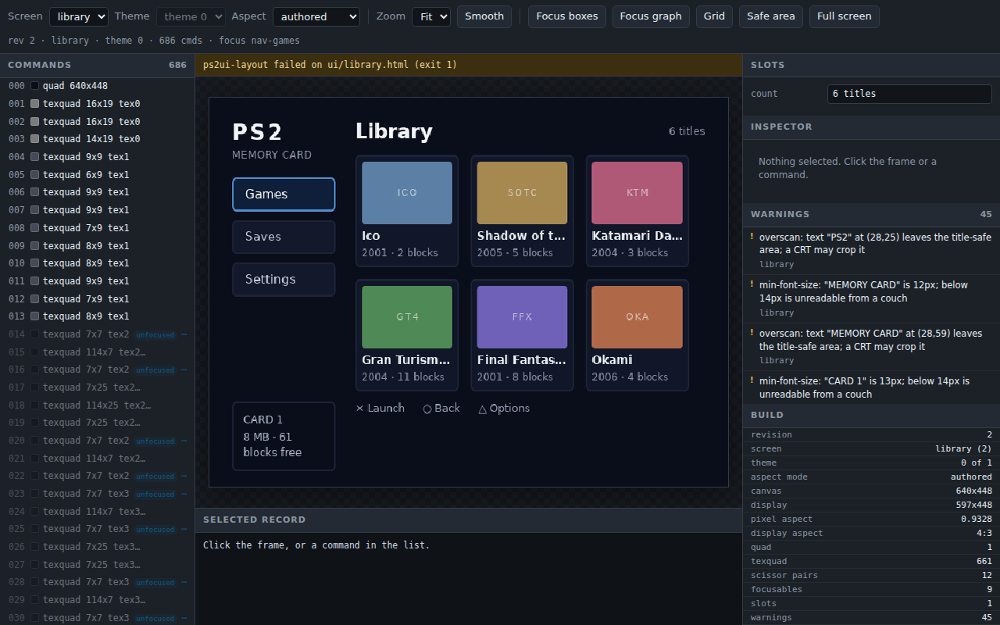

# Previewer

`ps2ui serve` builds the project, binds a port on `127.0.0.1`, and serves one
page. The page shows the blob a console would load and posts every input back
to the server. Reach for it once the first frame looks right and the questions
become harder: where the D-pad goes, what the second screen holds, how a longer
string sits in a slot.



The browser draws no UI pixels. Every frame comes from `preview.render` on the
server and arrives as PNG bytes in an ``. The grid, the focus rectangles
and the title-safe box are chrome drawn over the top.

## Synopsis

```sh
ps2ui serve [project] [--uib BLOB] [--port PORT] [--screen NAME]
            [--theme THEME] [--no-watch] [--selftest]
```

`serve` is a subcommand of [ps2ui](page:cli/ps2ui#serve). No `ps2ui-serve`
command is installed.

The project positional defaults to `ps2ui.json`, and a directory means the
project file inside it. Paths print relative to that file, as they do for
[every other subcommand](page:authoring/project-file#paths-resolve-against-the-project-file).

## Options

| flag | argument | default | effect |
|---|---|---|---|
| (positional) | `project` | `ps2ui.json` | the project to build, serve and watch |
| `--uib` | `BLOB` | none | serve a pre-baked blob: no project, no Node, no watching |
| `--port` | `PORT` | 8080, walking up to 8099 | bind this port once, and say which port is busy and fail |
| `--screen` | `NAME` | the blob's first screen | open on this screen |
| `--theme` | `THEME` | `0` | open on this theme row |
| `--no-watch` | none | off | serve the first build and never rebuild |
| `--selftest` | none | off | fetch every route on an ephemeral port, assert the frame, exit |

```console
$ ps2ui serve --help
usage: ps2ui serve [-h] [--uib BLOB] [--port PORT] [--screen NAME]
                   [--theme THEME] [--no-watch] [--selftest]
                   [project]

positional arguments:
  project

options:
  -h, --help     show this help message and exit
  --uib BLOB     serve a pre-baked blob: no Node, no watching
  --port PORT    the default 8080 moves up when busy; a port named here is
                 used or the command fails
  --screen NAME  the screen to open
  --theme THEME  the theme row
  --no-watch     do not rebuild on edits
  --selftest     build, serve one of every route, and exit
```

Everything else comes from the project file. Canvas, mode, display aspect,
fonts and the VRAM budget reach the server through the same call `ps2ui build`
makes, so a key that changes the build changes the preview.

`--screen` and `--theme` are checked against the blob before the port is bound.

```console
$ ps2ui serve --uib build/serve/ui.uib --screen nope --selftest
ps2ui serve: no screen named 'nope'. The blob has: library, saves
$ ps2ui serve --uib build/serve/ui.uib --theme 3 --selftest
ps2ui serve: no theme 3; the blob has 1
```

`--uib` skips the build. It needs no project file and no Node, which makes the
same page an inspector for any `.uib`, including one this toolchain did not
bake. Pair it with [ps2ui-check](page:cli/ps2ui-check#synopsis): check the blob,
then look at what passed.

```console
$ env -i PATH=/usr/local/bin:/usr/bin:/bin ps2ui serve --uib build/serve/ui.uib --selftest
ok - / 29569 bytes
ok - /frame.png 51449 bytes
ok - /state 88379 bytes
ok - /rev 15 bytes
ok - an unknown route is 404
ok - the framebuffer frame is byte-identical to --preview
PASS: 6 route(s)
```

A blob served this way carries no warnings, because warnings come from the IR
the compiler wrote, and `--uib` runs no compiler.

## Output

### The page

| control | drives |
|---|---|
| arrow keys | `{"key": dir}`, one `ps2ui_move` along the baked focus graph |
| Screen menu, `[` and `]` | `{"screen": name}`, the switch `ps2ui_screen_set` makes |
| Theme menu | `{"theme": n}`, the tint-table row; disabled below two themes |
| Aspect menu | `{"aspect": mode}`, one of the four resamplings below |
| a slot's text box | `{"slot": {name: text}}`, the host mirror of `ps2ui_slot_set` |
| Zoom menu | client-side scale: Fit, 1x, 2x, 3x |
| Smooth | client-side upscaling filter, nearest-neighbour by default |
| Focus boxes, `b` | one magenta rectangle per focusable |
| Focus graph, `n` | one arrow per solved D-pad edge |
| Grid, `g` | an 8 px lattice |
| Safe area, `s` | a dashed 10 percent inset |
| Full screen, `f`, Esc to leave | hides the toolbar and both panels |
| clicking the frame | selects the topmost command drawn there |
| clicking a command row | selects that command |
| clicking a focusable row | walks the D-pad to that node |

Focus moves by arrow key and by nothing else, which is the console's rule.
`/input` has no set-focus verb, so clicking a focusable walks the published
graph and posts those arrows. A node with no path from the current one says so
in the status line instead of jumping.

The Theme menu is the browser view of the tint table. One row is one theme, and
switching rows moves no geometry, as described under
[theming](page:authoring/theming#seeing-each-theme).

A slot box carries the slot's baked capacity as its `maxLength`. On the memcard
library screen the `count` box reports `maxLength 15`, and typing
`THE LONGEST TITLE THAT FITS AND MORE` leaves `THE LONGEST TIT`. That counts
UTF-16 units against a byte capacity, so the two agree for ASCII only. The
capacity rules are under [dynamic text](page:authoring/dynamic-text#truncation).

### The inspector

Clicking the frame hit-tests front to back and selects the topmost command
drawn at that point. A row in the Commands list selects the same record.



The Inspector reads alpha in the GS domain, 0 to 128, so a fully opaque command
shows `a128/128`. `drawn now` answers whether this record draws in the current
focus state. The Selected record pane below the frame holds the same command as
raw JSON.

### Aspect

Four modes resample one framebuffer. `authored` is the default and runs the
frame through the blob's own display aspect. `framebuffer` is the 1:1 render,
byte-identical to what `--preview` writes.

**So the page and `build/preview.png` are different sizes on purpose**: a
4:3 blob is 640x448 in the file and 597x448 on screen, and the difference is
the pixel aspect the television applies rather than anything the toolchain
disagrees with itself about. The self-test compares the `framebuffer` frame
and its line says so.



`force-4:3` and `force-16:9` put the UI on a set the header did not ask for.
That pair is the reason the menu exists, since every other artifact the
toolchain writes is already at the aspect requested. See
[video modes](page:authoring/video-modes#previewing-at-the-panels-aspect).

### Warnings

The Warnings panel lists what the compiler reported, one entry per screen and
message. Clicking an entry from another screen switches to it. An entry never
selects a command, because the server publishes a screen name and no command
index. That limit is on the [CRT linter](page:authoring/crt-linter#limits-and-errors) page.

### Routes

| route | method | type | purpose |
|---|---|---|---|
| `/` | GET | `text/html; charset=utf-8` | the previewer page |
| `/frame.png` | GET | `image/png` | the current state, rendered by `preview.render` |
| `/montage.png` | GET | `image/png` | one tile per focusable of the current screen |
| `/state` | GET | `application/json` | the whole payload the page draws from |
| `/rev` | GET | `application/json` | `{"revision": N}`, the poll target |
| `/input` | POST | `application/json` | one state change, answered with `/state` |
| anything else | GET or POST | `application/json` | `{"error": "no route '/x'"}` |

Every response carries `Cache-Control: no-store`. A server started with
`--port 8501` on a copy of `examples/memcard` answered:

```console
$ for r in / /frame.png /montage.png /state /rev /nope; do
>   curl -s -o /dev/null -w "%{http_code} %{content_type}  $r\n" "http://127.0.0.1:8501$r"
> done
200 text/html; charset=utf-8  /
200 image/png  /frame.png
200 image/png  /montage.png
200 application/json  /state
200 application/json  /rev
404 application/json  /nope
```

`/state` holds 16 keys: `revision`, `error`, `screens`, `screen`, `themes`,
`theme`, `aspect`, `aspects`, `canvas`, `display`, `display_aspect`, `focus`,
`focusables`, `commands`, `slots` and `warnings`. `focusables`, `commands` and
`slots` cover the screen in view and nothing else, because focus and slot names
are unique within a screen only. `warnings` covers every screen and names each.

`/input` takes one field per request. Anything it does not recognise is 400. A
rejected screen or theme comes back as the bare offending value.

```console
$ curl -s -X POST -d '{"nonsense":1}' -w '  <- %{http_code}\n' http://127.0.0.1:8501/input
{"error": "\"no recognised field in ['nonsense']\""}  <- 400
$ curl -s -X POST -d '{"screen":"nope"}' -w '  <- %{http_code}\n' http://127.0.0.1:8501/input
{"error": "'nope'"}  <- 400
$ curl -s -X POST -d '{"theme":9}' -w '  <- %{http_code}\n' http://127.0.0.1:8501/input
{"error": "9"}  <- 400
```

The page polls `/rev` every 250 ms and refetches `/state` only when the number
moved. When a poll fails it greys the frame, says the server stopped, and keeps
polling.

### Watching

The watcher stats the project file, every screen's HTML and CSS, and every
`.html`, `.css` and `.png` under each screen's directory. It polls at 0.2 s and
waits 0.12 s for an editor's save burst to settle before rebuilding.

A failed build never takes the frame away. The last good blob stays on screen
and the build's message appears in a banner above it.



```console
$ printf '\n.tile { background: #12g4f6; }\n' >> ui/library.css
$ curl -s http://127.0.0.1:8501/state | python3 -c "import json,sys;d=json.load(sys.stdin);print('revision',d['revision']);print('error:');print(d['error']);print('commands',len(d['commands']))"
revision 2
error:
ps2ui-layout failed on ui/library.html (exit 1)

commands 686
```

The banner carries that summary line only. The compiler's diagnostic, the one
naming the file and the line, goes to the terminal the server was started from.
Read both. Restoring the file rebuilds and clears the banner.

`--no-watch` serves the first build and stops there. It prints one extra line.

```console
$ ps2ui serve --port 8502 --no-watch
...
ps2ui serve: http://127.0.0.1:8502/ -- ctrl-c to stop
  (not watching)
```

### Ports

With no `--port` the server takes 8080 and walks up to 8099, one port at a
time. It says which it took. Two servers started in a row on the same machine:

```console
$ ps2ui serve --uib build/serve/ui.uib
ps2ui serve: http://127.0.0.1:8080/ -- ctrl-c to stop
$ ps2ui serve --uib build/serve/ui.uib
ps2ui serve: http://127.0.0.1:8081/ -- ctrl-c to stop
```

An explicit `--port` is tried once and fails hard when it is busy, because a
person who named a port meant that port. It says so rather than printing the
bind error:

```console
$ ps2ui serve --uib build/serve/ui.uib --port 8081
ps2ui serve: port 8081 is already in use.
  An explicit --port is not moved: naming a port means that port.
  Drop --port to take 8080 and move up from there, or name a free one.
$ echo $?
1
```

The bind address is `127.0.0.1` and never anything else. This is an
unauthenticated development tool.

### The self-test

`--selftest` builds, binds an ephemeral port, fetches one of every route, and
asserts the served frame is byte-identical to what `--preview` writes. It
ignores `--port`. Run it from CI, or run it when the page looks wrong and the
question is which half is lying.

```console
$ ps2ui serve --selftest
...
ok - / 29569 bytes
ok - /frame.png 51449 bytes
ok - /state 93517 bytes
ok - /rev 15 bytes
ok - an unknown route is 404
ok - the framebuffer frame is byte-identical to --preview
PASS: 6 route(s)
```

### Limits

| cannot show | why |
|---|---|
| `ps2ui_visible_set` and the list window | the renderer takes no visibility parameter, so the page draws the baked state |
| a hardware fault the command list is innocent of | the previewer replays that list faithfully; F-048 lived in a GS register the runtime never writes |
| two screens composited in one frame | the renderer takes one screen, and `/state` publishes one screen's records |
| a streamed texture's pixels | the server supplies no texels, so a streamed slot draws nothing |
| the rectangle the overscan lint enforces | the Safe area overlay insets 10 percent and the lint tests 5 percent |
| which command a warning is about | a warning carries a screen name and no command index |

Visibility is the boundary worth knowing before it surprises you: a hidden node
looks focusable here and is not on the console. What the runtime does with it
is on [moving and hiding](page:runtime/moving-and-hiding#visibility). Hardware
faults stay a bench job, and the checklist is
[first boot](page:runtime/first-boot#before-you-start).

## Exit codes

| code | meaning |
|---|---|
| 0 | the server ran and was stopped with Ctrl-C, or `--selftest` passed |
| 1 | a refusal, printed as `ps2ui serve: <message>` |
| 2 | argparse rejected the command line |

The `ps2ui serve: ` prefix is the exception in this tool. Every other
subcommand prints `ps2ui: `.

## Files written

| path | when | contents |
|---|---|---|
| `<build>/serve/<screen>.json` | project mode, every build | the IR for one screen |
| `<build>/serve/ui.uib` | project mode, every build | the blob the page replays |
| nothing | `--uib` | the blob is read, never written |

Output goes under `build/serve/` so that a `ps2ui build` in another terminal and
a live server cannot clobber each other. The server writes no PNG, since it
renders its own frames.

```console
$ find build -type f | sort
build/serve/library.json
build/serve/saves.json
build/serve/ui.uib
```

## Related pages

- [ps2ui](page:cli/ps2ui#serve) for the subcommand and how the project reaches it
- [ps2ui-check](page:cli/ps2ui-check#synopsis) for checking a blob before inspecting it
- [The project file](page:authoring/project-file#reference-table) for every key the build reads
- [Theming](page:authoring/theming#seeing-each-theme) for the theme menu
- [Video modes](page:authoring/video-modes#previewing-at-the-panels-aspect) for the aspect menu
- [Dynamic text](page:authoring/dynamic-text#truncation) for slot capacity
- [Focus and navigation](page:authoring/focus-and-navigation#seeing-the-graph) for the graph overlay
- [CRT linter](page:authoring/crt-linter#limits-and-errors) for the warning list
- [Moving and hiding](page:runtime/moving-and-hiding#visibility) for what the previewer cannot draw
- [First boot](page:runtime/first-boot#before-you-start) for the bench procedure
