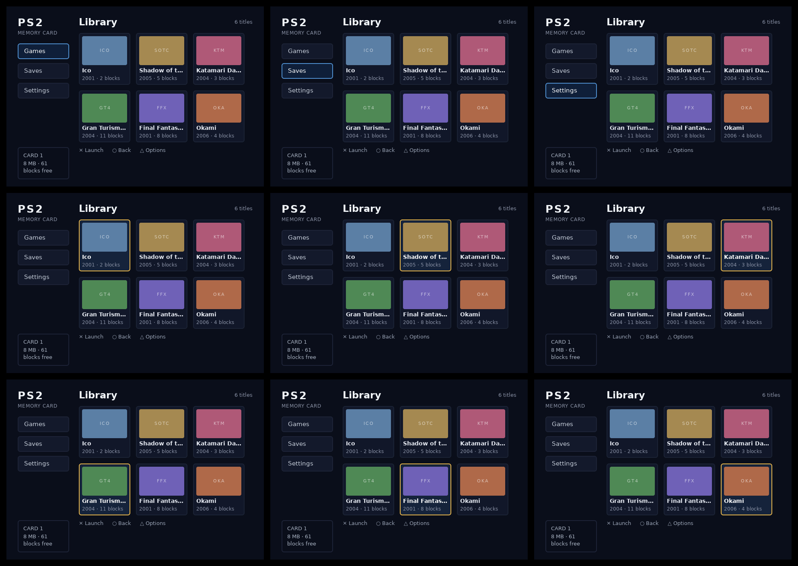

# ps2ui-bake

`ps2ui-bake` turns the IR that [ps2ui-layout](page:cli/ps2ui-layout#synopsis) emits into one `.uib` blob the C runtime replays. It rasterizes glyph atlases and nine-patches, flattens every command to GS quads, checks the result against the runtime's limits and the VRAM budget, and writes the file. It prints previews on request. `ps2ui build` runs it for a project file; call it directly to bake IR files by hand.

## Synopsis

```
ps2ui-bake [-h] [--version] -o OUT [--fonts FONTS] [--preview PREVIEW]
           [--montage MONTAGE] [--preview-display PNG]
           [--palettize-images] [--tints] [--vram-budget BYTES]
           ir [ir ...]
```

Pass one IR per screen. The screen name is the file stem, so `library.json` becomes the screen `library`. All IRs share one texture space: atlases, nine-patches, images and font tables are deduplicated across screens. The first IR sets the canvas, and every other IR must carry the same canvas. Read the format on [ui.json](page:reference/ir-format#layout) and the result on [.uib](page:reference/uib-format#layout).

Bake the memcard example's two screens with a preview and a focus-state sheet:

```sh
ps2ui-bake examples/memcard/build/library.json examples/memcard/build/saves.json \
    -o ui.uib --preview preview.png --montage states.png
```




## Options

The list below is the whole option set, from `ps2ui-bake --help` in this session. Video mode, display aspect and focus wrap are compiler concerns; set them on [ps2ui-layout](page:cli/ps2ui-layout#options), and the baked blob carries what the IR says.

| flag | argument | default | effect |
|---|---|---|---|
| `ir` | one or more `ui.json` paths | required | Each file becomes a named screen in the blob. The name is the file stem. |
| `-o`, `--out` | `.uib` path | required | Where the blob is written. Parent directories are created. |
| `--fonts` | `fonts.json` path | `fonts/fonts.json` three directories above the package, which exists only in a checkout | Font manifest mapping each face to TTF candidates and a metrics file. Pass the same file to `ps2ui-layout`. |
| `--preview` | PNG path | off | Replay the initial state of the first screen to a 1:1 PNG. |
| `--montage` | PNG path | off | Render every focus state of every screen into one sheet. |
| `--preview-display` | PNG path | off | Write the preview resampled to the panel's aspect, the way a television shows it. See [video modes](page:authoring/video-modes#behaviour). |
| `--palettize-images` | none | off | Quantize every `` to PSMT8 with a CLUT. Per-image opt-in is the `palettize` attribute; see [images](page:authoring/images#reference-table). |
| `--tints` | none | off | Print the tint table as it is written, with the `var()` name behind each entry. See [theming](page:authoring/theming#behaviour). |
| `--vram-budget` | bytes | 4 MiB minus two framebuffers and a Z buffer at canvas size | Texture VRAM ceiling the bake refuses past. See [VRAM budget](page:authoring/vram-budget#reference-table). |
| `--version` | none | | Print `ps2ui-bake` and the package version, then exit 0. |
| `-h`, `--help` | none | | Print the usage above and exit 0. |

### Font manifest resolution

`--fonts` names a JSON object keyed by face. Each face holds `ttf`, a path or a list of candidate paths, and `metrics`, the file `ps2ui-fontgen` wrote. A leading `~` expands to the home directory. A relative path resolves against the manifest's own directory. The first candidate that exists wins. A face with no existing candidate stops the bake. See [ps2ui-fontgen](page:cli/ps2ui-fontgen#synopsis) for the metrics file and [text and fonts](page:authoring/text-and-fonts#reference-table) for the manifest keys.

The IR records the family and weight each face was measured against. The bake compares that record with the manifest's metrics before it rasterizes anything. A face the manifest lacks, or a family or weight that differs, is a refusal. Two builds of the same family with different advances pass this check, so regenerate metrics and rebake together.

## Output

Every line goes to stderr. The only file on stdout is nothing; the blob and the PNGs go where the flags say. The transcript below is the bake above, run in this session, with the repeated layout warnings trimmed.

```
$ ps2ui-bake examples/memcard/build/library.json examples/memcard/build/saves.json -o ui.uib --preview preview.png --montage states.png
warning (layout library): overscan: text "PS2" at (28,25) leaves the title-safe area; a CRT may crop it
warning (layout library): min-font-size: "MEMORY CARD" is 12px; below 14px is unreadable from a couch
warning (layout library): overscan: text "MEMORY CARD" at (28,59) leaves the title-safe area; a CRT may crop it
...
warning (layout saves): overscan: text "PS2" at (28,25) leaves the title-safe area; a CRT may crop it
...
  runtime tables: 11 textures, 1 CLUTs, 6 slots, 2 screens
  tex[ 0] PSMT8     256x64   baked       16384 B payload ->   16384 B in pages
  tex[ 1] PSMT8     256x64   baked       16384 B payload ->   16384 B in pages
  tex[ 2] PSMT8      15x15   baked         225 B payload ->    8192 B in pages
  tex[ 3] PSMT8      15x15   baked         225 B payload ->    8192 B in pages
  tex[ 4] PSMT8     256x64   baked       16384 B payload ->   16384 B in pages
  tex[ 5] PSMT8     256x64   baked       16384 B payload ->   16384 B in pages
  tex[ 6] PSMT8     256x64   baked       16384 B payload ->   16384 B in pages
  tex[ 7] PSMT8      11x11   baked         121 B payload ->    8192 B in pages
  tex[ 8] PSMT8     256x64   baked       16384 B payload ->   16384 B in pages
  tex[ 9] PSMT8     256x64   baked       16384 B payload ->   16384 B in pages
  tex[10] PSMT8     256x64   baked       16384 B payload ->   16384 B in pages
  clut[0] PSMCT32  256 entries        ->    8192 B in pages
  framebuffers assumed: 2x draw/display + 1x Z @ 640x448 = 3440640 B
  payload 132667 B -> allocator 143104 B -> budget-charged 163840 B
  reclaimable 10437 B (7% of committed) -- the rest of the gap to 163840 B is the budget model's pessimism, which nothing allocates and P3c cannot reclaim
  textures 163840 B of 753664 B budget (21%)
ps2ui-bake: 2 screen(s), 1062 records, 11 textures (128 KiB baked), 1 CLUTs -> ui.uib
ps2ui-bake: arena 1662 bytes (static uint8_t arena[1662] __attribute__((aligned(16))))
ps2ui-bake: preview -> preview.png
ps2ui-bake: montage -> states.png
```

| line | meaning |
|---|---|
| `warning (layout library): ...` | A warning the compiler stored in the IR's `warnings` array, replayed with the screen name. The bake adds none of its own here. See [CRT linter](page:authoring/crt-linter#reference-table). |
| `runtime tables: 11 textures, 1 CLUTs, 6 slots, 2 screens` | Table sizes after deduplication across all screens. No denominator: the format bounds each count at 65535 and nothing smaller. |
| `trimmed N draw command(s) ...` | Absent here. Printed only when the flattener dropped commands that lie wholly outside their clip; channel6 prints `trimmed 20 draw command(s)` in this session. |
| `tex[ 0] PSMT8 256x64 baked 16384 B payload -> 16384 B in pages` | One texture: format, size, `baked` or `streamed`, the payload `ps2ui_tex_set` demands, and the page-rounded VRAM charge. |
| `clut[0] PSMCT32 256 entries -> 8192 B in pages` | One CLUT and its page charge. |
| `framebuffers assumed: ...` | What the default budget subtracts from 4 MiB. |
| `payload ... -> allocator ... -> budget-charged ...` | Texel bytes, what gsKit's allocator commits, and what the budget model charges. |
| `reclaimable ...` | The allocator-minus-payload gap; the rest is the model's margin. Read the whole table on [VRAM budget](page:authoring/vram-budget#behaviour). |
| `textures 163840 B of 753664 B budget (21%)` | The figure the bake refuses on. Past 100% the next line is an error and the exit code is 1. |
| `# 23 tint entries over 1 theme(s): root` | Only with `--tints`. Follows the VRAM lines. One row per entry with the RGBA vector per theme, the `var()` name or `(literal, unthemed)`, and `FIXED in every theme` when every theme shares one colour. |
| `ps2ui-bake: 2 screen(s), 1062 records, 11 textures (128 KiB baked), 1 CLUTs -> ui.uib` | The blob was written. Baked KiB counts file bytes; a blob with streamed slots adds `+ N KiB reserved by slots`, which are VRAM reservations and not file bytes. |
| `ps2ui-bake: arena 1662 bytes (static uint8_t arena[1662] ...)` | The block `ps2ui_load` needs, computed for the EE's 4-byte pointers. Paste the declaration into the integrator. See [the frame loop](page:runtime/frame-loop#what-it-is). |
| `ps2ui-bake: preview -> preview.png` | The 1:1 replay of the first screen's initial state. |
| `ps2ui-bake: display preview 597x448 at 4:3 -> display.png` | Only with `--preview-display`. Printed between the preview and montage lines; the memcard bake in this session gave these figures. |
| `ps2ui-bake: montage -> states.png` | The focus-state sheet. |

### The arena line

The arena line is printed on every successful bake, with or without preview flags. Its number is specific to the blob and to the target. It changes when a screen, slot, texture or CLUT is added, and it differs between the console and a 64-bit host, because `GSTEXTURE` holds two pointers. `ps2ui-check` prints both figures for the same blob:

```
$ ps2ui-check ui.uib | grep arena
# arena: 1662 bytes on the EE (1750 on a 64-bit host; GSTEXTURE holds pointers, so the two differ)
```

Take the figure from the bake of the blob being shipped, not from another project's transcript.

## Exit codes

The bake exits 0 after the last line above. Every refusal exits 1 before `write_uib` runs, so a failed bake leaves no stale `.uib` at `-o`. The table lists each condition, the exit value, what raised it in this session or in the test suite, and the fix.

| code | value | triggered by | fix |
|---|---|---|---|
| `error: <path>: IR version 2, expected 1` | 1 | An IR whose `version` is not 1; reproduced by editing memcard's `library.json`. | Recompile with the `ps2ui-layout` this package ships beside. |
| `error: duplicate screen name 'library' (file stems must be unique)` | 1 | Two IR arguments with the same file stem; reproduced with a copy of `library.json` in another directory. | Rename one file; the stem is the screen name. |
| `ps2ui-bake: no font manifest. ...` followed by a two-face JSON template | 1 | No `--fonts` and no `fonts/fonts.json` three directories above the package, which is every install outside a checkout. | Write the template with your TTF paths, generate metrics with `ps2ui-fontgen`, pass `--fonts`. |
| `ps2ui-bake: <path>: no such fonts.json. ...` | 1 | `--fonts` names a file that does not exist; reproduced in this session. | Fix the path. |
| `ps2ui-bake: 'ttf'` or another bare key or value error | 1 | A manifest a face lacks `ttf` or `metrics`, or a candidate list with no existing file; reproduced with a face holding only `metrics`. | Give every face both keys and at least one existing TTF. |
| `ps2ui-bake: the IR and the font manifest describe different fonts:` | 1 | A face the manifest lacks, or a family or weight that differs from the IR's `fonts` block; reproduced by editing the family in memcard's IR. | Pass one `--fonts` file to both `ps2ui-layout` and `ps2ui-bake`. |
| `ps2ui-bake: screen 'games': canvas {...} differs from {...}` | 1 | IRs compiled for different video modes in one bake; reproduced with channel6's 4:3 and 16:9 IRs together. | Bake one blob per video mode. |
| `ps2ui-bake: image: ...` and other flattener errors | 1 | An image that cannot decode, an indexed PNG drawn at a size other than its own, an unknown IR op. Test: [test_indexed_png_refuses_to_be_resized](repo:packages/baker/tests/test_baker.py#L2003). | Fix the image or its `width`/`height`. |
| `error: scissor nesting: N levels reaches PS2UI_MAX_SCISSOR_DEPTH = 8. ...` | 1 | `overflow: hidden` nested eight deep. The limit is parsed from [runtime/ps2ui.h](repo:runtime/ps2ui.h) when present; see [caps.py](repo:packages/baker/ps2ui_bake/caps.py#L77). | Flatten the nesting, or raise the constant in the header and rebuild the runtime. |
| `error: <table>: N does not fit the format's uint16 count field.` | 1 | More than 65535 textures, CLUTs, slots or screens, or one slot capacity past 65535. Test: [TestCaps](repo:packages/baker/tests/test_baker.py#L761). | Split the UI. |
| `error: texture VRAM footprint exceeds budget (see breakdown above; override with --vram-budget)` | 1 | The budget-charged total past the budget; reproduced with `--vram-budget 100000` on memcard. | Shrink or palettize textures, or declare the budget the console runs with. |

## Files written

| file | flag | content |
|---|---|---|
| `<out>.uib` | `-o` | The blob. Written once every check passes. Read back before any preview is rendered, so previews show the file and not the in-memory tables. |
| `<preview>.png` | `--preview` | First screen, initial focus, 1:1 canvas pixels. |
| `<montage>.png` | `--montage` | Every focus state of every screen on one sheet. |
| `<display>.png` | `--preview-display` | The preview resampled to the display size the blob declares. |

Parent directories of all four paths are created before the write; test [test_bake_creates_its_output_directories](repo:packages/baker/tests/test_baker.py#L4066) covers it. The PNGs are byte-stable: two bakes of the memcard IRs in this session produced identical `preview.png` and `states.png`, and `tools/check-site-assets.py` relies on that.

## Related pages

- [ps2ui](page:cli/ps2ui#synopsis) runs this bake from a project file.
- [ps2ui-layout](page:cli/ps2ui-layout#synopsis) writes the IR this reads.
- [ps2ui-check](page:cli/ps2ui-check#synopsis) validates the blob and prints both arena figures.
- [Screens and overlays](page:authoring/screens-and-overlays#behaviour) explains multi-IR blobs from the author's side.
- [VRAM budget](page:authoring/vram-budget#what-it-is) reads the breakdown in full.
- [.uib](page:reference/uib-format#layout) is the output format.
