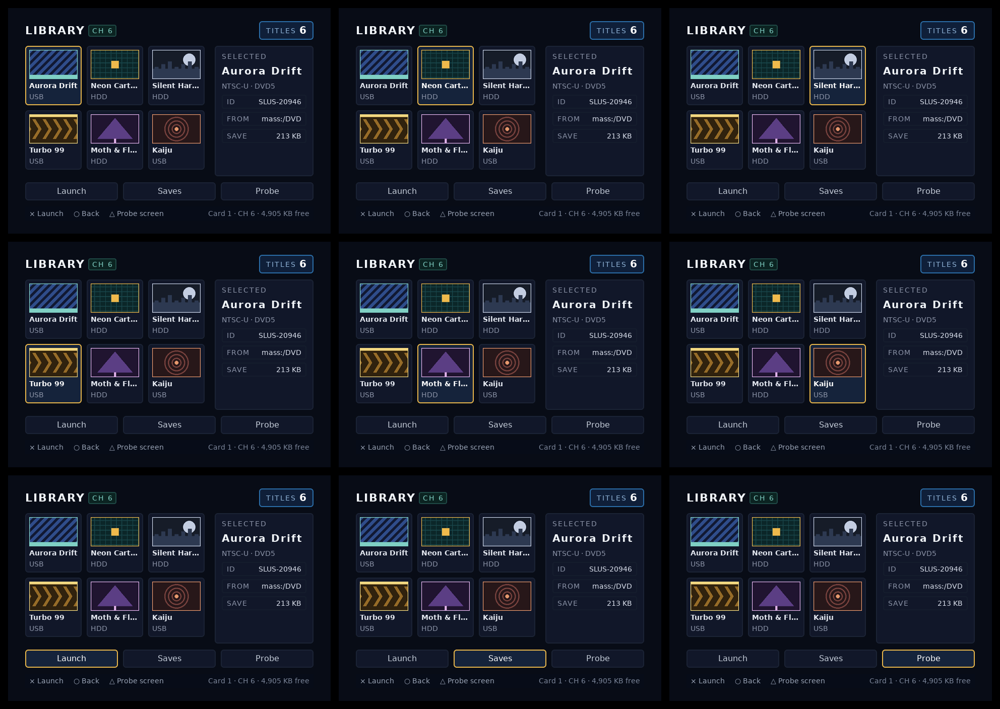
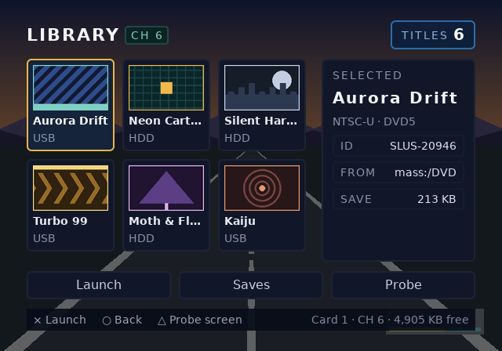

# channel6

## Screenshots






The fourth image is synthetic. `preview_in_game.py` draws the frame beneath the
UI from flat shapes, not a captured game, and renders the blob onto full
transparency before compositing the two. It shows the operation the GS
performs on a skipped clear. It is not a photograph of this UI over a running
game.

## What it demonstrates

channel6 bakes a `games` screen (a six-cover grid, a detail column, three
actions) and a `probe` screen (eight labelled conformance cells) into one
blob, sharing every texture, atlas and font table between them. The two
screens are reached with `ps2ui_screen_set`, not composited: the browser and
the probe never share a frame.

| mechanism | where |
|---|---|
| One project file compiles two screens against one shared stylesheet; only `probe.html` sets `focusWrap: true` | [ps2ui.json](repo:examples/channel6/ps2ui.json#L1-L10) |
| `focusable`/`autofocus` sets initial focus per screen; `games` dead-ends at its grid edges, `probe` wraps | [games.html](repo:examples/channel6/ui/games.html#L18), [probe.html](repo:examples/channel6/ui/probe.html#L17) |
| `data-slot` with `data-slot-capacity` for 13 games-screen slots and 2 probe-screen slots | [games.html](repo:examples/channel6/ui/games.html#L12), [probe.html](repo:examples/channel6/ui/probe.html#L12) |
| `data-keep` protects the CLIP cell's out-of-clip scissor instrument from the bake-time dead-geometry trim | [probe.html](repo:examples/channel6/ui/probe.html#L53-L54), [channel6.css](repo:examples/channel6/ui/channel6.css#L395-L405) |
| A second `ps2ui build --mode ntsc16x9 -o build/ui-16x9.uib` of the same project bakes the widescreen blob; there is no `variants` key | [build.sh](repo:examples/channel6/build.sh#L26-L29) |
| `preview_in_game.py` renders the blob on full transparency and composites it over a synthetic driving-game frame | [preview_in_game.py](repo:examples/channel6/preview_in_game.py#L87-L94) |
| `check.py` re-reads the baked blob and asserts the focus graph, slot capacities, vanish-row colours and the swizzle tile's region order | [check.py](repo:examples/channel6/check.py#L109-L433) |

The project file sets no `mode`, `canvas`, `strict` or `vramBudget`, so every
one of those takes the baker's default. Read the full key table on
[the project file](page:authoring/project-file#reference-table). The 16:9
blob is a second build of the same `ps2ui.json` with flags, which is why the
project file carries no variants block.

## Build and check

Run the example's own script from the repository root:

```sh
./examples/channel6/build.sh
```

The script bakes the 4:3 project, bakes it again for 16:9, renders the probe
screen's own preview and montage, composites the browser over a synthetic
game frame, refreshes the four committed screenshots, then runs `check.py`
against the fresh blob. Its last lines:

```
ok 46 - both are the same size (24x24), so only position distinguishes them
ok 47 - and clears the clip edge by 15px, so an ordinary layout edit cannot walk it back inside
1..47
PASS: 47 checks, 0 failure(s)
channel6 browser: ./examples/channel6/build/ui.uib
```

The screenshots the run just wrote match the ones already committed:

```sh
$ git diff --exit-code examples/channel6/screenshots; echo "diff exit: $?"
diff exit: 0
```

Validate either blob directly with [ps2ui-check](page:cli/ps2ui-check#synopsis):

```
$ ps2ui-check examples/channel6/build/ui.uib
...
1..75
# examples/channel6/build/ui.uib: 640x448 at 4:3, 2 screen(s), 1242 commands, 25 textures, 15 slots
PASS: 75 checks, 0 error(s), 1 warning(s)
```

`tools/check-blobs.sh` runs both channel6 blobs with a declared exemption,
because the probe screen's CLIP cell parks one instrument quad outside its
own scissor on purpose and a validator reading the file cannot tell that from
waste:

```
    examples/channel6/build/ui.uib|examples/channel6/build/ui-16x9.uib)
        echo "--allow-dead 1 --strict" ;;
```

Under that flag the same run shows zero warnings:

```
$ sh tools/check-blobs.sh examples/channel6/build/ui.uib examples/channel6/build/ui-16x9.uib
...
PASS: 75 checks, 0 error(s), 0 warning(s)
...
PASS: 75 checks, 0 error(s), 0 warning(s)
check-blobs: 2 blob(s) validated
```

CI runs this example across three separate steps: "Channel-6 browser end to
end" runs `./examples/channel6/build.sh` and nothing else
([ci.yml](repo:.github/workflows/ci.yml#L253-L264)); "Committed screenshots
match the renderer" re-runs the `git diff --exit-code` above alongside
memcard's and opl-env's screenshot directories
([ci.yml](repo:.github/workflows/ci.yml#L475-L492)); "Validate every blob
against the runtime's assumptions" runs `tools/check-blobs.sh` by name
against both channel6 blobs plus the other two examples'
([ci.yml](repo:.github/workflows/ci.yml#L546-L567)).

## Numbers from the blob

Taken from the `ps2ui-check` trailer and arena note above, the `ps2ui-bake`
texture and VRAM lines from the same `build.sh` run, and the two blobs' file
sizes. The 16:9 blob repeats every count and the arena figure; only its
canvas aspect and screen names differ.

| field | value |
|---|---|
| canvas | 640x448 at 4:3 (`ui.uib`); 640x448 at 16:9 (`ui-16x9.uib`) |
| screens | 2 |
| commands | 1242 |
| textures | 25 |
| CLUTs | 9 |
| slots | 15 |
| fonts | 4 |
| kern pairs | 570 |
| dead commands trimmed at bake | 20 |
| dead commands remaining, declared | 1 of 1 (`--allow-dead 1`) |
| arena, EE | 10624 bytes |
| arena, 64-bit host | 10824 bytes |
| VRAM used | 368 KiB of 736 KiB budget (50%) |
| blob size, `ui.uib` | 252,624 bytes |
| blob size, `ui-16x9.uib` | 252,640 bytes |

The arena figure is blob-specific: only a bake or a check run in this session
proves what this project needs. See
[the arena note](page:cli/ps2ui-check#the-arena-note) for why the EE and host
figures differ. The 20 trimmed commands are the tail of `nowrap` runs the GS
could never see; the one remaining dead command is the CLIP cell's own
`data-keep` instrument, declared through `--allow-dead 1` rather than fixed.

## Source tour

- [ps2ui.json](repo:examples/channel6/ps2ui.json) - the whole project: two
  screens, one of them wrapping, one shared stylesheet, three preview paths.
- [ui/games.html](repo:examples/channel6/ui/games.html) - the browser: six
  focusable cover tiles, a detail column of five slots and three actions.
- [ui/probe.html](repo:examples/channel6/ui/probe.html) - the conformance
  grid: eight labelled cells, each keyed to one bring-up step, including the
  `data-keep` scissor pair.
- [ui/channel6.css](repo:examples/channel6/ui/channel6.css) - the shared
  stylesheet, including the comment on why `data-keep` exists and what it
  guards against.
- [check.py](repo:examples/channel6/check.py) - the blob-level contract: the
  focus graph, the vanish rows for bring-up steps 4 and 5, and the swizzle
  tile's authored region order for step 3.
- [preview_in_game.py](repo:examples/channel6/preview_in_game.py) - the
  synthetic composite: a driving-game frame drawn from flat shapes, never a
  captured photograph.

## Start from this

Copy the two-screen project shape with one screen's `focusWrap` set and the
other left at the default, the `data-slot` pattern for runtime-editable text,
and the second `ps2ui build --mode` invocation for a widescreen bake of the
same project. Replace the six covers and eight probe cells with your own
screens, and keep the probe screen itself: it stays useful long after your
markup has replaced the browser, and its cells are what
[first boot](page:runtime/first-boot#reading-the-probe) compares a console
frame against.

channel6 uses none of the following, so add them only if the new project
needs them:

- Composited overlay screens, covered in
  [screens and overlays](page:authoring/screens-and-overlays#what-it-is).
  `games` and `probe` are both top-level and reached with
  `ps2ui_screen_set`; neither is drawn over the other.
- More than one theme, covered in
  [theming](page:authoring/theming#what-it-is). opl-env uses two.
- Streamed textures instead of baked ones, covered in
  [streaming art](page:runtime/streaming-art#what-it-is). Every cover here
  is palettized and baked in place; opl-env streams its covers instead.
- Repeated rows from one template, covered in
  [lists](page:authoring/lists#what-it-is). channel6 writes six tiles and
  eight cells out by hand, the same choice memcard makes.

After the blob passes [ps2ui-check](page:cli/ps2ui-check#synopsis), the
[first-boot](page:runtime/first-boot#steps-1-10) checklist runs the ten steps
this example's probe screen was built to answer.
