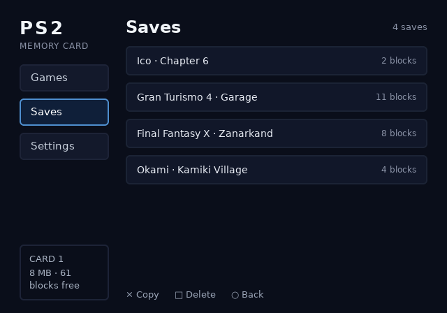

# memcard

## Screenshots





## What it demonstrates

memcard is a PS2 memory-card browser: a Library screen of six game tiles and a
Saves screen of four save rows, both reached from the same sidebar. It is the
smallest project in this tree that still exercises focus, dynamic text and a
shared stylesheet across screens.

| mechanism | where |
|---|---|
| One project file compiles two screens against one shared stylesheet | [ps2ui.json](repo:examples/memcard/ps2ui.json#L2) |
| `focusable` plus `autofocus` sets the initial focus per screen | [library.html](repo:examples/memcard/ui/library.html#L11), [saves.html](repo:examples/memcard/ui/saves.html#L12) |
| `:focus` changes only fill and border colour; geometry never does | [library.css](repo:examples/memcard/ui/library.css#L48) |
| `data-slot` with `data-slot-capacity` for runtime-editable counts and titles | [library.html](repo:examples/memcard/ui/library.html#L25), [saves.html](repo:examples/memcard/ui/saves.html#L25) |
| `white-space: nowrap` plus `text-overflow: ellipsis` truncates long titles | [library.css](repo:examples/memcard/ui/library.css#L138) |
| `preview.render` per screen and `preview.montage` for one sheet of every focus state | [build.sh](repo:examples/memcard/build.sh#L33) |

The project file names two screens, sets no `mode`, `canvas` or `focusWrap`,
and leaves every one of those keys at the baker's default. Read the full key
table on [the project file](page:authoring/project-file#reference-table).

## Build and check

Run the example's own script from the repository root:

```sh
./examples/memcard/build.sh
```

The script compiles both screens, bakes them into one blob, runs
`make -C runtime test` against the fresh blob, then re-renders the three
committed screenshots from it. Its last lines:

```
1..410
PASS: 410 checks, 0 failure(s)
make: Leaving directory '/home/user/OPHTML/runtime'
ps2ui-bake: screenshots -> ./examples/memcard/screenshots/
memcard example: ./examples/memcard/build/ui.uib
```

The screenshots the run just wrote match the ones already committed:

```sh
$ git diff --exit-code examples/memcard/screenshots; echo "diff exit: $?"
diff exit: 0
```

Validate the blob directly with [ps2ui-check](page:cli/ps2ui-check#synopsis):

```
$ ps2ui-check examples/memcard/build/ui.uib
...
1..63
# examples/memcard/build/ui.uib: 640x448 at 4:3, 2 screen(s), 1062 commands, 11 textures, 6 slots
PASS: 63 checks, 0 error(s), 0 warning(s)
```

`tools/check-blobs.sh` runs this same check with `--strict` and no other flag,
so a warning here is a CI failure:

```
    examples/memcard/build/ui.uib)
        echo "--strict" ;;
```

CI builds and checks this blob in the step named "Example builds end to end
(includes runtime tests)", which is `./examples/memcard/build.sh` and nothing
else ([ci.yml](repo:.github/workflows/ci.yml#L228-L229)).

## Numbers from the blob

Taken from the `ps2ui-check` trailer and arena note above, and from the
budget line `ps2ui-bake` prints while baking. The arena figure is
blob-specific: every project's arena is a different size, and only a bake or
a check run in the same session proves what this one needs. See
[the arena note](page:cli/ps2ui-check#the-arena-note) for why the EE and host
figures differ.

| field | value |
|---|---|
| canvas | 640x448 at 4:3 |
| screens | 2 |
| commands | 1062 |
| textures | 11 |
| CLUTs | 1 |
| slots | 6 |
| arena, EE | 1662 bytes |
| arena, 64-bit host | 1750 bytes |
| VRAM used | 160 KiB of 736 KiB budget (21%) |

`make -C runtime test` runs its 410-check main suite and its 5-check narrow
suite over this same blob, both listed as prerequisites of `test` but the
narrow suite's line prints last:

```
PASS: 5 checks, 0 failure(s)
...
PASS: 410 checks, 0 failure(s)
```

## Source tour

- [ps2ui.json](repo:examples/memcard/ps2ui.json) - the whole project: two
  screens, one stylesheet, a preview path and a montage path.
- [ui/library.html](repo:examples/memcard/ui/library.html) - the Library
  screen: six focusable tiles, an autofocus nav button and a `count` slot.
- [ui/saves.html](repo:examples/memcard/ui/saves.html) - the Saves screen:
  four save rows, each with its own `save-N` slot capped at 31 bytes.
- [ui/library.css](repo:examples/memcard/ui/library.css) - the shared
  stylesheet both screens compile against, including the `:focus` deltas and
  the comment on why focus never moves anything.
- [build.sh](repo:examples/memcard/build.sh) - what is genuinely this
  example's: the runtime test run and the screenshot refresh, since the build
  itself lives in `ps2ui.json`.

## Start from this

Copy the project file shape (two screens sharing one stylesheet, a preview
and a montage path), the `:focus` colour-only pattern, and the slot markup
for a count or a title that changes at runtime. Replace the tile grid and
save rows with your own screens and slot names.

memcard uses none of the following, so add them only if the new project
needs them:

- Overlay screens, covered in
  [screens and overlays](page:authoring/screens-and-overlays#what-it-is).
- More than one theme, covered in
  [theming](page:authoring/theming#what-it-is).
- Streamed textures instead of baked ones, covered in
  [streaming art](page:runtime/streaming-art#what-it-is).
- Repeated rows from one template, covered in
  [lists](page:authoring/lists#what-it-is). memcard writes six tiles and four
  rows out by hand because the count never changes at runtime; a list with a
  scrolling window is the next step past that.

After the blob passes `ps2ui-check`, the
[first-boot checklist](page:runtime/first-boot#reading-the-probe) is what takes it
from a host build to a console frame.
