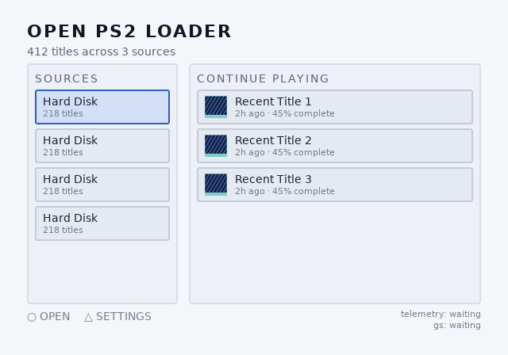
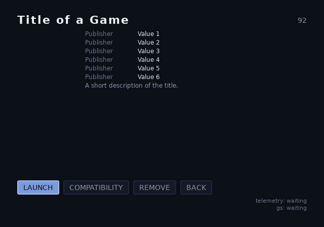
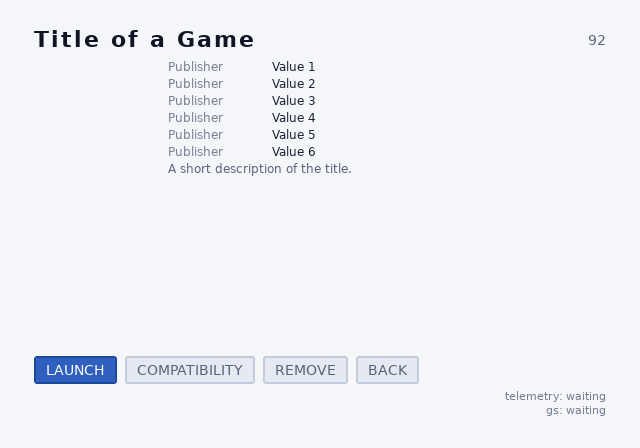
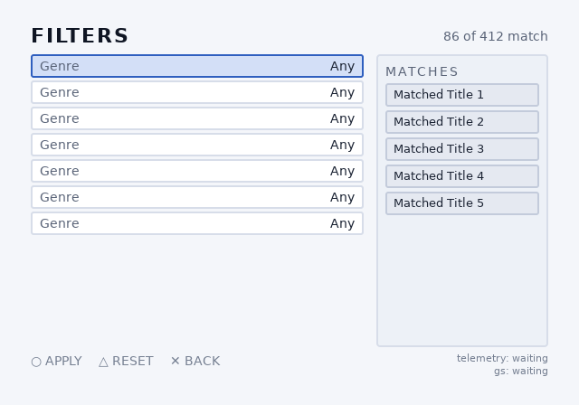
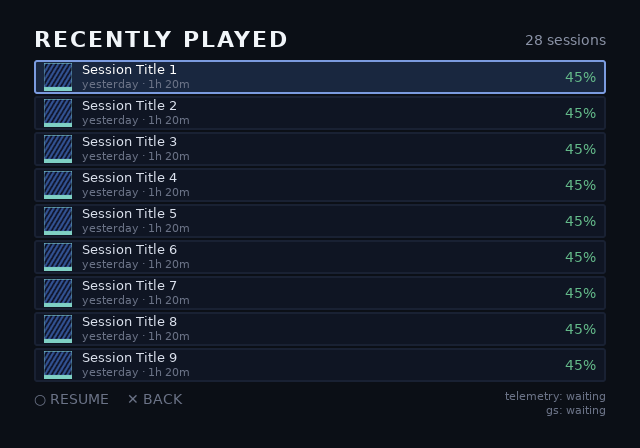
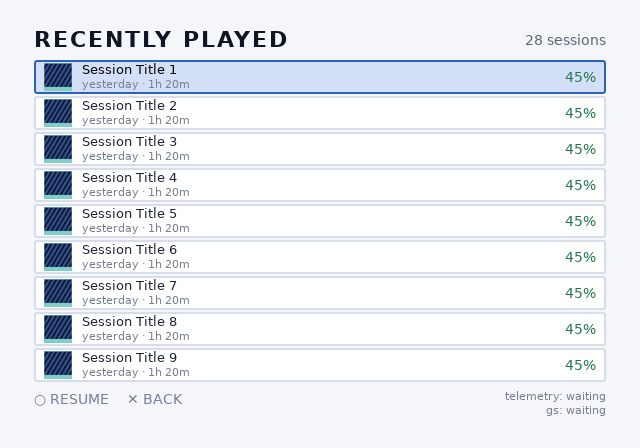
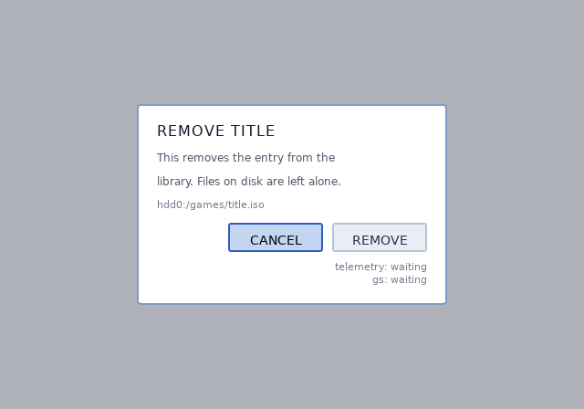
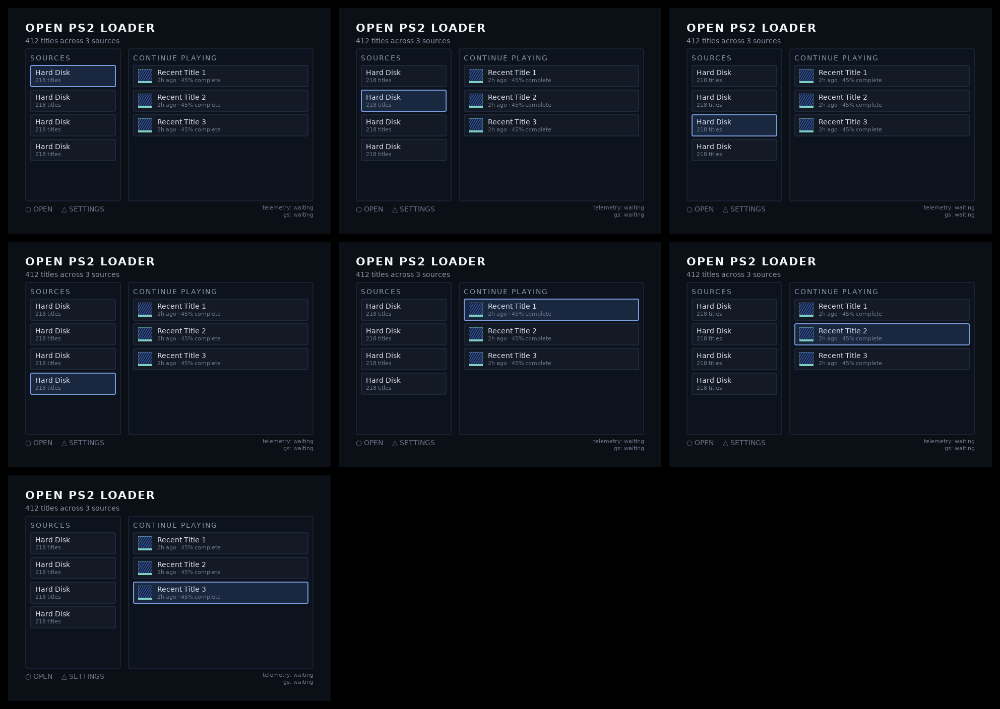

# opl-env

## Screenshots





















Every streamed slot renders empty here. `ps2ui_upload` leaves an unfilled
reservation's texture pointer null, and `ps2ui_render` skips the textured
draw on the same test. A driver fills each one as the corresponding row or
cover scrolls into view.

## What it demonstrates

opl-env bakes six screens into one blob: landing, library, detail, filters,
recent and confirm, sharing one stylesheet and carrying two themes and 137
runtime-editable slots between them. It exercises the same mechanisms
memcard does, plus three memcard has none of: a themed palette, streamed
cover art and an overlay screen.

| mechanism | where |
|---|---|
| One project file compiles six screens against one shared stylesheet, `--strict` and an 11px slot-text floor | [ps2ui.json](repo:examples/opl-env/ps2ui.json#L1) |
| `data-tex-slot` reserves a streamed texture: nine 28x28 library-row covers and one 120x72 detail cover | [library.html](repo:examples/opl-env/ui/library.html#L21), [detail.html](repo:examples/opl-env/ui/detail.html#L13) |
| `confirm` is a separate screen composited over library or detail, with no clear between the two renders | [confirm.html](repo:examples/opl-env/ui/confirm.html#L4) |
| `:root` plus one `@theme light` block gives every named colour a second value | [opl.css](repo:examples/opl-env/ui/opl.css#L30), [opl.css](repo:examples/opl-env/ui/opl.css#L78) |
| `data-repeat` writes out the repeated rows, tiles and fields: nine library rows, six detail fields, seven filter facets, three landing resume cards | [library.html](repo:examples/opl-env/ui/library.html#L20), [detail.html](repo:examples/opl-env/ui/detail.html#L16) |
| `data-slot` on every screen for a two-line driver telemetry readout, named per screen | [library.html](repo:examples/opl-env/ui/library.html#L51) |
| A host-side windowed list keeps nine fixed streamed reservations pointed at a scrolling selection | [window.h](repo:examples/opl-env/window.h#L31) |

The project file names six screens and sets `strict` and `minFontSize`; it
leaves `mode`, `canvas`, `displayAspect`, `focusWrap`, `palettizeImages` and
`vramBudget` at the baker's default. Read the full key table on
[the project file](page:authoring/project-file#reference-table). Two named
theme rows are the mechanism [theming](page:authoring/theming#what-it-is)
covers; the streamed row and detail covers are what
[streaming art](page:runtime/streaming-art#what-it-is) covers; `confirm`
composited over the base screen is what
[screens and overlays](page:authoring/screens-and-overlays#what-it-is)
covers; the repeated library rows, facets and tiles are the pattern
[lists](page:authoring/lists#what-it-is) covers, though opl-env writes every
row out at build time rather than through a runtime scrolling window.

## Build and check

Run the example's own script from the repository root:

```sh
./examples/opl-env/build.sh
```

The script compiles all six screens, bakes them into one blob, runs
[ps2ui-check](page:cli/ps2ui-check#synopsis) through `tools/check-blobs.sh`,
runs the example's own `check.py` against the fresh blob, then re-renders the
twelve committed per-theme screenshots. Its last lines:

```
1..93
PASS: 93 checks, 0 failure(s)
ps2ui-bake: screenshots (2 theme(s)) -> ./examples/opl-env/screenshots/
opl-env example: ./examples/opl-env/build/ui.uib
```

`build.sh`'s header comment says it runs the host runtime tests. It runs
`ps2ui build`, `check-blobs.sh` and `check.py`; none of the three calls
`make -C runtime test`.

The screenshots this run just wrote match the ones already committed:

```sh
$ git diff --exit-code examples/opl-env/screenshots; echo "diff exit: $?"
diff exit: 0
```

`tools/check-blobs.sh` checks this blob with `--strict` alone, no
`--allow-dead` or `--allow-hairline`:

```
    examples/opl-env/build/ui.uib)
        echo "--strict" ;;
```

Validate the blob's numbers directly with ps2ui-check:

```
$ ps2ui-check examples/opl-env/build/ui.uib
...
1..107
# examples/opl-env/build/ui.uib: 640x448 at 4:3, 6 screen(s), 2158 commands, 21 textures, 137 slots
PASS: 107 checks, 0 error(s), 0 warning(s)
```

The example's own `check.py` reads the same bytes and asserts the theming
contract a format-level check cannot see: the tint table is role-keyed, slot
text and commands share the entries their names share, and every screen
carries a fitting telemetry pair. It runs from `build.sh`, against a build
artefact, rather than from the baker's unit suite.

The figures in `README.md` match the blob:

```
$ python3 tools/check-example-figures.py
ok - opl-env: 7 of 7 documented figures match the blob
ok - docs/PLAN.md's 4 restated figures match too
```

CI builds and checks this blob in the step named "OPL environment end to
end", which runs `./examples/opl-env/build.sh` and nothing else. Two later
steps depend on that build: "Example figures match their blobs" runs
`tools/check-example-figures.py`, and "Committed screenshots match the
renderer" re-runs the `git diff --exit-code` above across all three
examples' screenshot directories together.

## Numbers from the blob

Taken from the `ps2ui-check` trailer and arena note above, and from the
texture and VRAM lines `ps2ui-bake` prints while baking, both from the same
`build.sh` run. See [the arena note](page:cli/ps2ui-check#the-arena-note)
for why the EE and host figures differ.

| field | value |
|---|---|
| canvas | 640x448 at 4:3 |
| screens | 6 |
| commands | 2158 |
| textures | 21 (10 streamed, 11 baked) |
| CLUTs | 2 |
| slots | 137 |
| focus nodes | 51 |
| fonts | 6 |
| themes | 2 |
| arena, EE | 7319 bytes |
| arena, 64-bit host | 7487 bytes |
| blob size | 269,824 bytes |
| VRAM used | 336 KiB of 736 KiB budget (45%) |

## Source tour

- [ps2ui.json](repo:examples/opl-env/ps2ui.json) - the whole project: six
  screens, one stylesheet, `--strict`, an 11px floor and a preview and
  montage path.
- [ui/library.html](repo:examples/opl-env/ui/library.html) - the busiest
  screen: nine streamed rows, five filter chips, three continue-playing
  tiles and its own telemetry pair.
- [ui/confirm.html](repo:examples/opl-env/ui/confirm.html) - the overlay
  screen: a two-line body split across two slots, and the comment on why
  composition never clears.
- [ui/opl.css](repo:examples/opl-env/ui/opl.css) - the shared stylesheet:
  every named colour in `:root`, the second value in `@theme light`.
- [window.h](repo:examples/opl-env/window.h) - the host-side windowed list:
  C89, no PS2 headers, the mechanism a scrolling library needs on top of
  fixed reservations.
- [check.py](repo:examples/opl-env/check.py) - the blob-level theming
  contract: role-keyed tints, the identity entry and the per-screen
  telemetry fit.

## Start from this

Copy the six-screens-one-stylesheet project shape with `strict` and
`minFontSize` set, the `:root` plus `@theme` pair for a second palette, the
`data-tex-slot` pattern for art that arrives at runtime, and the per-screen
telemetry slot pair for a readout that costs nothing when unset. Copy the
two-slot split for any text that runs past one line; a single `data-slot`
never wraps.

Replace the six screens and their `data-repeat` counts with your own,
replace the streamed slot names and sizes with the art your environment
actually loads, and replace the driver's telemetry format strings with
whatever your own build wants measured. `window.h`'s per-row reservation
model is a starting point, not a mandate: it windows by row and reuploads
every visible row on any scroll, which is the cost the file exists to make
visible before anything optimises it.

After the blob passes [ps2ui-check](page:cli/ps2ui-check#synopsis), the
[first-boot checklist](page:runtime/first-boot#reading-the-probe) is what takes it
from a host build to a console frame.
