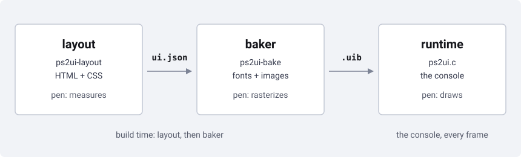

# How it works

## The three stages

`ps2ui-layout` compiles one HTML file and one CSS file into `ui.json`.
`ps2ui-bake` reads `ui.json`, fonts and images, and writes one `.uib` blob.
The runtime loads that blob on the console and renders it every frame. One
`ui.json` describes one screen; several files become named screens in one
blob. Each stage reads only the file the stage before it wrote. The baker
never reads HTML or CSS. The runtime never reads `ui.json`. Three programs,
two files, one direction.

## The two seams

Two file formats sit between the three stages. [ui.json](page:reference/ir-format#layout)
is UTF-8 JSON, one screen per file: canvas, fonts, themes, commands, focus,
slots and warnings, in that order. It carries `version: 1`; a baker that
sees any other value stops before reading anything else. [.uib](page:reference/uib-format#layout)
is fixed-stride binary: a header, eight tables, padding to 16 bytes, then a
data blob. Its magic is 0x31424955 and its format version is 7. Its own
CRC-32 is checked at every load. Format version 7 is frozen; new behaviour
is a feature bit, never a new layout. `PS2UI_VERSION` in the runtime header
is that same integer 7. Baker and runtime agree because `ps2ui vendor-runtime`
ships both files from one package, not because the macro polices drift.

## Build time does the work

Every geometry decision is made before the console runs. Command
coordinates are integers, fixed at compile time. A `:focus` rule that
changes geometry is a compile error, so a focused and an unfocused command
share one layout. [ps2ui_render](page:runtime/frame-loop#behaviour) computes
nothing: it replays the command list the build baked, every primitive
already inside the canvas rectangle. It issues no clear and ages no texture
residency; the app owns both. There is no unload, free or destroy call. The
29 public functions are the whole runtime API, and a refused load never
touches the arena. Nothing on the console decides where a pixel goes.
Everything on the console decides whether to draw it.

## Three pens, one pixel

Three pens draw the same text, on both sides of the two seams.
`ps2ui-layout` has no weight axis: `font-weight >= 600` selects the bold
face, and the emitted command carries the CSS number, not the face name.
`ps2ui-bake` reads that number, builds a glyph atlas from the real TTF, and
rasterizes it. The runtime's pen walks the blob's own glyph table and draws
from the atlas the baker built. All three share one rounding rule, so a
build and a render land every glyph on the same pixel. See [text and fonts](page:authoring/text-and-fonts#the-charset)
for the rule. A codepoint the metrics never saw takes the `?` advance
everywhere. Only the layout pen stops at measuring it. The baker rasterizes
the real character from the TTF. The runtime and the blob pen substitute
the `?` glyph outright, because the blob's font table carries no other
entry.

## What the previewer shows and what it cannot

`ps2ui serve` renders every frame with the Python previewer, `preview.render`,
on the server. It ships the result as PNG bytes; the browser draws no UI
pixel itself. Four aspect modes resample that one render: `framebuffer`,
`authored`, `force-4:3`, `force-16:9`. See [the previewer](page:cli/previewer#limits)
for the full list of what it draws. The previewer cannot show
`ps2ui_visible_set` or the runtime's list window, because its renderer
takes no visibility parameter. It cannot show a hardware fault the command
list is innocent of, or two screens composited into one frame, because it
renders one screen at a time. It cannot fill a streamed texture, because it
supplies no texels. A warning it prints names a screen, never a command
index, so it cannot jump to what it is about.

## Related pages

- [Internals](page:project/internals#decisions) covers the decisions behind
  the three-stage split and the bugs each stage design closed.
- [ui.json](page:reference/ir-format#layout) documents every field the
  layout stage emits.
- [.uib](page:reference/uib-format#layout) documents every table the baker
  writes.
- [The frame loop](page:runtime/frame-loop#behaviour) documents every
  guarantee `ps2ui_render` holds.
- [Text and fonts](page:authoring/text-and-fonts#the-charset) documents the
  three pens in full, including wrapping and ellipsis.
- [Previewer](page:cli/previewer#limits) documents every route and control
  the previewer offers.
