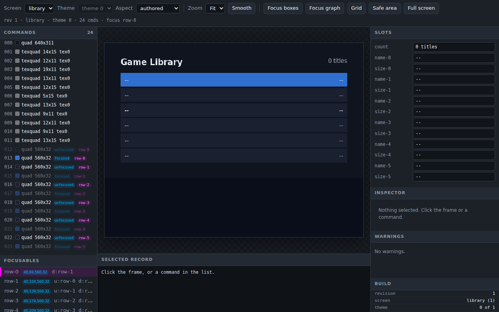

# Quick start

## What you get

Eight commands turn one TTF into a baked blob and a browser preview, run
from an empty directory. [Install the packages](page:getting-started/installation#what-it-is)
first; every command below assumes `ps2ui` and `ps2ui-fontgen` are already
on PATH.

## 1. Fonts from a TTF

```sh
mkdir -p browser/ui && cd browser
ps2ui fontgen "$TTF_REGULAR" "$TTF_BOLD"
```

```text
ps2ui-fontgen: 115 glyphs, 284 kern pairs -> fonts/default.metrics.json
ps2ui-fontgen: 115 glyphs, 163 kern pairs -> fonts/default-bold.metrics.json
ps2ui-fontgen: manifest -> fonts/fonts.json
```

This rasterizes both faces and writes `fonts/fonts.json`, the manifest every
later command reads.

## 2. The screen

```sh
cat > ui/library.html <<'EOF'
<screen name="library">
  <div class="page">
    <div class="header">
      <span class="title">Game Library</span>
      <span class="count" data-slot="count" data-slot-capacity="16">0 titles</span>
    </div>
    <div class="row" data-repeat="6" id="row-{i}" focusable>
      <span class="name" data-slot="name-{i}" data-slot-capacity="40">--</span>
      <span class="size" data-slot="size-{i}" data-slot-capacity="12">--</span>
    </div>
  </div>
</screen>
EOF
```

`data-repeat="6"` stamps six rows at compile time. Each `data-slot` reserves
runtime text, and `focusable` puts a row in the D-pad graph.

## 3. The style

```sh
cat > ui/library.css <<'EOF'
:root {
  --bg: #10141f; --panel: #1a2030;
  --text: #e8ecf4; --dim: #a8b2c4; --accent: #2f6fd0;
}
.page   { display: flex; flex-direction: column; padding: 32px 40px; background: var(--bg); }
.header { display: flex; flex-direction: row; padding-bottom: 12px; }
.title  { font-size: 20px; font-weight: 700; color: var(--text); flex-grow: 1; }
.count  { font-size: 14px; color: var(--dim); }
.row    { display: flex; flex-direction: row; padding: 7px 10px; background: var(--panel); margin-bottom: 3px; }
.row:focus { background: var(--accent); }
.name   { font-size: 14px; color: var(--text); flex-grow: 1; }
.size   { font-size: 14px; color: var(--dim); }
.row:focus .size { color: var(--text); }
EOF
```

`flex-direction` is required on any container with two or more children.
Every `var(--x)` here becomes a row in the blob's tint table, not a fixed
color.

## 4. The project file

```sh
cat > ps2ui.json <<'EOF'
{
  "screens": ["ui/library.html"],
  "css": "ui/library.css",
  "strict": true,
  "montage": "build/states.png"
}
EOF
```

The [project file](page:authoring/project-file#reference-table) takes
`screens` and `css` only; every other key defaults. `strict` and `montage`
are already optional here.

## 5. Build

```sh
ps2ui build
```

```text
ps2ui-layout: 14 paint commands, 6 focusables -> build/library.json
ps2ui-bake: 1 screen(s), 24 records, 2 textures (32 KiB baked), 1 CLUTs -> build/ui.uib
ps2ui-bake: arena 1516 bytes (static uint8_t arena[1516] __attribute__((aligned(16))))
ps2ui-bake: preview -> build/preview.png
ps2ui-bake: montage -> build/states.png
```

Two stages ran: the compiler solved layout and focus, then the baker wrote
`build/ui.uib` and rendered `build/preview.png` from it. The arena line is
the number to paste into a C program: this blob needs 1516 bytes and the
runtime allocates nothing on its own.


## 6. Check it

```sh
ps2ui check
```

```text
# arena: 1516 bytes on the EE (1532 on a 64-bit host; GSTEXTURE holds pointers, so the two differ)
# build/ui.uib: 640x448 at 4:3, 1 screen(s), 24 commands, 2 textures, 13 slots
PASS: 51 checks, 0 error(s), 0 warning(s)
```

`ps2ui check` validates the blob against every assumption the C runtime
makes: table bounds, texture residency, scissor depth, VRAM budget. It
prints two arena figures because a `GSTEXTURE` pointer is 4 bytes on the EE
and 8 bytes on a 64-bit host; `ps2ui build` only prints the EE figure.

## 7. Confirm the preview matches the server

```sh
ps2ui serve --selftest
```

```text
ok - an unknown route is 404
ok - the frame is byte-identical to --preview
PASS: 6 route(s)
```

This builds the project, binds an ephemeral port, fetches every route once,
and asserts the served frame equals what `--preview` wrote. If those ever
differ, everything judged in a browser is judged against a picture the
console will not draw.

## 8. Serve it

```sh
ps2ui serve --port 8600
```

```text
ps2ui-layout: 14 paint commands, 6 focusables -> build/serve/library.json
ps2ui serve: http://127.0.0.1:8600/ -- ctrl-c to stop
```

With no `--port` this tries 8080 first and walks up to the next free port.
Open the URL and the [previewer](page:cli/previewer#the-page) shows the
frame, the command list, the focusables and the slot boxes. The server
writes to `build/serve/` rather than `build/`, so a `ps2ui build` in
another terminal cannot collide with it.



## Next

- [Tutorial: a game browser](page:getting-started/tutorial-game-browser#what-it-is)
  builds this same screen out further, with a second screen and real list data.
- [ps2ui](page:cli/ps2ui#build) documents every subcommand and flag used above.
- [The project file](page:authoring/project-file#reference-table) lists
  every key `ps2ui.json` accepts, not only the four used here.
