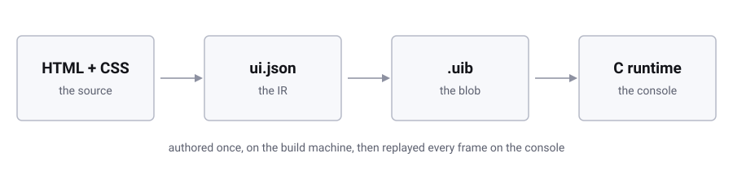
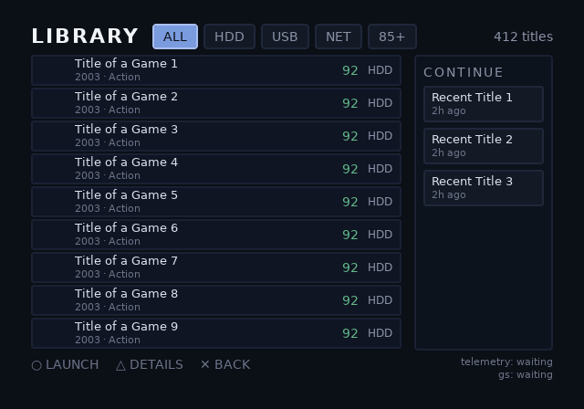
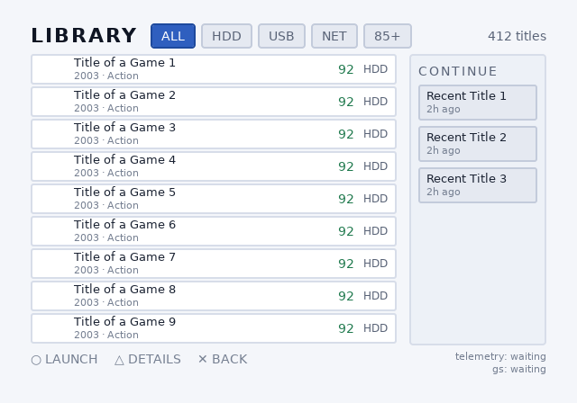

# OPHTML

OPHTML builds PlayStation 2 homebrew user interfaces from HTML and CSS. A
build machine measures the layout, rasterizes the text and images, and
packs the result into one blob. A small C99 runtime on the console only
replays that blob, so the console never parses a document, runs flexbox,
or lays out a frame. Focus, navigation, theming and dynamic text are all
decided before the blob ships. The console only moves a cursor and swaps
a table.

Two tools sit between the two files the pipeline names. `ps2ui-layout`
turns HTML and CSS into `ui.json`, and `ps2ui-bake` turns `ui.json` into
`.uib`. [How it works](page:getting-started/how-it-works#the-three-stages)
covers both seams and the rules the design rests on.

One blob renders in more than one theme, swapped on the console at
runtime with no rebuild and no second asset set. These two pictures are
the same opl-env library screen, the same blob, theme 0 then theme 1:

## Start here

- [Installation](page:getting-started/installation#what-it-is) installs
  both packages and checks each is on PATH. Do this first.
- [Quick start](page:getting-started/quickstart#what-you-get) runs eight
  commands from a TTF to a served preview, on a project scaled down to fit
  one page.
- [Tutorial: a game browser](page:getting-started/tutorial-game-browser#1-fonts-of-your-own)
  builds the same screen from an empty directory, then drives it from a
  checked C loop, closer to a real project.

## Requirements

| need | version | used by |
|---|---|---|
| Node.js | 18 or newer | `ps2ui-layout`, `ps2ui-dev` |
| Python | 3.9 or newer | `ps2ui`, `ps2ui-bake`, `ps2ui-check`, `ps2ui-fontgen` |
| Pillow | 9 or newer | `ps2ui-bake`, `ps2ui-fontgen` |
| uharfbuzz | 0.51.7 or newer | `ps2ui-fontgen`; pip installs it, and nothing comes from the system |
| a TTF | any | `ps2ui-fontgen` |
| a C cross toolchain (ps2dev) | latest | the console half only, vendored by `ps2ui vendor-runtime` |

## Sections

- **Getting started**: [Installation](page:getting-started/installation), [Quick start](page:getting-started/quickstart), [Tutorial: a game browser](page:getting-started/tutorial-game-browser), [How it works](page:getting-started/how-it-works).
- **Authoring**: [The project file](page:authoring/project-file), [HTML](page:authoring/html), [CSS](page:authoring/css), [Text and fonts](page:authoring/text-and-fonts), [Images](page:authoring/images), [Dynamic text](page:authoring/dynamic-text), [Lists](page:authoring/lists), [Focus and navigation](page:authoring/focus-and-navigation), [Theming](page:authoring/theming), [Screens and overlays](page:authoring/screens-and-overlays), [Video modes](page:authoring/video-modes), [CRT linter](page:authoring/crt-linter), [VRAM budget](page:authoring/vram-budget).
- **CLI**: [ps2ui](page:cli/ps2ui), [ps2ui-layout and ps2ui-dev](page:cli/ps2ui-layout), [ps2ui-bake](page:cli/ps2ui-bake), [ps2ui-check](page:cli/ps2ui-check), [ps2ui-fontgen](page:cli/ps2ui-fontgen), [Previewer](page:cli/previewer).
- **Runtime**: [Integrating the runtime](page:runtime/integrating), [The frame loop](page:runtime/frame-loop), [C API reference](page:runtime/api-reference), [Errors and constants](page:runtime/errors-and-constants), [Streaming art](page:runtime/streaming-art), [Moving and hiding](page:runtime/moving-and-hiding), [Telemetry](page:runtime/telemetry), [Deploying](page:runtime/deploying), [First boot](page:runtime/first-boot).
- **Reference**: [ui.json](page:reference/ir-format), [.uib](page:reference/uib-format), [Diagnostics](page:reference/diagnostics), [Compatibility](page:reference/compatibility).
- **Examples**: [memcard](page:examples/memcard), [opl-env](page:examples/opl-env), [channel6](page:examples/channel6).
- **Project**: [Changelog](page:project/changelog), [Contributing](page:project/contributing), [Security and license](page:project/security-and-license), [FAQ](page:project/faq), [Glossary](page:project/glossary), [Internals](page:project/internals).
