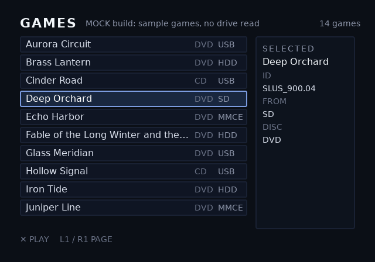

# Console launcher

## What it is

`ophtml.elf` is a finished PlayStation 2 program that lists the ISOs on the
drives it can mount and draws them through your theme. Pressing ✕ hands the
selected game to [Neutrino](https://github.com/rickgaiser/neutrino), which
boots it. The theme is an ordinary `.uib`. Nothing in C is yours to write.

**It has not yet been run on a console.** CI boots it in the Play! emulator,
where it draws, fills its list and follows the pad. Play! has no USB, HDD or
memory card slot, so no real drive has been read and no game has been started.
The bench cases in [console/README.md](repo:console/README.md#L225) are the
hardware checks, and each stays open until a sitting reports it. Treat any
failure on a console as a gap in the launcher, and report it as an issue.

The same program built with `MOCK=1` lists fourteen invented games without
reading a drive, and a release carries it as `ophtml-mock.elf`. This is the
previewer's drawing of that list through the built-in theme after three
presses of Down. CI presses the same keys at the emulator and compares its
frame with this one:



## Minimal example

1. Download `ophtml.elf` from the Assets list of a
   [GitHub Release](https://github.com/coffeedevsolutions/OPHTML/releases).
   Check it against the release's `SHA256SUMS`.
2. Copy it to a memory card or a USB stick, and start it from the launcher
   you already use, such as wLaunchELF or FMCB.
3. Download Neutrino from its releases page. Unzip its `neutrino/` folder at
   the root of the drive that holds your games.
4. Put your ISOs in `DVD/` or `CD/` at that drive's root, as OPL does.

```text
<drive root>/
  DVD/                  Name.iso, or SLUS_200.02.Name.iso
  CD/                   the same, for CD games
  neutrino/             Neutrino's release folder, unzipped as-is
  OPHTML/theme.uib      optional: your theme
```

With no theme on the drive, the launcher draws its built-in one, the
`examples/console` project.

To run your own theme, build it with `ps2ui build` and copy the blob as
`theme.uib` beside `ophtml.elf`, or to `OPHTML/theme.uib` on a drive. Check
it first with `ps2ui check`, and see it filled with the mock games in
`ps2ui serve --console`. Both are on [ps2ui-check](page:cli/ps2ui-check#options)
and the [previewer](page:cli/previewer#options).

A release with no `ophtml.elf` among its assets predates the launcher.
Build it from a checkout instead, with the Docker line in
[console/README.md](repo:console/README.md#L179).

## Reference table

The names the launcher fills. Each one is optional. A name the theme leaves
out is never filled.

| name | element | filled with |
|---|---|---|
| `game-0`, `game-1`, ... | focusable row, `id="game-{i}"` under `data-repeat` | one game per row; the launcher counts the rows from `game-0` until the first missing number |
| `game-{i}-title` | `data-slot` | the title, from the file name |
| `game-{i}-id` | `data-slot` | the title ID, from the file name or the disc's `SYSTEM.CNF` |
| `game-{i}-media` | `data-slot` | `DVD` or `CD`, from the folder |
| `game-{i}-device` | `data-slot` | `USB`, `HDD`, `SD` or `MMCE` |
| `sel-title`, `sel-id`, `sel-media`, `sel-device` | `data-slot` | the same four, for the selected game |
| `game-count` | `data-slot` | the number of games found |
| `status` | `data-slot` | what the launcher is doing, or what went wrong |

The drives it mounts, and the label each one gets:

| drive | attached | label |
|---|---|---|
| USB stick or USB SD reader | USB port, FAT32 or exFAT | `USB` |
| internal HDD | expansion bay, exFAT | `HDD` |
| microSD on MX4SIO | memory card slot | `SD` |
| microSD in an SD2PSX or MemCard PRO2 | memory card slot | `MMCE` |

The controls:

| button | action |
|---|---|
| Up, Down | move through the list, and out of it at either end |
| L1, R1 | one page up or down |
| Left, Right | move between the theme's other focusable elements |
| ✕ | start the selected game |

## Behaviour

The launcher waits for the drives before it draws anything, because the
theme may be on one of them. The wait ends once the drives stop changing,
and is capped at 300 frames: five seconds at 60 Hz, six on a PAL console. The screen stays plain
dark while it waits. The wait is
[wait_for_drives](repo:console/main.c#L303).

It then picks the theme once, in this order:
[choose_theme](repo:console/main.c#L200).

| order | where |
|---|---|
| 1 | `theme.uib` in the folder `ophtml.elf` was started from |
| 2 | `OPHTML/theme.uib` at each drive's root |
| 3 | the built-in theme |

A theme the runtime refuses falls back to the built-in one, and `status`
names the file and the error code.

The launcher opens on the theme's screen named `games`. A theme with no such
screen opens on its first screen. It scans `DVD/` and `CD/` on every drive
and sorts the games by title.

When ✕ is pressed, it looks for Neutrino in this order:
[console_find_neutrino](repo:console/launch.c#L52).

| order | path |
|---|---|
| 1 | `neutrino/neutrino.elf`, then `neutrino.elf`, beside `ophtml.elf` |
| 2 | `neutrino/neutrino.elf` at each drive's root |
| 3 | `mc0:/APPS/neutrino/neutrino.elf`, then the same on `mc1:` |

MX4SIO and MMCE both drive the memory card port, so only one is loaded. MMCE
is the default. To load MX4SIO instead, rename the ELF so its name contains
`m4s` or `M4S`, such as `ophtml-m4s.elf`, or start it with the argument
`-mx4sio`:
[wants_mx4sio](repo:console/main.c#L428).

## Limits and errors

A problem the launcher can report goes to the `status` slot in words.

| status | cause | fix |
|---|---|---|
| `No drives found` | no drive mounted within the wait | attach a drive, and check the label table above for the formats read |
| `No ISOs in DVD/ or CD/` | drives mounted, none with ISOs in those folders | move the ISOs into `DVD/` or `CD/` at the drive's root |
| `Neutrino not found: put neutrino/ at a drive's root` | ✕ pressed, Neutrino in none of the places above | unzip Neutrino's `neutrino/` folder at a drive's root |
| `Could not start Neutrino (<code>)` | Neutrino was found, and the loader returned instead of starting it | check that `neutrino/` is Neutrino's release folder unzipped as-is, with its modules beside `neutrino.elf` |
| `This theme has no game-0 row to list games in` | games were found, and the theme has no `game-0` row to show them in | add rows with `id="game-{i}"` under `data-repeat`, and run `ps2ui check --console` on the blob |
| `<path> refused (<code>); built-in theme` | your `theme.uib` failed to load | run `ps2ui check` on it, and read the code on [Errors and constants](page:runtime/errors-and-constants) |

Before a theme draws, a solid colour is the only signal:
[main](repo:console/main.c#L453).

| screen | meaning |
|---|---|
| grey | a required IOP module failed to load |
| red, before any theme | the built-in theme failed to load, so the ELF is broken |
| yellow | the theme did not fit in video memory; the launcher holds this screen and does not fall back to the built-in theme, so run `ps2ui check` on your theme first and read its VRAM line |

After ✕, the PS2SDK loader that starts Neutrino paints its own colours. Red
at that point is the loader refusing its arguments, not the launcher. The
full list of the loader's colours is in
[console/README.md](repo:console/README.md#L145).

An HDD formatted for HDLoader, the APA format OPL uses, is not read. Only
exFAT is. The launcher has no cover art and no per-game settings yet.

## Related pages

- [ps2ui-check](page:cli/ps2ui-check#options) holds a theme to the names above.
- [Previewer](page:cli/previewer#options) fills a theme with the mock games.
- [Lists](page:authoring/lists) covers `data-repeat` and the list window.
- [Deploying](page:runtime/deploying) covers getting any ELF onto a console.
