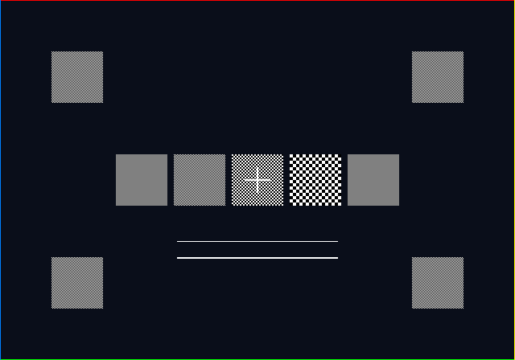

# First boot

Bring-up runs ten steps in order. Each step isolates one subsystem, so a later step's reading means nothing while an earlier one still fails. Run the build for a step, compare the screen against its expect column, and read the if-not column only when it disagrees. `docs/bringup.md` holds the full reasoning behind every verdict; `docs/bench-runbook.md` holds the same steps as a bench operator's order of operations.

## Before you start

| need | why |
|---|---|
| A PS2 console, or Play! (no BIOS, CI's choice) or PCSX2 in software-renderer mode (needs your own BIOS, more accurate) | Steps 2, 3 and 6 depend on GS texel addressing and blend behaviour an inaccurate emulator gets wrong |
| The prebuilt ELFs from a green `hw` CI run, or a local `make -C runtime/sample` build per step ([flags](page:runtime/integrating#reference-table)) | Each step is a separate ELF; only `ps2ui_sample.elf` looks like the finished UI, and it answers step 9 alone |
| `examples/channel6/build/ui.uib` | Steps 3, 5, 7 and 10 read its probe screen through `conform.elf` |
| A test-card blob from `tools/make_testcard.py` | Steps 6 and 8 read the alignment card, not either example blob |
| A fresh file name for every copy, sizes checked on the drive after copying | A stale ELF booted under an old name is the most common way to read the wrong build |

**This page needs the checkout and there is no no-clone lane for it.**
`ps2ui vendor-runtime --starter` gives an installed user a buildable
project, which is enough for [deploying](page:runtime/deploying), and it
does not give them these: the channel-6 probe screen and the test card
are the instruments each step is read against, not example content, and
nothing in the wheel or the npm tarball produces either. A reader
bringing up their own UI on their own console can still read a flat
fill as a status, but **not from the legend below**: that one is
`runtime/sample/main.c`'s. The starter's `main.c` agrees on dark red
(the blob failed to load) and olive (the upload ran out of VRAM), and
differs on the third. It paints **navy blue** (`#000080`, not the steel blue `#4080c0` of a
passing step 1) when `SCREEN=` names a screen
the blob does not have, deliberately, rather than falling back to
screen 0 and looking like the flag was ignored, and it never paints
magenta at all. Reading the sample's legend against a starter build
turns that failure into "step 1 passed".

A screen filled edge to edge with one flat colour is never a UI. Blue means step 1 passed. Dark red means the blob failed to load. Olive means step 9's upload ran out of VRAM. Magenta means the boot flag named a screen absent from the blob. Read a flat fill live, not from a photograph: a phone renders saturated magenta as violet and lifts near-black to a visible maroon.

## Steps 1-10

Every step below ends in one of three states. PASS means the property holds. FAIL means it does not, and the row says what to check next. VOID means the instrument itself could not answer, which is not a failure and not worth reading as one.

| step | build | expect | if not |
|---|---|---|---|
| 1 boot and clear | `make -C runtime/sample MINIMAL=1` | Solid blue (`#4080c0`), holds 30 seconds, then returns to the browser | Orange means byte-swapped `RGBAQ`; fix it before any later step. Black then return means the loop drew nothing. No return means it hung before drawing |
| 2 solid quads, alpha blend | `make -C runtime/sample PROBE=1` | Clear, four corner brackets, six alpha columns with no seam in 1-5 and a seam in 6, then returns after 90 seconds | Column 6 with no seam is void, not a pass; it is the calibration. Missing rungs above `0x80` mean the blend unit needs `gsKit_set_primalpha`, not a rescaled alpha |
| 3 CLUT and the CSM1 swizzle | `make -C runtime/sample STATIC=1 SCREEN=probe UIB=../../examples/channel6/build/ui.uib` (`conform.elf`) | Probe screen's IMAGE cell: a flat dark-teal bar with one bright-orange stripe hard against the right edge | No stripe anywhere is void; the stripe is the calibration. A stripe elsewhere names the failed palette bit. Add `LINEAR_CLUT=1` (`conform-linear.elf`) to rule out double permutation |
| 4 text tinting, `TEX0.TFX` | none; settled by source | Nothing to run. gsKit hardcodes `TFX` to MODULATE at every site, so tinting is already on | Not applicable; there is no ELF and no bench slot for this step |
| 5 modulate colour domain | reuses step 3's `conform.elf`, MODULATE cell | Top two rows blank, third row legible | A wrong shade means the tint domain is wrong. Brighter text than its block means `TEX0.TCC` is discarding atlas alpha; compare `NO_ALPHA=1` (`conform-noalpha.elf`) |
| 6 texel and pixel centres | `python3 tools/make_testcard.py testcard.uib --preview expected.png`, then `make -C runtime/sample STATIC=1 UIB=testcard.uib` (`testcard.elf`); add `PROBE6=1` (`probe6.elf`) to localise a texture-path fault | Wedge crisp at 1px, 2px and 4px; four colour-coded edge rules visible; four corner checkers crisp | Grey at 1px only is a real sampling fault. Grey at 1px and 2px is the panel's resolution limit, not a fault. All three grey reads nothing. On `probe6.elf`, column G's colour names the CLUT convention if a column seams |
| 7 scissor nesting | reuses step 3's `conform.elf`, CLIP cell | Exactly one magenta square | Two squares means the scissor rect never reached the GS. None is void; the visible square is the calibration |
| 8 interlace | reuses step 6's `testcard.elf`; watch live, do not photograph | The 1px rule flickers at 30 Hz; the 2px rule holds steady | Both steady is void; check `gsGlobal->Field` (`GS_FRAME` against `GS_FIELD`) before the panel. Both flickering means field order or a half-height framebuffer |
| 9 VRAM pressure | `make -C runtime/sample STATIC=1` (`ps2ui_sample.elf`, default `UIB`) | The full memcard UI draws | Solid yellow, held, is the [VRAM](page:authoring/vram-budget#behaviour) preflight refusing; rebake with `--vram-budget` set to what your app actually leaves free. Black or nothing is a boot failure; re-run step 1 first |
| 10 display aspect | reuses step 3's `conform.elf`, probe-aspect cell | Exactly one of gold, blue or green reads square; blue on 4:3 or pillarbox, green when the panel stretches to 16:9 | Gold square means a screenshot, not a television. [Bake](page:authoring/video-modes#anamorphic-pixels) with the aspect actually displayed: `--mode ntsc16x9` for a stretching panel, `--mode ntsc` for 4:3 or pillarbox |

## Reading the probe

`examples/channel6`'s probe screen is the conformance target every step above compares a console frame against. Its seven labelled cells fail in their own recognisable way, so a wrong cell narrows the search before a single line of source is read.


| cell | step |
|---|---|
| ALPHA | 2 |
| RADIUS | 6 |
| TYPE | 3, 4, 5 |
| CLIP | 7 |
| IMAGE | 3, 5 |
| ASPECT | 10 |
| FLEX | none; layout geometry, not a numbered step |

The texel-alignment test card carries steps 6 and 8 alone and shares neither screen with the probe:



`tools/read_testcard.py` and `tools/read_probe6.py` grade a capture of either card the same way an operator would: by contrast against a flat reference in the same frame, never by naming a colour. Both tools, and `tools/make_testcard.py` itself, ship a `--self-test` that proves the reader can fail before it grades a real photograph:

```
$ python3 tools/make_testcard.py --self-test
ok - 1px checker is pure black and white ([0, 255])
...
ok - and it is the colour a mushed checker becomes (128 vs 128)
PASS: 0 failure(s)
$ python3 tools/read_testcard.py --self-test
ok   - a correct card reads every rung CRISP
ok   - a card whose checkers averaged to grey reads MUSH, not CRISP
ok   - a mushed 1px rung alone still fails
ok   - and the coarser rungs are still read as patterned
ok   - a frame that is not the card reads VOID, not MUSH
read_testcard self-test: PASS (0 failure(s))
```

The fixes each fault above produced, and the bench readings that found them, are in [Internals](page:project/internals).

## Related pages

| page | why |
|---|---|
| [Integrating the runtime](page:runtime/integrating#reference-table) | every `make -C runtime/sample` flag this page uses, and the ones it does not |
| [Deploying](page:runtime/deploying#what-it-is) | getting a boot-channel ELF onto the console this page tests |
| [Video modes](page:authoring/video-modes#anamorphic-pixels) | why step 10 measures the panel and never the blob |
| [VRAM budget](page:authoring/vram-budget#behaviour) | the preflight step 9 is testing, and the breakdown a rebake needs |
| [Internals](page:project/internals) | the hardware log, and the reasoning behind each fix it found |
