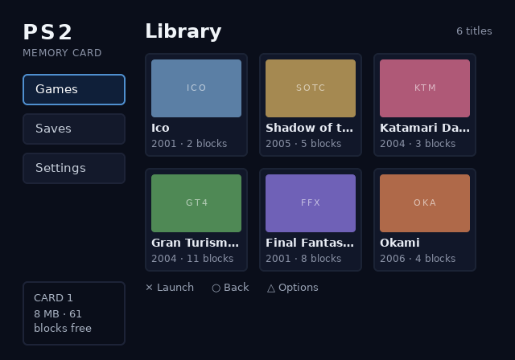
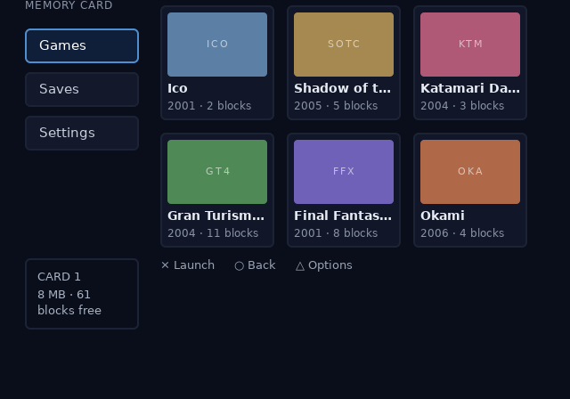
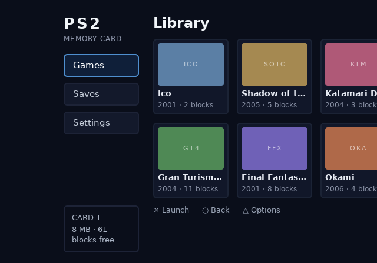

# Moving and hiding

Two runtime changes are not paint. `ps2ui_visible_set` takes a focus node's subtree out of the frame. `ps2ui_offset_set` moves everything the next frame draws.

## What it is

The command list is baked. Layout ran at compile time, and the runtime replays a fixed list of records. So neither of these reflows anything.

Hiding is a bit per focus node. A hidden node's commands are skipped, its slots are skipped, and the D-pad walks past it. The rect it occupied stays empty. Use it for a row with no data behind it, a button an app turns off, a panel that is not available yet.

The offset is a translation added where coordinates reach the GS. Every command position moves, and so does every scissor a command pushed. The canvas rect does not, so content pushed far enough is clipped by the display. Use it for a scrolling region, a sliding panel, a carousel.



`display: none` is the compile-time alternative, and it does the opposite thing: the box is dropped before layout and the gap closes. Two compiles of one document, differing only by `#b { display: none; }`, show it.

```text
ps2ui-layout: 4 paint commands, 3 focusables -> row.json
ps2ui-layout: 3 paint commands, 2 focusables -> row-none.json
```

In `row.json` the three tiles sit at x 40, 176 and 312. In `row-none.json` the third tile sits at x 176 and the middle one has no focus node at all.

## Minimal example

Hide a row, ask about it, and put everything back.

```c
ps2ui_visible_set(&ui, "row-5", 0);   /* stop painting row-5's subtree */
int shown = ps2ui_visible_get(&ui, "row-5");   /* 0 hidden, 1 shown, -1 unknown */
ps2ui_visible_reset(&ui);             /* every node in the blob, shown again */
```

Slide the next frame up sixty pixels.

```c
ps2ui_offset_set(&ui, 0, -60);        /* PS2UI_OK, or PS2UI_ERR_RANGE */
ps2ui_offset_get(&ui, &dx, &dy);      /* read it back for your own art */
ps2ui_render(&ui, gs);                /* the translation applies here */
```

Both calls are cheap and take no `GSGLOBAL`. Neither schedules a transfer. Call them on a button press, not once per command.

## Reference table

| function | effect | scope |
|---|---|---|
| `int ps2ui_visible_set(ps2ui_ctx *ctx, const char *name, int visible)` | Sets or clears the hidden bit for one focus node. Returns 1, or 0 when the current screen has no such name. | current screen |
| `int ps2ui_visible_get(const ps2ui_ctx *ctx, const char *name)` | Returns 1 shown, 0 hidden, `PS2UI_VISIBLE_UNKNOWN` for a name the current screen does not carry. | current screen |
| `void ps2ui_visible_reset(ps2ui_ctx *ctx)` | Clears every hidden bit in the blob, on every screen. | whole blob |
| `int ps2ui_offset_set(ps2ui_ctx *ctx, int dx, int dy)` | Sets the draw-time translation. Returns `PS2UI_OK`, or `PS2UI_ERR_RANGE` outside int16. | whole blob |
| `void ps2ui_offset_get(const ps2ui_ctx *ctx, int *dx, int *dy)` | Writes the current offset through either non-`NULL` pointer. | whole blob |

The same five signatures, with their return conventions, are on the [C API reference](page:runtime/api-reference#visibility).

## Behaviour

### Visibility

The unit is a focus node's subtree, because that is the only grouping the baked command list carries. Every record and every slot stores the focus node it belongs to. The render loop tests that field twice, once over commands and once over slots. A hidden node loses its panel and its text together.

A run over the memcard blob hid `save-ico` on the saves screen, which owns the slot `save-0`.

```text
saves: hiding save-ico 310 -> 274 prims, skipped_hidden=24 slots_hidden=1
```

Skipped records are counted rather than lost. `stats.skipped_hidden` and `stats.slots_hidden` carry them, described on [Telemetry](page:runtime/telemetry#what-it-is).

Names resolve inside the current screen's focus range. The memcard example has `nav-games` on both of its screens, and `data-repeat` makes two screens each using `row-{i}` the ordinary thing to author. A blob-wide scan would hide the wrong screen's node and report success. The same run asked the library screen about a saves-screen name.

```text
library's save-ico: -1 (unknown on this screen)
```

`ps2ui_visible_reset` is the exception: it clears the whole bitmap, from whichever screen is current.

Hiding does not move focus. `ps2ui_move` skips a hidden node, so the D-pad cannot land on one, but `ps2ui_focus_set` still reaches it by name. That call is deliberate, and a caller that names a hidden node means it. Hide the row and move focus in the same breath if focus is sitting on it.

Lists drive this for you. `ps2ui_list_apply_visibility` hides the rows past the end of the data, covered on [Lists](page:authoring/lists#visibility).

### The offset

New in 0.6.0. The runtime could change what was drawn and never where. The offset is the missing half, and it is a draw-time transform over records that already exist. No record, header field or format version changed for it. A blob baked by any 0.x toolchain renders where it always did, because a freshly loaded context starts at (0, 0).

The translation is added at the sink, where coordinates reach gsKit, not at the call sites that read a command's x. Textured and untextured primitives take it alike. So does the glyph pen, which derives its position from a slot entry rather than from a command. [test_runtime.c](repo:runtime/tests/test_runtime.c#L3561) asserts that every primitive in a frame moved by exactly the offset. That check caught an earlier version applying it in three places out of five.

A scissor pushed by a command takes the offset, because a panel's clip slides with the panel. The rect the scissor stack is seeded with does not, because it is the display edge. The result is that a frame slid past the edge is cut by the screen rather than drawn outside it.

```sh
PYTHONPATH=packages/baker python3 -c "from ps2ui_bake.uib import read_uib; from ps2ui_bake import preview; preview.render(read_uib('examples/memcard/build/ui.uib'), screen='library', offset=(0, -60)).save('docs/site/assets/runtime/moving-and-hiding/offset-up.png')"
```





Geometry queries stay in UI coordinates, the coordinates the blob was authored in. The focused node's rect is read from `ctx->focus_nodes[ctx->focus]` and does not move with the offset. A host program read that rect either side of `ps2ui_offset_set(&ui, 80, -60)`.

```text
focus tile-okami rect at offset (0,0): x=464 y=209 w=128 h=129
focus tile-okami rect at offset (80,-60): x=464 y=209 w=128 h=129
```

An app that hit-tests against those numbers keeps working. An app drawing its own cursor over the UI adds the offset itself, from `ps2ui_offset_get`.

### The two together

Hiding changes which records are submitted. The offset changes where the submitted ones land. They are independent, and a hidden node is hidden at every offset.

The offset also composes with `ps2ui_render`, which never clears. Set an offset, render the scrolling screen, set (0, 0), render the dialog. The dialog stays put while the page behind it moves. One frame of that, counted in the gsKit stub:

```text
composite: library at (0,-60) drew 446 prims, saves at (0,0) added 310
```

The compositing rules the second render obeys are on [Screens and overlays](page:authoring/screens-and-overlays#compositing).

## Limits and errors

| symptom | cause | fix |
|---|---|---|
| `ps2ui_visible_set` returns 0 | The current screen has no focus node with that name. | Check the screen with `ps2ui_screen_name`, or the spelling against the compiler's focus names. |
| `ps2ui_visible_get` returns -1 | The same, reported as `PS2UI_VISIBLE_UNKNOWN` rather than as hidden. | Distinguish the two before treating -1 as false. |
| A hidden row leaves a gap | Hiding keeps the node's space. Nothing reflows. | Use `display: none` at compile time when the gap must close. |
| Focus is on a node you just hid | `visible_set` does not move focus. | Call `ps2ui_focus_set` or `ps2ui_move` after hiding. |
| A hidden node reappears | `ps2ui_visible_reset` cleared every bit in the blob. | Re-hide after the reset, or hide and show by name instead. |
| `ps2ui_offset_set` returns `PS2UI_ERR_RANGE` | Either value is outside the int16 a command's own position uses. | Pass -32768 to 32767. The old offset is kept, so a refused call changes nothing. |
| `ps2ui_offset_set` returns `PS2UI_ERR_BOUNDS` | The context pointer is `NULL`. | Load a context first. |
| Content vanishes at a large offset | The canvas scissor does not move, so the display clips it. | Clamp the offset to the range the screen can show. |
| The offset moves the frame and not a cursor an app draws | Queries answer in UI coordinates by design. | Add `ps2ui_offset_get`'s values to your own coordinates. |

`PS2UI_ERR_RANGE` and the other codes are listed on [Errors and constants](page:runtime/errors-and-constants#error-codes).

The browser page draws neither of these. `preview.render` has no visibility parameter, so hiding is outside what the browser page shows. That boundary is stated in [serve.py](repo:packages/baker/ps2ui_bake/serve.py#L36) and described on [Previewer](page:cli/previewer#output).

The offset reaches one pen only. `preview.render(uib, offset=(dx, dy))` is the host mirror of `ps2ui_offset_set`, down to refusing a value outside int16, and the three images above came from it. No command-line flag carries it: `ps2ui serve --help` and `ps2ui-bake --help` list none, and a served frame is always at (0, 0). Call `preview.render` directly to preview one.

## Related pages

- [C API reference](page:runtime/api-reference#offset) for the signatures and their return conventions.
- [Lists](page:authoring/lists#visibility) for `ps2ui_list_apply_visibility` and the row window.
- [Screens and overlays](page:authoring/screens-and-overlays#compositing) for a dialog drawn over a scrolled page.
- [Previewer](page:cli/previewer#output) for what the browser page does and does not draw.
- [Errors and constants](page:runtime/errors-and-constants#error-codes) for `PS2UI_ERR_RANGE` and `PS2UI_ERR_BOUNDS`.
- [Telemetry](page:runtime/telemetry#what-it-is) for the counters hiding moves records into.
