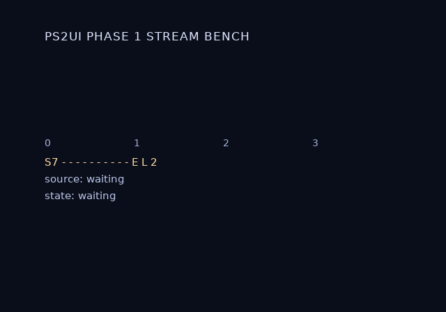

# Streaming art

## What it is

Cover art off a disc, an HDD or a network cannot be baked, because nothing at build time knows what it is. Reserve a slot instead, and fill it on the console.

A streamed slot is `` with an explicit CSS `width` and `height` and no `src`. [Images](page:authoring/images#streamed-slots) has the authoring rules. The blob carries geometry, the name and a PSMCT32 reservation, and no texels.

At runtime the app hands `ps2ui_tex_set` a pointer to decoded texels. Nothing is copied. The pointer becomes the slot's DMA source, so the app owns the buffer and the runtime owns the geometry. The EE has no image decoder and the runtime does not ship one, so convert the art on the host first.

Two elements may name one slot. They share one reservation and draw it in both places. One name at two laid-out sizes fails the bake.

## Minimal example

The markup and the size, from [covers.html](repo:fixtures/bench-stream/ui/covers.html#L6) and [bench.css](repo:fixtures/bench-stream/ui/bench.css#L11):

```html
<div class="cell"><div class="cap" data-slot="c0">0</div></div>
```

```css
.cell img { width: 128px; height: 128px; }
```

The call. This file compiles against the shipped header:

```c
#include <stdio.h>
#include <ps2ui.h>

#define COVER_W     128
#define COVER_H     128
#define COVER_BYTES (COVER_W * COVER_H * 4)

/* 16-aligned: ps2ui_tex_set refuses anything else. Static: the pointer
 * stays the slot's DMA source for as long as the slot can be drawn. */
static unsigned char cover[COVER_BYTES] __attribute__((aligned(16)));

int fill_cover0(ps2ui_ctx *ui, GSGLOBAL *gs)
{
    FILE *fh = fopen("mass:/ps2ui/cover0.raw", "rb");
    size_t got;

    if (!fh)
        return -1;
    got = fread(cover, 1, COVER_BYTES, fh);
    fclose(fh);
    if (got != COVER_BYTES)
        return -1;
    return ps2ui_tex_set(ui, gs, "cover0", cover, COVER_BYTES);
}
```

```sh
$ cc -std=c99 -Wall -Wextra -Werror -Istub -Ivendor/gsKit -Ivendor/host-shim -I. -c stream_min.c
```

Run that from `runtime/`. It exits 0 and prints nothing.

## Reference table

Six constraints hold for every `ps2ui_tex_set` call.

| constraint | consequence of breaking it |
|---|---|
| `len` equals the entry's reservation exactly | `PS2UI_ERR_SIZE`. A short buffer would DMA past its end; a long one means the app and the bake disagree about the geometry ([ps2ui.c](repo:runtime/ps2ui.c#L697)). |
| `texels` is 16-byte aligned | `PS2UI_ERR_ALIGN`. A DMA source address truncates silently below qword alignment ([ps2ui.c](repo:runtime/ps2ui.c#L703)). |
| `name` is a streamed slot in this blob | `PS2UI_ERR_NOT_STREAMED`. A baked texture and an unknown name return the same code ([ps2ui.c](repo:runtime/ps2ui.c#L692)). |
| `texels` stays alive and unmoved while the slot can be drawn | gsKit re-reads the pointer at render time when it re-binds an evicted texture. A freed buffer draws whatever replaced it, with no error ([ps2ui.h](repo:runtime/ps2ui.h#L480)). |
| `texels` holds PSMCT32 with alpha in 0 to 128 | The GS reads 0x80 as opaque. Alpha 255 asks for about twice the coverage the texel has and composites overbright. |
| the texels are written before the call | `ps2ui_tex_set` flushes `len` bytes from the EE cache at call time ([ps2ui.c](repo:runtime/ps2ui.c#L726)). A CPU write made after the call is not flushed. |

`ps2ui_clut_set` repoints a palette without moving a texel. It is the other half of runtime art, for blobs that carry PSMT8 textures.

| rule | effect |
|---|---|
| Call it after `ps2ui_upload` | Before upload it returns `PS2UI_ERR_STATE`. Upload re-permutes every palette from the blob, so an early swap would be overwritten in silence ([ps2ui.c](repo:runtime/ps2ui.c#L752)). |
| Pass a linear palette | The CSM1 permutation is applied on the way into the pool, exactly as `ps2ui_upload` does ([ps2ui.c](repo:runtime/ps2ui.c#L765)). |
| `ncolors` is at most the baked width | A wider palette returns `PS2UI_ERR_SIZE` rather than recolouring indices no texel references ([ps2ui.c](repo:runtime/ps2ui.c#L761)). |
| A short palette blanks the tail | `permute_clut` opens with `memset(out, 0, 256 * 4)`. A 16-entry palette handed to a 256-entry CLUT erases the other 240 to transparent black ([ps2ui.c](repo:runtime/ps2ui.c#L546)). |
| Every texture sharing the index changes together | One palette recolours every atlas drawn from it. Two that must diverge need two CLUTs at bake time ([ps2ui.c](repo:runtime/ps2ui.c#L771)). |
| A swap does not survive an upload | A second `ps2ui_upload` re-permutes every CLUT from the blob and reverts the swap, with no error ([ps2ui.h](repo:runtime/ps2ui.h#L539)). |
| The swap takes effect on the next bind | `ps2ui_render` binds every texture it draws. `ps2ui_clut_set` does not bind by itself ([ps2ui.h](repo:runtime/ps2ui.h#L555)). |

For tints against palettes, see [Theming](page:authoring/theming#runtime). `ps2ui_theme_set` moves a pointer and schedules no transfer. `ps2ui_clut_set` sends 1 KiB per sharing texture. An app that uses both does the CLUT swap last.

## Behaviour

### From the host file to VRAM

Five stages, in order.

1. The compile reserves the slot. `` emits a texture entry with geometry, a name and a reservation, and no texel data.
2. The bake prints the reservation on the slot's VRAM row.
3. `ps2ui_upload` counts the reservation against the VRAM budget and binds nothing for the slot, because there is no source yet.
4. The app reads the converted file into a 16-aligned buffer and calls `ps2ui_tex_set`.
5. The next `ps2ui_render` binds the slot and draws it.

Stage 3 is the reason a reservation is not free. A slot costs its VRAM from the moment the blob loads, filled or not. [VRAM budget](page:authoring/vram-budget#which-number-the-runtime-wants) has the two cost models and the `payload` figure to pass as `len`.

### Setting a slot

`ps2ui_tex_set` points `GSTEXTURE::Mem` at the caller's buffer, flushes that buffer from the EE cache, and invalidates the slot's residency. The invalidation is what makes a swap visible. The texture manager may hold the slot resident from a previous set. A bind without the invalidation would draw the old cover out of VRAM.

Call it again to swap texels. Scrolling a list of covers is a sequence of such calls, one per row that moved.

Call it before or after `ps2ui_upload`. The function has no upload-state guard, unlike `ps2ui_clut_set`.

### Unfilled slots

An unfilled slot draws nothing and increments `stats.tex_unfilled`. That is the ordinary state of a row that has just scrolled into view, so the runtime does not treat it as an error. The rest of the frame draws as usual. Read the counter through [ps2ui_stats](page:runtime/telemetry#reference-table).

Bake the streaming bench fixture and render its first screen to see it.

```sh
$ ps2ui-layout fixtures/bench-stream/ui/covers.html fixtures/bench-stream/ui/bench.css -o covers.json
ps2ui-layout: 6 paint commands, 0 focusables -> covers.json
$ ps2ui-layout fixtures/bench-stream/ui/dialog.html fixtures/bench-stream/ui/bench.css -o dialog.json
ps2ui-layout: 11 paint commands, 2 focusables -> dialog.json
$ ps2ui-bake covers.json dialog.json -o bench.uib --preview covers-empty.png
  runtime tables: 9 textures, 1 CLUTs, 7 slots, 2 screens
  tex[ 0] PSMT8     256x64   baked       16384 B payload ->   16384 B in pages
  tex[ 1] PSMCT32   128x128  streamed    65536 B payload ->   65536 B in pages
  tex[ 2] PSMCT32   128x128  streamed    65536 B payload ->   65536 B in pages
  tex[ 3] PSMCT32   128x128  streamed    65536 B payload ->   65536 B in pages
  tex[ 4] PSMCT32   128x128  streamed    65536 B payload ->   65536 B in pages
...
  textures 368640 B of 753664 B budget (48%)
ps2ui-bake: 2 screen(s), 74 records, 9 textures (96 KiB baked + 256 KiB reserved by slots), 1 CLUTs -> bench.uib
ps2ui-bake: arena 1875 bytes (static uint8_t arena[1875] __attribute__((aligned(16))))
ps2ui-bake: preview -> covers-empty.png
```



The four boxes are blank. Each one reserves 65536 B and holds no texels. The previewer skips them exactly as `ps2ui_render` does.

### Converting on the host

`tools/make_cover_raw.py` turns art into texels. Output is a bare `.raw` of exactly `width * height * 4` bytes of PSMCT32, row-major, with no header. The ELF reads it straight into its buffer and checks the file size, which is the integrity check a header would have given.

Every alpha goes through the same `css_alpha_to_gs` the baker uses. An opaque texel therefore lands at 0x80, and a streamed cover composites like a baked one. Converting with a plain `img.tobytes("raw", "RGBA")` would reintroduce the 2x overbright fault.

```sh
$ python3 tools/make_cover_raw.py --self-test
ok - a cover is exactly w * h * 4 bytes
ok - opaque alpha lands in the GS domain (0x80), not 255 -- 255 would ask for ~2x coverage and composite overbright
ok - two synthetic covers differ, so a swap is visible
ok - and carries more than two distinct texels, so a stale block cannot pass for it
ok - generation is deterministic
ok - 128x128 is 65536 bytes, which is what the blob reserves
1..6
PASS: make_cover_raw self-test
```

Point it at art to convert real covers. A source at another size is cover-fitted and centre-cropped, so the picture bends and the geometry does not. Slots the images do not cover are filled with a synthetic checker, which the ELF also generates when it finds no drive.

```sh
$ python3 tools/make_cover_raw.py examples/channel6/ui/assets/cover-kaiju.png --out-dir covers --size 128x128 --count 4
make_cover_raw: covers/cover0.raw  128x128  65536 B  <- cover-kaiju.png
make_cover_raw: covers/cover1.raw  128x128  65536 B  <- synthetic
make_cover_raw: covers/cover2.raw  128x128  65536 B  <- synthetic
make_cover_raw: covers/cover3.raw  128x128  65536 B  <- synthetic
make_cover_raw: copy covers/ to the drive as ps2ui/ (so the ELF finds mass:/ps2ui/cover0.raw)
```

That is the whole deployment step for streamed art. The blob is compiled into the ELF and needs no file beside it. The covers are the exception and need [USB](page:runtime/deploying#what-it-is) attached.

### Palettized art

A reservation is PSMCT32 only. Quantizing needs the art, which does not exist at bake time, so `palettize` on a streamed slot is a compile error.

Palettized art still has a runtime path, through the palette rather than the texels. Bake the atlas once as PSMT8 and swap its CLUT with `ps2ui_clut_set`. The swap moves 1 KiB per sharing texture and leaves the atlas resident in VRAM.

## Limits and errors

`ps2ui_tex_set` returns three codes. [Errors and constants](page:runtime/errors-and-constants#error-codes) has the full catalogue, including `PS2UI_ERR_STATE` and `PS2UI_ERR_RANGE` from `ps2ui_clut_set`. [C API reference](page:runtime/api-reference#textures-and-palettes) has the signatures.

| code | value | triggered by | fix |
|---|---|---|---|
| `PS2UI_ERR_NOT_STREAMED` | -10 | A NULL argument, a name no texture carries, or a name that belongs to a baked texture. | Name a texture the bake marked `streamed`. Read the name back from the bake transcript. |
| `PS2UI_ERR_SIZE` | -11 | `len` differs from the entry's reservation by any amount. | Pass the `payload` figure from the slot's VRAM row, not the `in pages` figure. |
| `PS2UI_ERR_ALIGN` | -8 | The texel address is not a multiple of 16. | Declare the buffer with `__attribute__((aligned(16)))`. |

Four limits have no error at all.

The return is a bare code. Nothing reports which size was expected, so the bake output is where that number lives.

A slot name is matched byte for byte with `strcmp`. The compiler refuses a name with leading or trailing whitespace for that reason, but it cannot check the string the app passes.

A buffer that is freed or moved while the slot can still be drawn is undefined. The runtime never re-reads the length and never validates the pointer again.

A CLUT swap made before an upload is refused; one reverted by a second upload is not. Nothing in this repository calls `ps2ui_upload` twice.

## Related pages

| page | why |
|---|---|
| [Images](page:authoring/images#streamed-slots) | authoring `data-tex-slot`, and what a baked image does instead |
| [VRAM budget](page:authoring/vram-budget#which-number-the-runtime-wants) | the reservation's cost, and the `payload` number `len` must equal |
| [C API reference](page:runtime/api-reference#textures-and-palettes) | the signatures, return conventions and scope rules |
| [Errors and constants](page:runtime/errors-and-constants#error-codes) | every code these calls can return |
| [The frame loop](page:runtime/frame-loop#behaviour) | where `ps2ui_upload` and `ps2ui_render` sit |
| [Theming](page:authoring/theming#runtime) | the tint table, and why `ps2ui_theme_set` takes no `GSGLOBAL` |
| [Deploying](page:runtime/deploying#what-it-is) | getting the blob and the covers onto a console |
