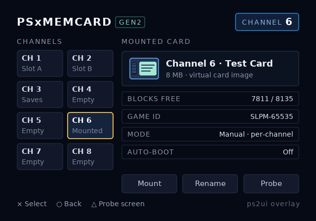

# channel6 — a PSxMemCard GEN2 overlay, and the probe screen behind it

A two-screen `.uib` you can put on a PSxMemCard GEN2 channel and stare at
on a real television. It exists to answer one question — *does this
toolchain's HTML actually come out the other end looking like the
previewer said it would?* — and to keep answering it as the toolchain
changes.

| screen | file | what it is |
|--------|------|------------|
| `overlay` | [ui/overlay.html](ui/overlay.html) | the channel browser: eight channel chips, the mounted-card panel, three actions |
| `probe` | [ui/probe.html](ui/probe.html) | one labelled cell per supported feature, for diffing a console frame against the PNG |

Both compile against one stylesheet, [ui/overlay.css](ui/overlay.css),
and bake into one blob that shares its textures, atlases and font tables
across the two screens.




## Build

```sh
./examples/channel6/build.sh
```

Writes into `examples/channel6/build/`:

| file | what |
|------|------|
| `ui.uib` | the console blob — both screens, ~190 KiB of textures, 50% of the default VRAM budget |
| `preview.png` / `states.png` | the overlay screen, and every one of its 11 focus states on one sheet |
| `probe.png` / `probe-states.png` | the same pair for the probe screen |
| `overlay.json` / `probe.json` | the IR, if you need to look at what layout decided |

Then it runs [check.py](check.py), which re-reads the blob and asserts
its contract in TAP: screen names, the D-pad graph, slot names and
capacities, the palettized image, and the two domain rules
[docs/bringup.md](../../docs/bringup.md) warns about (GS alpha 0–128,
modulate RGB in the 0x80-identity domain). Twenty checks; a red one names
what broke.

Three `charset` warnings are expected and deliberate — they are the ×, ○
and △ face-button glyphs in the footer hints, which is exactly the
codepoint range the linter is unsure about. Any *other* warning is news.

## Getting it onto channel 6

Nothing here is PSxMemCard-specific: the device serves a memory card
image, and the PS2 boots an ELF off it. So the blob rides along inside
the ELF, and channel 6 is just where that ELF lives.

1. Bake the blob (above).
2. Build the bring-up ELF around it. Needs the ps2dev toolchain
   (`ghcr.io/ps2dev/ps2dev`), same as CI's `hw` workflow:

   ```sh
   make -C runtime/sample UIB="$PWD/examples/channel6/build/ui.uib"
   ```

   The blob is embedded via `bin2c`, so `ps2ui_sample.elf` is
   self-contained — no filesystem access at runtime.
3. Copy the ELF into the card image your device serves on channel 6.
   Where that image lives on the SD card depends on your firmware
   version and whether you run per-game or manual channel mode, so check
   it against your firmware's docs rather than trusting a path from here.
4. Switch the device to channel 6, then launch the ELF from `mc0:` with
   uLaunchELF or Open PS2 Loader.

The sample ELF shows screen 0 and walks its focus states on a timer,
which is what you want for a first look. To reach the probe screen, add
one line after the load:

```c
ps2ui_load(&ui, ui_uib, size_ui_uib);
ps2ui_upload(&ui, gs);
ps2ui_screen_set(&ui, "probe");   /* or "overlay" */
```

Emulator first is the cheaper loop: PCSX2 in software-renderer mode is
the most trustworthy stand-in short of the console, and Play! needs no
BIOS. Either way, work [docs/bringup.md](../../docs/bringup.md) in order
— each of its nine steps isolates one subsystem, and this example was
built to give every one of them something to look at.

## Reading the probe screen

Put `screenshots/probe.png` next to your capture. Each cell fails in its
own recognizable way:

| cell | passes when | fails like |
|------|-------------|------------|
| ALPHA | four rungs step evenly from 25% to opaque | uniformly dark or double-darkened — GS alpha domain (bring-up step 2) |
| RADIUS | 0/3/8/13px corners, no seams | nine-patch UVs or the half-texel bias (step 6) |
| TYPE | 14/16/20px, regular vs bold, then wide tracking | banded noise = CLUT/CSM1 (step 3); flat white = no `GSTEXTURE::Function` (step 4); washed out = modulate domain (step 5) |
| CLIP | the first line ellipsizes, the amber line is cut mid-glyph at the padding edge | 1px bleed = the inclusive-scissor off-by-one (step 7) |
| IMAGE | the two cards are indistinguishable | CLUT8 wrong = palettization or CLUT upload |
| FLEX | bars in a 1:2:3 ratio, three lines left/centre/right | layout, not the GS |

The `display: none` paragraph in the ALPHA cell must never appear. If you
can read it, that's a compiler regression, not a console one.

## Driving it from C

Fifteen slots on the overlay screen, two on the probe screen. Everything
a real channel browser would read off the card at runtime is a slot, so
the geometry stays baked and the strings don't:

```c
ps2ui_slot_set(&ui, "channel", "6");
ps2ui_slot_set(&ui, "card-name", name_from_card);   /* 26 chars */
ps2ui_slot_set(&ui, "blocks", "7811 / 8135");       /* 18 chars */
ps2ui_slot_set(&ui, "ch6", "Mounted");              /* 10 chars */
```

Text longer than the declared capacity is cut at the capacity into a
fixed per-slot buffer — never overrun, no allocation — and the baked
ellipsis policy still applies at the box edge.

Focus names are the element ids: `ch-1` … `ch-8`, `act-mount`,
`act-rename`, `act-probe` on the overlay; `probe-alpha` … `probe-flex`
on the probe screen. `ps2ui_focus_name()` gives you the current one, so a
D-pad handler is a name comparison.

```c
if (pad_pressed & PAD_CROSS) {
    const char *sel = ps2ui_focus_name(&ui);
    if (!strncmp(sel, "ch-", 3)) mount_channel(sel[3] - '0');
}
```

## Deliberate choices worth keeping

- **The root is a translucent scrim** (`#060a14e6`), not an opaque fill.
  The blob is meant to be replayed over whatever the host app already
  drew, so the alpha path is under test from the first quad. The
  previewer composites it over the same dark navy the sample ELF clears
  to, which is why the PNGs and a console frame should match.
- **The overlay does not wrap, the probe screen does.** One `--focus-wrap`
  flag, both of its behaviours, checked in `check.py`. Walking off the
  overlay's chip grid dead-ends on purpose: a stuck D-pad should be
  visible, not silently wrapped away.
- **`.chip.current` is a class, not `:focus`.** Which channel is mounted
  is state that survives the cursor moving past it; `:focus` is only the
  cursor. They use different colors (teal vs amber) so a photo of a CRT
  still tells you which is which.
- **Nothing below 14px, no 1px borders, no saturated reds.** The CRT
  linter's rules, obeyed, so that a warning from this example means
  something regressed rather than "yes, we know".
- **The art is generated**, not committed blind — see
  [ui/assets/make_assets.py](ui/assets/make_assets.py). Five colors, so
  the PSMCT32 and palettized copies on the probe screen have no excuse
  to differ.
