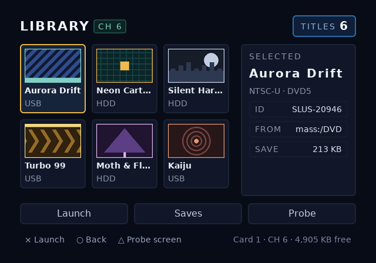
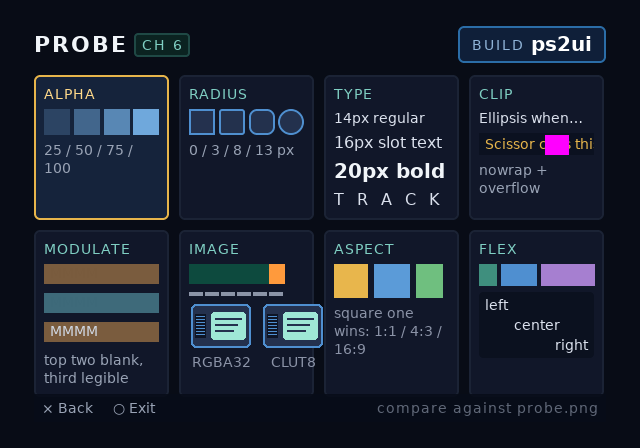

# channel6 — a game browser that lives on a PSxMemCard GEN2 channel

The `probe` screen is this repository's conformance target for console bring-up: [docs/bringup.md](../../docs/bringup.md) maps each of its cells to the step that fails when the cell looks wrong.

A two-screen `.uib` for the channel you keep your homebrew on, and the
starting point this repository recommends for a new UI. It exists to
answer one question — *does this toolchain's HTML actually come out the
other end looking like the previewer said it would?* — and to keep
answering it as the toolchain changes.

Copy the directory, keep `build.sh` and `check.py`, replace the markup.
The parts worth keeping are the shape of the build (layout → bake →
per-screen previews → assert the blob), the budget discipline the
stylesheet is built around, and the probe screen, which stays useful
long after your own screens have replaced the browser.

| screen | file | what it is |
|--------|------|------------|
| `games` | [ui/games.html](ui/games.html) | the browser: a six-cover grid, a detail column, three actions |
| `probe` | [ui/probe.html](ui/probe.html) | one labelled cell per supported feature, for diffing a console frame against the PNG |

Both compile against one stylesheet, [ui/channel6.css](ui/channel6.css),
and bake into one blob that shares its textures, atlases and font tables
across the two screens.

It is an **overlay**, so that is how it should be judged. The blob has no
background of its own beyond a translucent scrim, and `ps2ui_render()`
draws straight into the framebuffer — skip the `gsKit_clear()` the sample
ELF does, and the game underneath stays visible:


Over flat navy, which is the ground truth every bring-up step compares
against:




The game frame is drawn from flat shapes by
[preview_in_game.py](preview_in_game.py), not captured — shipping a real
game's pixels into a repository is a licensing problem, and a synthetic
frame is the better test anyway because you can put the bright band
exactly where the UI is darkest.

## What the device actually does, and what it doesn't

Worth being precise, because it decides where this UI runs.

The PSxMemCard GEN2 is BitFunX's build of the open-source
[sd2psx](https://sd2psx.net/) memory-card emulator, running sd2psx or
[sd2psXtd](https://sd2psxtd.github.io/) firmware. On the microSD, **a
card is a directory and a channel is a file** inside it:

```
MemoryCards/PS2/Card1/Card1-6.mcd     <- channel 6 of card 1
MemoryCards/PS2/BOOT/BootCard-1.mcd   <- the boot channel (FMCB ships here)
```

Eight channels per card by default (`MaxChannels` in `CardX.ini`, which
also names them). You switch with BT1/BT2 on the device's 128×64 OLED,
or on PS1 with L1+R1+L2+R2+Left/Right. In GameID mode the firmware
watches for the ID that OPL or UNIROM announces and swaps cards by
itself.

What it does **not** do is execute anything. It presents an 8 MB card
image to the console over the memory-card port; every pixel still comes
from the PS2's Graphics Synthesizer. So:

- This is a **PS2-side** UI at 640×448, drawn by `runtime/ps2ui.c`
  through gsKit. It is not for the device's OLED — that panel is 128×64
  and monochrome, and the firmware draws it from its own splash images
  (`splashgen`), nothing to do with this toolchain.
- "Running on channel 6" means the ELF *and* this blob live inside
  `Card1-6.mcd`, and the PS2 boots them from `mc0:`.

## Build

```sh
./examples/channel6/build.sh
```

Writes into `examples/channel6/build/`:

| file | what |
|------|------|
| `ui.uib` | the console blob — both screens, 22 textures, 43% of the default VRAM budget |
| `preview.png` / `states.png` | the games screen, and every one of its 9 focus states on one sheet |
| `probe.png` / `probe-states.png` | the same pair for the probe screen |
| `in-game.png` | the browser composited over a synthetic game frame |
| `preview-display.png` | the games screen resampled to what a 4:3 television shows |
| `ui-16x9.uib` / `preview-16x9-display.png` | the same UI baked for a panel that stretches to 16:9 |
| `games.json` / `probe.json` | the IR, if you need to look at what layout decided |

Then it runs [check.py](check.py), which re-reads the blob and asserts
its contract in TAP — 24 checks; a red one names what broke.

The 4:3 bake is expected to be **silent**. Earlier revisions emitted
three `charset` warnings for the ×, ○ and △ face-button glyphs in the
footer hints; B13 whitelisted those ranges and gave them real metrics,
so any warning from the 4:3 bake is now news.

The 16:9 bake is a different matter: it warns about `aspect-distortion`
on the rounded corners and the covers, which is the linter doing its
job. This stylesheet is authored for 4:3 pixels and nothing in it has
been pre-squashed for a stretching panel.

Both blobs exist so you can run the two-way panel test in
[docs/bringup.md](../../docs/bringup.md) step 10 — same television,
same UI, one blob correct in each TV mode.

`ps2ui-check` on either blob reports one warning, and it is the CLIP
cell working as designed:

```
20 command(s) fall entirely outside their clip and are submitted every
frame for nothing (from command 628)
```

Those are the tail glyphs of `Scissor clips this line at the padding
edge`, a `nowrap` run inside `overflow: hidden`. The baker emits the
whole string and lets the GS clip it, which is the behaviour the cell
exists to demonstrate. Any *other* ps2ui-check output from this example
is news.

### The runtime's table caps

`ps2ui.h` sizes the runtime context statically, and `ps2ui_load()`
rejects anything past those bounds with `PS2UI_ERR_TOO_MANY`. Every bake
prints where you stand:

```
runtime tables: 22/32 textures, 15/16 slots, 2/8 screens
```

| cap | value | this blob |
|-----|-------|-----------|
| `PS2UI_MAX_TEXTURES` | 32 | 22 |
| `PS2UI_MAX_SLOTS` | 16 | 15 |
| `PS2UI_MAX_SCREENS` | 8 | 2 |
| `PS2UI_SLOT_BUFSZ` | 96 | 30 max |

Writing this example is what surfaced the gap: an earlier revision
declared **seventeen** slots, and it laid out, baked, previewed and
passed every check while `ps2ui_load()` would have rejected it — the
sample ELF's red screen with nothing to explain it. The VRAM budget did
not catch it because that is a different limit; the blob sat at 43% of
VRAM and was still unloadable. Since B10 the baker parses the caps out
of `ps2ui.h` and refuses to write the file, naming the count and where
to raise it. `check.py` still asserts all four from the far side of the
format, which is cheap and independent.

The counts are why the stylesheet looks the way it does — see the
[design notes](#deliberate-choices-worth-keeping) below.

## Getting it onto channel 6

1. Bake the blob (above).
2. Build the bring-up ELF around it. Needs the ps2dev toolchain
   (`ghcr.io/ps2dev/ps2dev`), same as CI's `hw` workflow:

   ```sh
   make -C runtime/sample UIB="$PWD/examples/channel6/build/ui.uib"
   ```

   The blob is embedded via `bin2c`, so `ps2ui_sample.elf` is
   self-contained — no filesystem access at runtime, which matters here
   because you have exactly one card slot and the device is in it.
3. Write the ELF into the channel-6 image. It is an ordinary PS2 card
   image, so any of the usual tools work — mymc++ on the `.mcd`
   directly, or uLaunchELF copying from USB with the device switched to
   channel 6.
4. Boot the console on the boot channel so FMCB/FunTuna comes up, switch
   the device to channel 6 with BT1/BT2, then launch the ELF from `mc0:`
   in uLaunchELF. The switch has to happen after boot: the console boots
   whatever channel was presented at power-on, and the boot channel is
   the one carrying the exploit.

Emulator first is the cheaper loop — PCSX2 in software-renderer mode is
the most trustworthy stand-in short of the console, and Play! needs no
BIOS. Either way, work [docs/bringup.md](../../docs/bringup.md) in order:
each of its ten steps isolates one subsystem, and this example was built
to give every one of them something to look at.

The sample ELF shows screen 0 and walks its focus states on a timer,
which is what you want for a first look. To reach the probe screen, add
one line after the load:

```c
ps2ui_load(&ui, ui_uib, size_ui_uib);
ps2ui_upload(&ui, gs);
ps2ui_screen_set(&ui, "probe");   /* or "games" */
```

### Drawing it as an overlay

The sample ELF clears every frame, which is what you want while you are
proving the GS path. To get `in-game.png` instead, draw your scene and
then call `ps2ui_render()` without clearing in between:

```c
render_my_game(gs);           /* whatever is underneath */
if (ui_visible)
    ps2ui_render(&ui, gs);    /* composites over it, no clear */
gsKit_queue_exec(gs);
gsKit_sync_flip(gs);
```

`ps2ui_render()` never clears and never touches the Z buffer, so the two
compose in paint order. Toggle `ui_visible` on your menu button and the
overlay costs nothing on the frames it is hidden.

## Reading the probe screen

Put `screenshots/probe.png` next to your capture. Each cell fails in its
own recognizable way:

| cell | passes when | fails like |
|------|-------------|------------|
| ALPHA | four rungs step evenly from 25% to opaque | uniformly dark or double-darkened — GS alpha domain (bring-up step 2) |
| RADIUS | 0/3/8/13px corners, no seams | nine-patch UVs or the half-texel bias (step 6) |
| TYPE | 14/16/20px, regular vs bold, then wide tracking | banded noise = CLUT/CSM1 (step 3); flat white = no `GSTEXTURE::Function` (step 4); washed out = modulate domain (step 5) |
| CLIP | the first line ellipsizes, the amber line is cut mid-glyph at the padding edge | 1px bleed = the inclusive-scissor off-by-one (step 7) |
| IMAGE | the two cards are indistinguishable | CLUT8 wrong = palettization or CLUT upload |
| ASPECT | exactly one of gold / blue / green reads square | see below — this cell measures the television, not the blob |
| FLEX | bars in a 1:2:3 ratio, three lines left/centre/right | layout, not the GS |

The ASPECT cell is three boxes of equal height, each pre-squashed for a
different pixel aspect: **gold** is square in framebuffer pixels,
**blue** at 4:3 (PAR 0.9333), **green** at 16:9 (PAR 1.2444). Whichever
looks square names what your panel is doing. Gold reads square in a
screen capture and never on a television. The widths are baked, so the
cell is identical in the 4:3 and 16:9 blobs.

The `display: none` paragraph in the ALPHA cell must never appear. If you
can read it, that's a compiler regression, not a console one.

## Driving it from C

Thirteen slots on the games screen, two on the probe screen. Everything
a browser would discover at runtime is a slot, so the geometry stays
baked and the strings don't:

```c
ps2ui_slot_set(&ui, "count", "6");
ps2ui_slot_set(&ui, "title-1", name_from_art_db);       /* 24 chars */
ps2ui_slot_set(&ui, "sel-id", "SLUS-20946");            /* 16 chars */
ps2ui_slot_set(&ui, "card", "Card 1 · CH 6 · 4,905 KB free");  /* 30 */
```

Text longer than the declared capacity is cut at the capacity into a
fixed per-slot buffer — never overrun, no allocation — and the baked
ellipsis policy still applies at the box edge. Three of the six cover
titles ellipsize at their placeholder length on purpose: a library where
every name happens to fit is not a library you have tested.

Focus names are the element ids: `game-aurora` … `game-kaiju`,
`act-launch`, `act-saves`, `act-probe` on the browser; `probe-alpha` …
`probe-flex` on the probe screen. `ps2ui_focus_name()` gives you the
current one, so a D-pad handler is a name comparison:

```c
if (pad_pressed & PAD_CROSS) {
    const char *sel = ps2ui_focus_name(&ui);
    if (!strncmp(sel, "game-", 5)) launch_title(sel + 5);
    else if (!strcmp(sel, "act-probe")) ps2ui_screen_set(&ui, "probe");
}
```

The detail column does not follow focus by itself — the blob has no
logic in it. Repointing `sel-title`, `sel-sub`, `sel-id`, `sel-from` and
`sel-save` in your `ps2ui_move()` handler is what makes it live, and it
costs five `strncpy`s per D-pad press.

## Deliberate choices worth keeping

- **The root is a translucent scrim** (`#060a1499`, 60%), not an opaque
  fill. The blob is meant to be replayed over whatever the host app
  already drew, so the alpha path is under test from the first quad. 60%
  is a judgement call you should expect to retune: heavier and the game
  disappears, lighter and the text on the scrim starts to struggle over
  bright content. The rule that survives retuning is **the scrim sets
  the mood, panels guarantee legibility** — every string here sits on an
  opaque panel except the footer, which is why the footer grew a backing
  bar of its own (square, so it costs no nine-patch texture).
- **One panel style, one focus style, five glyph atlases.** Every
  distinct rounded-box style bakes a nine-patch texture and every
  distinct (size, weight) pair bakes an atlas, so tiles, the detail
  column, the action buttons and the probe cells all share one look on
  purpose. Six covers cost six textures; the alpha ladder and flex bars
  are square because rounding them would have cost seven more to prove
  what the RADIUS cell already proves. That is what keeps 22/32.
- **The CRT contrast lint cannot see this.** It composites text against
  the nearest rect's raw RGB and ignores that rect's alpha, so a scrim
  at 60% lints identically to one at 100%. Over a bright game frame the
  real contrast is worse than the linter believes. Judge the overlay
  from `in-game.png`, not from the lint being quiet.
- **The browser does not wrap, the probe screen does.** One
  `--focus-wrap` flag, both of its behaviours, checked in `check.py`.
  Walking off the cover grid dead-ends on purpose: a stuck D-pad should
  be visible, not silently wrapped away.
- **Covers are baked art, not save icons.** A real PS2 save carries a 3D
  icon and an `icon.sys` title, not a 2D cover; these six stand in for
  whatever art pack your launcher ships, the same way OPL's ART folder
  does. They are palettized (PSMT8 + CLUT, a quarter of the VRAM per
  texel) because six PSMCT32 covers would not have fit the budget above.
- **Sizes are in KB, not blocks.** Blocks are the PS1 unit — 15 to a
  card. The PS2 browser counts kilobytes, and a fresh 8 MB card reports
  8,135 KB free, so a browser that says "11 blocks" is a browser written
  by someone who never looked at the console.
- **Nothing below 14px, no 1px borders, no saturated reds.** The CRT
  linter's rules, obeyed, so that a warning from this example means
  something regressed rather than "yes, we know".
- **The art is generated**, not committed blind — see
  [ui/assets/make_assets.py](ui/assets/make_assets.py). Flat shapes, no
  antialiasing, three colors per cover, so the PSMCT32 and palettized
  copies on the probe screen have no excuse to differ.
