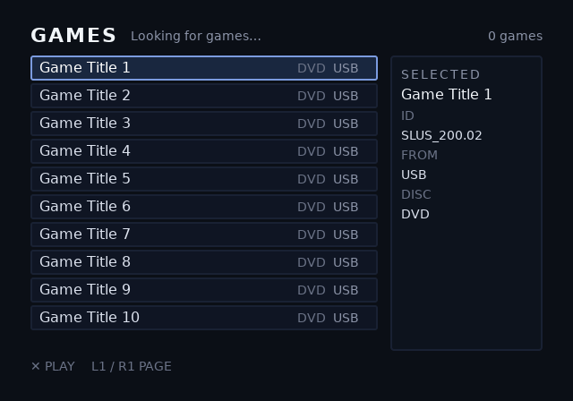

# console: the console's built-in theme

The theme `ophtml.elf` shows when no `theme.uib` is on a drive, and the
smallest complete example of the console's theme contract. See
[console/README.md](../../console/README.md) for the contract and the
console itself.

```sh
./examples/console/build.sh
```



One screen, `games`:
- ten `game-{i}` rows, each with a title, disc type and drive;
- a panel showing the selection's `sel-*` slots;
- `status` and `game-count` in the top bar.

The placeholder text is what the previewer draws. On a console, every
slot is replaced by what the scan found.

To make your own theme, copy this directory, keep the names, and change
everything else.
