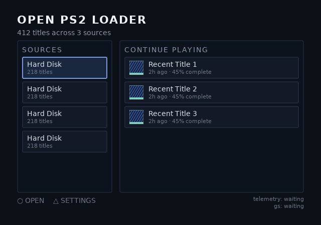
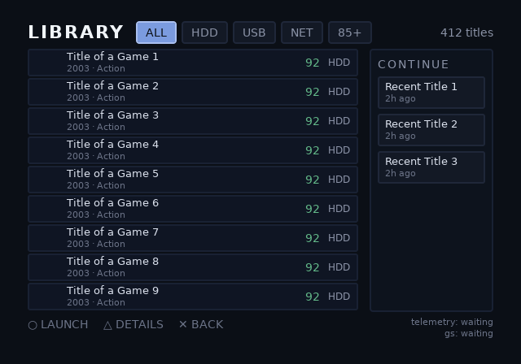
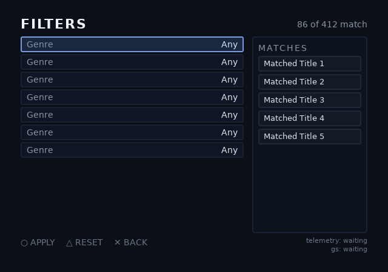
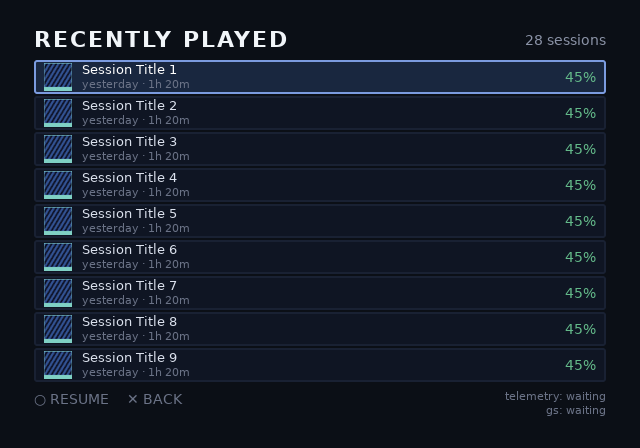
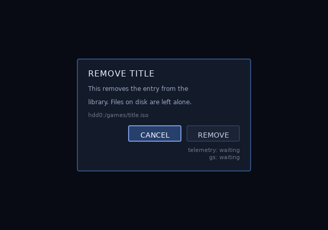

# opl-env — an OPL-class environment

The Phase 2 skeleton (`docs/PLAN.md` §6): a game-launcher environment
built out of the same six mechanisms Phase 1 shipped, at the scale a
real one runs at. Six screens, 137 slots, ten streamed texture slots,
one overlay composited over whichever screen is beneath it.

It lives in `examples/`, not `fixtures/`, and carries what that
promises: it builds warning-free under `--strict`, its screenshots are
refreshed by building rather than by hand, and `check-blobs.sh`
validates it with **no exemptions** — the numbers below are taken from
this blob, and an exemption here would be an exemption on them.

```sh
./examples/opl-env/build.sh
```

## What it dogfoods

| mechanism | where |
|---|---|
| blob-declared working set | 7,319-byte arena for the whole environment |
| streamed texture slots | nine list thumbnails + one detail cover |
| slot text at scale | 137 slots, none of them a fixed ceiling |
| composition | `confirm` drawn over `library` or `detail`, no clear between |
| focus routing | 51 nodes, per-screen graphs |
| repeats | nine library rows, six detail fields, three recent tiles |

## Measurements

Taken from the blob, not estimated -- and since #65, CHECKED against
it. `tools/check-example-figures.py` reads the committed blob header
and diffs it against the block below, because this sentence was true
when it was written and then silently stopped being true: #63 added the
telem slot, the library screen went 43 to 44, and three of these
figures drifted through two pull requests and a phase lock with nobody
re-deriving them.

These are the Phase 2 baseline; Phase 3 optimises against them.

```
blob            269,824 bytes
arena             7,319 bytes      (the whole six-screen environment)
screens                   6
slots                   137
focus nodes              51
textures                 21        (10 streamed)
fonts                     6
VRAM                336 KiB        within a 736 KiB budget
```

**P3b-4 added 48 bytes and nothing else**: a second tint row, 13
entries of four bytes, plus alignment. That is what a theme costs --
bytes, and no commands, textures or slots, because it is a table swap.
Everything else below moved at P3b-6.

| screen | commands | textured | slots | focus |
|---|---:|---:|---:|---:|
| landing | 331 | 324 | 17 | 7 |
| library | 694 | 669 | 45 | 17 |
| detail | 196 | 195 | 17 | 4 |
| filters | 467 | 456 | 22 | 12 |
| recent | 360 | 341 | 30 | 9 |
| confirm | 110 | 109 | 6 | 2 |

**These moved at P3b-6, and in both directions.** Rounded boxes stopped
premixing their colour into a texture and became two tinted coverage
layers, so commands rose 1,302 -> 2,158 (1,244 -> 2,100 of them
painting, which is the count `check.py`'s palette-ratio rule keys on)
while textures fell 28 -> 21 and VRAM 392 -> 336 KiB. A coverage patch
keys on `(radius, borderWidth)` alone, where a premixed one keyed on
the colours too: eleven patch textures collapsed to four, 88 KiB of
VRAM to 32. The blob grew because it now carries two theme rows and
856 more commands.

This example gets the good end of that trade and channel6 does not --
it draws five corner radii and pays 16 KiB rather than saving 56. See
F-043: the direction depends on how many colours share how few
geometries, so it is a fact about the stylesheet.

The per-screen slot counts also correct a stale figure the headline
check could not see -- it verifies the seven numbers above and not this
table, and library had read 43 since before #63 added the telem slot.

**And the readout is now on all six screens, which is the 127 -> 137.**
Slots are per-screen: `render_slots` walks the current screen's slot
range, so the telemetry pair that lived only on library drew nothing
whenever anything else was up. That was invisible while every driver
ELF rendered library, and it made five of P3d's six content-sweep
points photograph no numbers at all. Ten slots and 560 bytes of arena
buy every screen the ability to report its own cost. They are 11px
rather than 14px for a related reason: at 14px the theme arm's worst
case is 43 characters in a 38-character slot, so its last field was
already being clipped on long runs, and `check.py` now measures every
arm of the driver's format strings against every screen's slot rather
than trusting that it fits.

Two streamed reservation sizes, because a real environment needs both:

```
row-0-art .. row-8-art   28x28     3,136 B each
det-art                  120x72   34,560 B
                                  62,784 B total
```

Against the memcard example, for scale: 175,120-byte blob, 6 slots,
808 commands. This is roughly **20× the slot count** on 1.4× the blob.

**Frame time and prim counts on hardware are not measured yet.** They
need the runtime driver, and the exit gate wants them; until then this
example proves the environment *bakes and loads*, not that it runs at
field rate.

## Findings

Phase 2's job is to surface foundation gaps by building something real.
Three came out of the first build, recorded here rather than fixed
quietly:

**1. `make -C runtime test UIB=<blob>` segfaulted on any blob but one.**
The Makefile takes `UIB` as a parameter, which reads as an invitation to
point it at your own blob. The suite asserts the *memcard* example's
contents by name — slot `count`, focus node `tile-okami` — so another
blob ran 700 checks and then crashed on
`strcmp(ps2ui_slot_get(...), ...)`, because `slot_get` correctly returns
`NULL` for a name the blob does not have and the caller did not expect
it. The runtime was never at fault. **Fixed:** the suite now refuses an
unexpected blob up front, naming which one it needs and pointing at
`check-blobs.sh` for the blob-generic path. Found by this example's
`build.sh` copying the memcard one.

**2. Slots are single-line, and a confirm dialog wanting two is
ordinary.** `dlg-body` had to be split into `dlg-body-1` and
`dlg-body-2`. The split is the idiom and the error message is clear, but
it is an authoring wart: the app now has to know a sentence is two
slots. Filed rather than fixed — a multi-line slot is a real feature
with a real cost (wrapping in the runtime pen), and it should be pulled
by a use case, not added because a dialog was awkward once.

**3. `--strict` caught a 12px button.** The dialog buttons were 12px;
the floor is 14px because below it is unreadable from a couch. Working
as intended, and worth recording that it fired on the most consequential
text on the screen.

It read as a rule about *focusable* text for a while, and it never was.
`lint.js` checks every text command. What made it look focusable-only
is that every other small string here is `data-slot` text, and the
linter could not see a slot at all until P3b-5 — at which point 97 more
instances at 11–13px appeared. `build.sh` now passes
`--min-font-size 11`, and S14 read that layer off an SCPH-50000 and
found it legible [F-046] — so the value has a photograph behind it, not
just a build that passes. Open on one point: the bench panel was within
arm's reach, and "from a couch" means two or three metres.

## Screens

| | |
|---|---|
|  |  |
|  |  |
|  |  |

The streamed slots render empty here: the previewer draws what the blob
declares, and an unfilled streamed slot draws nothing by design. On
hardware the app fills them as rows scroll into view.
